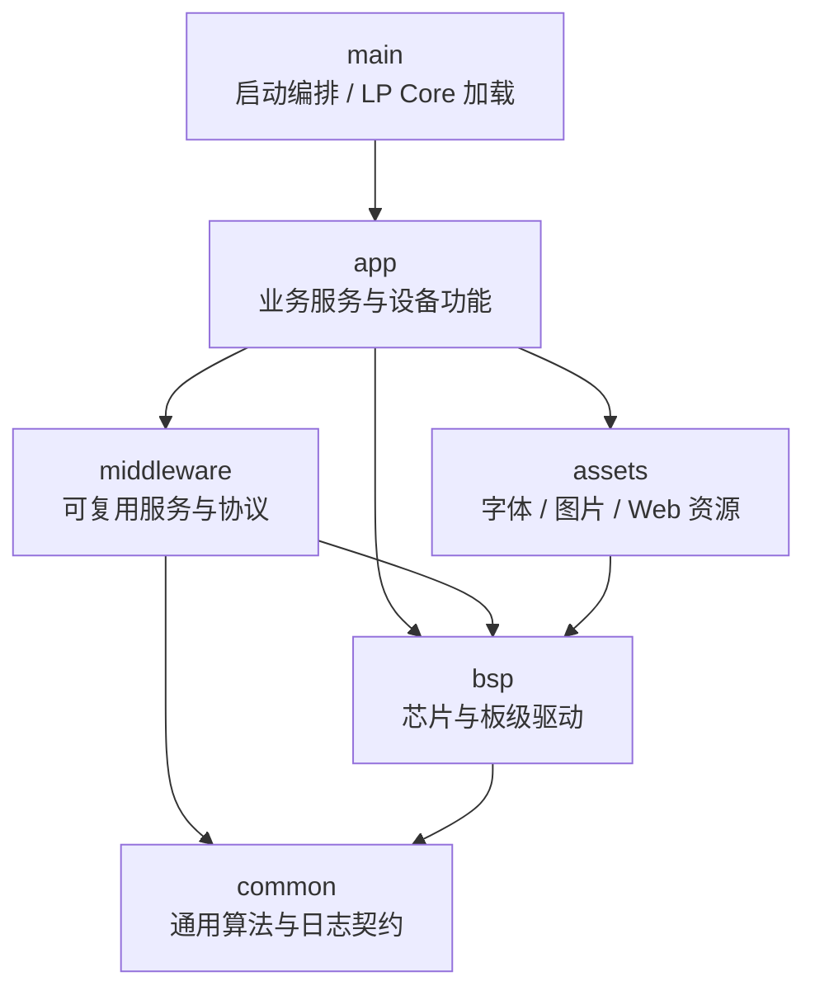

# Wireless Power Meter Lite

无线功率计 Lite — 基于 ESP32-C6 的紧凑型无线功率测量、显示、保护与联网控制设备。

## 功能概览

- 电压/电流/功率实时测量：INA226 由 LP 核采样，主程序读取共享状态。
- 输出保护：支持过温、过压、欠压、过流保护，并与输出控制联动。
- 本地显示与控制：ST7735S 160x80 TFT 显示，按键与串口 Shell 调试。
- 通信与联网：CAN(TWAI) 通信，WiFi STA/AP 配网，Web 页面与 REST API。
- 数据与配置：NVS 持久化配置，Flash 循环日志，结构化黑匣子记录。
- 固件布局：已提供 OTA 双 APP 分区、Web 流式上传、固件校验、二次确认激活与重启切换流程。

## 硬件平台

| 项目 | 规格 |
|------|------|
| 主控 | ESP32-C6 |
| 功率采样 | INA226 (I2C, LP 核驱动) |
| 温度采样 | TMP235 (ADC) + ESP32-C6 片内温度传感器 |
| 显示屏 | ST7735S 160x80 TFT (SPI) |
| 通信接口 | CAN (TWAI) / WiFi |
| 本地输入 | 主按键 / 侧按键 |

## 分区表

| 分区 | 类型 | 偏移 | 大小 | 说明 |
|------|------|------|------|------|
| nvs | data | 0x9000 | 80KB | NVS 键值存储 |
| otadata | data | 0x1D000 | 8KB | OTA 状态数据 |
| app0 | app(ota_0) | 0x20000 | 1280KB | 应用程序分区 A |
| app1 | app(ota_1) | 0x160000 | 1280KB | 应用程序分区 B |
| blackbox | data | 0x2A0000 | 1408KB | 黑匣子日志分区 |

## 项目结构

```text
├── CMakeLists.txt              # 顶层构建配置与版本号注入
├── partitions.csv              # 分区表
├── sdkconfig                   # ESP-IDF 项目配置
├── scripts/                    # 构建、资源生成和固件合并脚本
├── main/                       # app_main 与 LP 核程序
├── components/
│   ├── app/                    # 应用层组件
│   ├── bsp/                    # 板级支持包
│   ├── middleware/             # 通用中间件
│   ├── assets/                 # 字体、UI、Web 静态资源
│   └── common/                 # 通用算法/库
├── .github/workflows/          # CI/CD
└── .devcontainer/              # VS Code Dev Container
```

## 架构与模块文档

依赖方向原则为 `app -> middleware -> bsp/common`，资源组件由使用方按需引用。
应用层组件之间允许按业务协作互相依赖，但 BSP 和通用中间件不应依赖应用层。
每个组件 README 末尾都有按当前 CMake 生成的直接依赖链接。



当前已知边界例外：[`can_resistor`](components/middleware/can_resistor/README.md)
会同步写入 [`global_state`](components/app/global_state/README.md)，因此形成
`middleware -> app` 反向依赖。该组件包含设备业务状态，后续调整目录或状态发布
机制时再收口；其余中间件不依赖应用层。

组件若需要私有头文件，统一放在 `private_include/` 并通过
`PRIV_INCLUDE_DIRS` 引入；跨组件公开接口放在 `include/`。

### 启动与工具

| 模块 | 职责 |
|------|------|
| [LP 核加载](main/ulp_loader/README.md) | HP 核加载 LP 固件、共享快照与校准参数 |
| [LP 核采样](main/ulp_app/README.md) | INA226 采样、累计计量与跨核状态 |
| [构建脚本](scripts/README.md) | Web 压缩、资源生成、固件合并与日志分析 |

### 应用层 `components/app`

| 业务域 | 模块 |
|--------|------|
| 状态与诊断 | [global_state](components/app/global_state/README.md) · [boot_diagnostics](components/app/boot_diagnostics/README.md) · [blackbox_service](components/app/blackbox_service/README.md) |
| 安全与输出 | [protect](components/app/protect/README.md) · [power_output](components/app/power_output/README.md) · [current_calibration](components/app/current_calibration/README.md) |
| 本地交互 | [screen](components/app/screen/README.md) · [shell_command](components/app/shell_command/README.md) · [can_callback](components/app/can_callback/README.md) |
| 无线与 Web | [wifi_service](components/app/wifi_service/README.md) · [espnow_service](components/app/espnow_service/README.md) · [web_backend](components/app/web_backend/README.md) |
| 升级 | [ota_service](components/app/ota_service/README.md) |

### 中间件 `components/middleware`

| 领域 | 模块 |
|------|------|
| 网络协议 | [WebServer](components/middleware/WebServer/README.md) · [DNSServer](components/middleware/DNSServer/README.md) · [espnow_link](components/middleware/espnow_link/README.md) · [time_service](components/middleware/time_service/README.md) |
| 数据与升级 | [blackbox](components/middleware/blackbox/README.md) · [energy_meter](components/middleware/energy_meter/README.md) · [ota_manager](components/middleware/ota_manager/README.md) |
| 设备交互 | [Button](components/middleware/Button/README.md) · [can_resistor](components/middleware/can_resistor/README.md) |

### 板级支持 `components/bsp`

| 领域 | 模块 |
|------|------|
| 模拟与温度 | [ADC](components/bsp/ADC/README.md) · [Temperature](components/bsp/Temperature/README.md) |
| 总线与无线 | [HXC_TWAI](components/bsp/HXC_TWAI/README.md) · [wifi_manager](components/bsp/wifi_manager/README.md) |
| GPIO 与显示 | [cpp_gpio_driver](components/bsp/cpp_gpio_driver/README.md) · [PWM](components/bsp/PWM/README.md) · [st7735_driver](components/bsp/st7735_driver/README.md) |
| 存储与平台 | [HXC_NVS](components/bsp/HXC_NVS/README.md) · [circular_flash_buffer](components/bsp/circular_flash_buffer/README.md) · [hardware](components/bsp/hardware/README.md) · [shell](components/bsp/shell/README.md) |

### 通用库与资源

| 层级 | 模块 |
|------|------|
| `common` | [diagnostic_log](components/common/diagnostic_log/README.md) · [Interp](components/common/Interp/README.md) |
| `assets` | [Fonts](components/assets/Fonts/README.md) · [ui_resources](components/assets/ui_resources/README.md) · [web_file](components/assets/web_file/README.md) |

## Web 后端概览

Web 后端由 `components/app/web_backend` 提供，对外入口为 `WebBackend::start_with_wifi_service()`。组件负责注册页面路由和 REST API，底层 HTTP 能力由 `components/middleware/WebServer` 提供，网页资源由 `components/assets/web_file` 嵌入固件。

当前后端实现按职责拆分为路由注册、页面 handler、API handler、日志捕获和 JSON 请求解析等源文件。为适配 ESP32-C6 的内存约束，后端响应使用固定静态缓冲，请求 JSON 使用 common/json 的 SAX 方式按字段读取，不构造完整 JSON DOM。

详细路由表、API 示例、内存策略和源码结构见 [components/app/web_backend/README.md](components/app/web_backend/README.md)。

## 启动入口

主入口位于 `main/app_main.cpp`。当前启动流程只在主 README 保留入口级说明：

1. 初始化黑匣子、NVS 和黑匣子应用服务，再探测硬件配置，使最早期硬件异常也能落盘。
2. 在其他功能启动前分行同步写入基础诊断块，包括复位原因、固件、Flash、OTA 槽位、MAC、CAN、WiFi、校准参数和保护阈值。
3. 在温度、状态定时器/屏幕、LP Core、保护、输出、按键、CAN、Shell 和 WiFi/Web 初始化前分别写入同步阶段标记。
4. 初始化温度采样、状态更新定时器和屏幕任务。
5. 加载 LP 核采样程序。
6. 初始化保护、输出控制、按键、CAN、Shell。
7. 调用 `WebBackend::start_with_wifi_service()` 启动 WifiService；所有非 OFF 模式
   启用 ESP-NOW，按配置决定是否继续启动 WiFi IP 网络与 Web。
8. 写入依赖运行期状态的补充诊断，包括 CAN 电阻、WiFi 模式、IP、INA226 原始值和全局标志。

具体模块行为以对应 README 和源码为准。

## 构建与烧录

### 环境要求

- ESP-IDF v6.0+
- 目标芯片：`esp32c6`

### 构建

```bash
idf.py set-target esp32c6
idf.py build
```

构建完成后 `scripts/post_build.py` 会自动合并固件生成 `Wireless_power_meter_lite_merged.bin`。

### 烧录

合并固件，全新烧录：

```bash
esptool.py --chip esp32c6 write_flash 0x0 Wireless_power_meter_lite_merged.bin
```

仅 APP 固件，写入 app0：

```bash
esptool.py --chip esp32c6 write_flash 0x20000 build/Wireless_power_meter_lite.bin
```

## 版本号

版本号定义为 `MAJOR.MINOR.PATCH`，在 `CMakeLists.txt` 中配置：

- `MAJOR` / `MINOR`：开发者手动修改。
- `PATCH`：`99` 表示本地构建，`0` 表示 CD 构建。

CD 通过 Tag 触发，例如 `v1.0.0`，自动注入版本号并发布 Release。

## CI/CD

- CI：推送或 PR 到 `main` 分支时自动构建。
- CD：推送 `v*` 标签时自动构建、合并固件、创建 GitHub Release 并上传固件。

## 开发环境

项目提供 VS Code Dev Container 配置，基于 ESP-IDF v6.0 Docker 镜像。

## 许可证

请参阅项目源文件头部的许可证声明。
