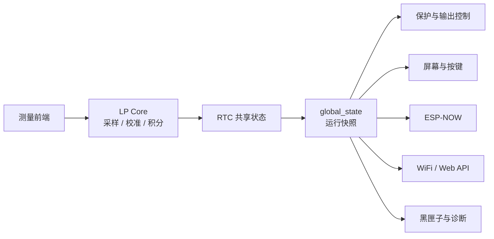
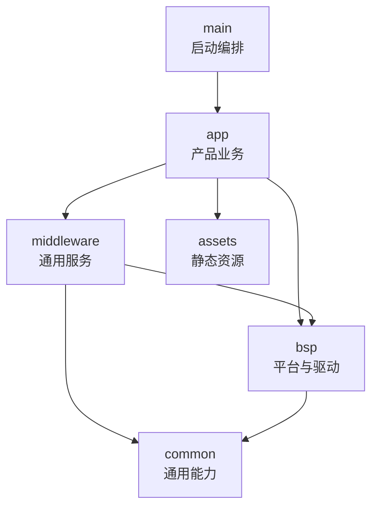

# Wireless Power Meter Lite

`Wireless_power_meter_lite` 是一个基于 ESP-IDF 的无线功率测量与输出控制固件。
工程将实时采样、累计计量、保护策略、本地交互、无线控制、Web 服务、日志诊断和
OTA 升级组织为独立组件，既可以直接构建完整固件，也可以作为 ESP-IDF 多组件项目
的参考实现。


配套遥控器固件见
[`Wireless_power_switch_button`](https://github.com/qingmeijiupiao/Wireless_power_switch_button)。

- 本工程提供[使用github生成固件，无需搭建开发环境的教程](#使用在线环境开发)

- 不想了解代码请跳转[固件烧录](#烧录)

> 本 README 主要介绍软件功能、架构和二次开发入口。具体器件连接、引脚定义和
> 电气参数属于 BSP 与板级实现细节，不在根目录文档中展开。

## 主要功能

- **实时测量**：由低功耗核心持续采样，主核心读取一致的数据快照。
- **累计计量**：计算电量和能量，支持会话数据与长期累计数据。
- **输出控制与保护**：开关操作经过保护策略和冷却策略检查，异常时主动关闭输出。
- **本地交互**：提供屏幕页面、按键操作和串口 Shell。
- **无线遥控**：通过 ESP-NOW 接收配对遥控器的控制请求，并可返回测量数据。
- **网络与 Web**：支持 STA、AP 配网、Captive Portal、REST API 和网页控制。
- **配置持久化**：使用 NVS 保存网络、校准、保护和业务配置。
- **故障诊断**：Flash 循环黑匣子保存关键日志和运行快照。
- **固件升级**：支持 Web 上传、远端版本检查、断点续传和双 APP 分区 OTA。
- **自动化发布**：通过 CI/CD 构建、校验并发布可下载和可在线烧录的固件。

## 系统如何工作

ESP32-C6 包含主核心和低功耗核心。本工程把持续采样和积分放到 LP Core，把屏幕、
网络、保护和业务逻辑放到 HP Core。

采用 LP Core 的主要原因不是单纯降低功耗，而是隔离 I2C 采样带来的阻塞。ESP32 上的
I2C 读取需要等待总线事务完成；当采样运行在主核心时，频繁读取会占用执行时间并干扰
WiFi、Web 和其他实时任务。将采样移到 LP Core 后，I2C 等待不会阻塞 HP Core 的业务
任务，同时 LP Core 可以按独立节奏持续采样和积分，保证测量过程的实时性与连续性。

- **LP Core** 是后台测量单元，即使主业务繁忙，也持续更新测量结果。
- **HP Core** 是应用处理单元，读取测量快照并执行显示、保护、通信和 Web 服务。
- 两个核心通过 RTC 共享内存交换固定格式的数据和状态。



## 软件架构

工程使用 ESP-IDF Component 管理模块。每个 Component 都可以声明自己的源码、
公开头文件和依赖，CMake 会按照依赖关系完成编译和链接。

```text
main/                       启动编排、LP Core 程序和共享状态加载
components/
  app/                      产品业务和设备功能
  middleware/               可复用服务、协议和数据处理
  bsp/                      芯片外设与板级驱动
  common/                   通用算法和日志契约
  assets/                   字体、图片和 Web 静态资源
scripts/                    资源生成、固件合并和日志分析工具
```

推荐依赖方向：



- `app` 可以组合多个底层组件完成完整功能。
- `middleware` 不应依赖具体页面、按键含义或产品启动流程。
- `bsp` 封装外设和板级差异，不应调用应用层业务。
- 跨组件公开接口放在 `include/`，组件内部头文件放在 `private_include/`。

这是一条设计原则，不表示应用层组件之间完全禁止协作。业务组件可以互相调用，但应
优先通过公开接口连接，避免直接访问其他组件的内部状态。

## 关键技术说明

### LP Core 与共享快照

LP Core 独立执行 I2C 读取、校准补偿和积分，避免同步总线事务阻塞 HP Core 上的
WiFi、Web、屏幕和控制任务。采样循环不依赖主业务任务的调度状态，因此能够保持稳定
的测量节奏。

HP Core 不直接读取一组可能正在变化的零散变量，而是取得同一批次快照，再发布到
`global_state`。这样可以减少电压、电流和原始寄存器来自不同采样时刻的问题。

详细实现：

- [LP Core 程序](main/ulp_app/README.md)
- [HP Core 加载与共享状态](main/ulp_loader/README.md)

### 输出控制与保护策略

所有开启、关闭和切换请求都进入 `power_output`。开启输出前，组件按顺序检查已注册的
策略；任一策略拒绝，本次操作就不会执行。保护状态触发时还会主动关闭输出。

这种策略链便于二次开发：新增启动条件时，可以增加策略，而不必在按键、Web、CAN 和
ESP-NOW 的每个入口重复判断。

### ESP-NOW、WiFi 与 Web

ESP-NOW 和普通 WiFi 共用同一套 2.4 GHz 射频，因此不能把它们当成完全独立的外设。
`wifi_service` 统一管理以下运行模式：

- 已保存网络可用时连接 STA 并启动 Web；
- 未配置或连接失败时进入 AP 配网；
- Web 被禁用时保留 ESP-NOW 所需射频；
- WiFi 信道变化时配合 ESP-NOW 完成 peer 通信。

`espnow_link` 负责可靠传输、配对和信道恢复，`espnow_service` 负责本产品的命令和
数据格式。

### 黑匣子

普通日志主要用于实时调试，黑匣子用于保留设备已经重启或离线后的诊断信息。
`blackbox_service` 捕获重要日志和状态，`blackbox` 将记录写入循环 Flash 分区。
空间写满后覆盖最旧记录，从而限制 Flash 占用。

### 双分区 OTA

固件包含两个应用分区。设备运行其中一个分区时，新固件写入另一个分区；下载完成后
校验镜像，再切换下次启动分区。这样可以避免直接覆盖当前正在运行的程序。

远端 OTA 还会检查版本、HTTPS、文件长度和固件格式，并支持连接中断后的 Range 续传。

## 组件导航

### 启动与工具

| 模块 | 职责 |
|------|------|
| [LP 核加载](main/ulp_loader/README.md) | 加载 LP 固件、读取共享快照和传递校准参数 |
| [LP 核采样](main/ulp_app/README.md) | 持续采样、校准补偿和累计计量 |
| [构建脚本](scripts/README.md) | 资源生成、固件合并和黑匣子分析 |

### 应用层

| 业务域 | 模块 |
|--------|------|
| 状态与诊断 | [global_state](components/app/global_state/README.md) · [boot_diagnostics](components/app/boot_diagnostics/README.md) · [blackbox_service](components/app/blackbox_service/README.md) |
| 安全与输出 | [protect](components/app/protect/README.md) · [power_output](components/app/power_output/README.md) · [current_calibration](components/app/current_calibration/README.md) |
| 本地交互 | [screen](components/app/screen/README.md) · [shell_command](components/app/shell_command/README.md) · [can_callback](components/app/can_callback/README.md) |
| 无线与 Web | [wifi_service](components/app/wifi_service/README.md) · [espnow_service](components/app/espnow_service/README.md) · [web_backend](components/app/web_backend/README.md) |
| 固件升级 | [ota_service](components/app/ota_service/README.md) |

### 中间件

| 领域 | 模块 |
|------|------|
| 网络服务 | [WebServer](components/middleware/WebServer/README.md) · [DNSServer](components/middleware/DNSServer/README.md) · [espnow_link](components/middleware/espnow_link/README.md) · [time_service](components/middleware/time_service/README.md) |
| 数据与升级 | [blackbox](components/middleware/blackbox/README.md) · [energy_meter](components/middleware/energy_meter/README.md) · [ota_manager](components/middleware/ota_manager/README.md) |
| 设备交互 | [Button](components/middleware/Button/README.md) · [can_resistor](components/middleware/can_resistor/README.md) |

### BSP、通用库与资源

| 领域 | 模块 |
|------|------|
| 模拟与温度 | [ADC](components/bsp/ADC/README.md) · [Temperature](components/bsp/Temperature/README.md) |
| 总线与无线 | [HXC_TWAI](components/bsp/HXC_TWAI/README.md) · [wifi_manager](components/bsp/wifi_manager/README.md) |
| GPIO 与显示 | [cpp_gpio_driver](components/bsp/cpp_gpio_driver/README.md) · [PWM](components/bsp/PWM/README.md) · [st7735_driver](components/bsp/st7735_driver/README.md) |
| 存储与平台 | [HXC_NVS](components/bsp/HXC_NVS/README.md) · [circular_flash_buffer](components/bsp/circular_flash_buffer/README.md) · [hardware](components/bsp/hardware/README.md) · [shell](components/bsp/shell/README.md) |
| 通用库 | [diagnostic_log](components/common/diagnostic_log/README.md) · [Interp](components/common/Interp/README.md) |
| 静态资源 | [Fonts](components/assets/Fonts/README.md) · [ui_resources](components/assets/ui_resources/README.md) · [web_file](components/assets/web_file/README.md) |

## 二次开发入口

| 需求 | 建议从这里开始 |
|------|----------------|
| 新增或修改屏幕页面 | `components/app/screen/` |
| 新增 Shell 命令 | `components/app/shell_command/` |
| 新增 REST API | `components/app/web_backend/` |
| 修改网页 | `components/assets/web_file/` |
| 修改保护逻辑 | `components/app/protect/` |
| 增加输出操作约束 | `components/app/power_output/` 的策略接口 |
| 修改 ESP-NOW 产品命令 | `components/app/espnow_service/` |
| 修改可靠传输或配对 | `components/middleware/espnow_link/` |
| 修改 WiFi/AP 配网策略 | `components/app/wifi_service/` |
| 修改采样和积分 | `main/ulp_app/` 与 `main/ulp_loader/` |
| 适配不同板卡 | `components/bsp/hardware/` 及相关 BSP 组件 |

建议先阅读应用组件的公开头文件和 README，再查看实现文件。修改一个功能前，先确认
它属于产品策略、通用服务还是板级驱动，避免把同一逻辑复制到多个入口。

## Web 后端

Web 后端入口为 `WebBackend::start_with_wifi_service()`。它负责启动网络策略、注册页面
路由和 REST API；HTTP 服务由 `WebServer` 提供，网页由 `web_file` 嵌入固件。

为控制 RAM 使用，后端响应采用固定缓冲区，请求 JSON 使用按字段读取方式，不构造完整
JSON DOM。路由、API 和内存策略见
[web_backend 文档](components/app/web_backend/README.md)。

## 构建

### 环境要求

- ESP-IDF v6.0+
- Python 3 及 `scripts/requirements.txt` 中的脚本依赖
- 目标芯片：ESP32-C6

```powershell
idf.py set-target esp32c6
idf.py build
```

构建过程会生成静态资源，并在完成后输出：

- `build/Wireless_power_meter_lite.bin`：仅应用程序；
- `Wireless_power_meter_lite_merged.bin`：Bootloader、分区表和应用程序合并固件。

## 烧录

### 完整烧录

适用于首次安装、故障恢复或分区布局发生变化：

```powershell
esptool.py --chip esp32c6 write_flash 0x0 Wireless_power_meter_lite_merged.bin
```

完整烧录会覆盖 NVS 和 OTA 状态区域，网络、校准和业务配置需要重新设置。

## 分区布局

| 分区 | 偏移 | 大小 | 用途 |
|------|------|------|------|
| `nvs` | `0x9000` | 80 KB | 持久化配置 |
| `otadata` | `0x1D000` | 8 KB | OTA 启动状态 |
| `app0` | `0x20000` | 1280 KB | 应用程序分区 A |
| `app1` | `0x160000` | 1280 KB | 应用程序分区 B |
| `blackbox` | `0x2A0000` | 1408 KB | 循环诊断日志 |

## 在线烧录

[使用 ESP Launchpad 在线烧录最新固件](https://espressif.github.io/esp-launchpad/?flashConfigURL=https://cdn.jsdelivr.net/gh/qingmeijiupiao/Wireless_power_meter_lite@firmware-dist/launchpad/latest.toml)

在线入口读取 `firmware-dist` 分支上的最新发布配置，需要使用支持 Web Serial 的
Chromium 系浏览器。完整烧录会清除 NVS 配置，升级前应确认是否需要备份。

## 版本与发布

版本格式为 `MAJOR.MINOR.PATCH`：

- 开发者维护顶层 `CMakeLists.txt` 中的 `MAJOR` 和 `MINOR`；
- 本地构建使用 `PATCH=99`，表示非正式固件；
- 标签发布由 CI 使用 `PATCH=0` 构建，例如 `v0.9.0`；
- 编译时间统一按 UTC+8 写入固件。

推送或提交 PR 到 `main` 时，CI 会检查工程能否正常构建。推送版本标签后，CD 会生成
发布固件、校验文件和在线烧录配置。

## 使用在线环境开发
### 1.fork工程


### 2.在fork后的工程中创建codespace

注意是在自己刚刚fork的工程下创建，否则后续不能触发CD


### 3.等待初始化完成后安装插件

codespace加载较慢请耐心等待
需要安装以下插件
- ESP-IDF
- ESP-IDF WEB


安装后使用ctrl + shift + P 或者 F1 输入reload点击重新加载


### 4.连接串口
先将设备插入电脑USB
使用ctrl + shift + P 或者 F1
搜索serial


点击后浏览器会弹出选择串口选择设备所在串口即可

### 5.常用操作


web按钮和本地开发无异,但是由于codespace性能低延迟高,操作响应慢是正常现象
有条件还是建议本地开发

### 6.使用CD生成固件
**注意需要先启用仓库的action功能**
在修改代码推送后可以创建vX.X.0的版本标签，例如 **v99.10.0** 

再使用

`git push --tag` 推送标签

会触发CD流程，等待action运行完成后即可在仓库的release处下载编译好的固件

## 许可证

参阅仓库中的 [LICENSE](LICENSE)。
