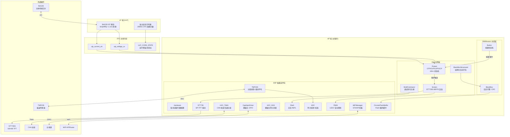

# Wireless Power Meter Lite

无线功率计 Lite — 基于 ESP32-C6 的紧凑型无线功率测量与保护设备。

## 功能概览

- **电压/电流/功率实时测量** — 通过 INA226 (LP 核驱动) 高精度采样，电压量程 0~27.5V，电流量程支持双向
- **四重保护机制** — 过温保护(OTP)、过压保护(OVP)、欠压保护(UVP)、过流保护(OCP)，三级状态(正常→警告→保护)，带滞回恢复
- **TFT 屏幕实时显示** — ST7735S 160×80 横屏显示电压、电流、功率、温度、时间及保护状态图标
- **CAN 总线通信** — 基于 TWAI 的 CAN 收发封装，支持多 ID 回调回调分发
- **WiFi 管理** — STA/AP 模式切换、扫描、省电模式等完整功能封装
- **黑匣子日志** — 循环 Flash 缓冲区存储，支持字符串日志与结构化数据日志
- **Shell 调试命令** — 串口交互式 REPL，可注册自定义命令
- **NVS 持久化存储** — 模板化封装，支持任意基础类型与字符串的存取
- **OTA 升级** — 双 APP 分区设计，支持在线固件升级

## 硬件平台

| 项目 | 规格 |
|------|------|
| 主控 | ESP32-C6 |
| 供电传感器 | INA226 (I2C, LP 核驱动) |
| 温度传感器 | TMP235 (ADC) + ESP32-C6 片内温度传感器 |
| 显示屏 | ST7735S 160×80 TFT (SPI) |
| 通信接口 | CAN (TWAI) / WiFi |
| 按键 | 主按键 (短按/双击/长按/超长按) |

## 分区表

| 分区 | 类型 | 偏移 | 大小 | 说明 |
|------|------|------|------|------|
| nvs | data | 0x9000 | 80KB | NVS 键值存储 |
| otadata | data | 0x1D000 | 8KB | OTA 状态数据 |
| app0 | app(ota_0) | 0x20000 | 1280KB | 应用程序分区 A |
| app1 | app(ota_1) | 0x160000 | 1280KB | 应用程序分区 B |
| blackbox | data | 0x2A0000 | 1408KB | 黑匣子日志分区 |

## 项目结构

```
├── CMakeLists.txt              # 顶层构建配置，版本号注入(MAJOR.MINOR.PATCH)
├── partitions.csv              # 分区表
├── sdkconfig                   # ESP-IDF 项目配置
├── scripts/
│   ├── pre_build.py            # 构建前检查脚本
│   ├── post_build.py           # 构建后合并固件 + Flash 占用统计
│   ├── generate_font.py        # 字体资源生成
│   ├── generate_backlight_lut.py # 背光 LUT 生成
│   └── image_converter.py      # 图片资源转换
├── main/
│   ├── app_main.cpp            # 主入口：初始化各模块，创建任务
│   ├── ulp_app/
│   │   ├── ulp_main.cpp        # LP 核主循环：INA226 采样 + 溢出安全计时器
│   │   ├── ina226.hpp          # INA226 LP 核 I2C 驱动 (寄存器读写/配置)
│   │   └── ulp_state.h         # LP/HP 核共享状态位定义
│   └── ulp_loader/
│       ├── ulp_loader.cpp      # LP 核二进制加载与启动
│       └── ulp_loader.h
├── components/
│   ├── app/                    # 应用层组件
│   │   ├── protect/            # 保护逻辑：OTP/OVP/UVP/OCP 阈值判断与状态机
│   │   ├── global_state/       # 全局状态：电压、电流、温度、保护位、输出位
│   │   ├── screen/             # 屏幕渲染：ST7735S 60FPS 刷新 + UI 布局
│   │   ├── shell_command/      # Shell 命令注册
│   │   └── blackbox_structured/ # 黑匣子结构化日志(GloalState 打包写入)
│   ├── bsp/                    # 板级支持包
│   │   ├── hardware/           # 硬件版本适配：引脚配置、版本检测
│   │   ├── st7735_driver/      # ST7735S SPI TFT 驱动 (双缓冲/背光PWM)
│   │   ├── HXC_TWAI/           # CAN 总线封装(回调分发/软队列/硬件中断)
│   │   ├── wifi_manager/       # WiFi 管理单例(STA/AP/扫描/省电)
│   │   ├── HXC_NVS/            # NVS 模板化封装(泛型存储/字符串特化)
│   │   ├── shell/              # 交互式 Shell(REPL/命令注册/日志模式切换)
│   │   ├── Button/             # 任务驱动型按键(消抖/短按/双击/长按/超长按)←middleware
│   │   ├── ADC/                # ADC 单次采样+校准封装
│   │   ├── PWM/                # LEDC PWM 封装(自动通道分配)
│   │   ├── Temperature/        # TMP235 板温传感器(分段线性+滑动平均)
│   │   ├── cpp_gpio_driver/    # C++ 模板化 GPIO 驱动(编译期引脚绑定/运行时绑定)
│   │   └── circular_flash_buffer/ # SPI Flash 循环缓冲区(与数据结构解耦)
│   ├── middleware/             # 中间件
│   │   ├── blackbox/           # 黑匣子日志引擎(CRC校验/Flash循环写入)
│   │   └── Button/             # 按键驱动(事件状态机/异步回调)
│   ├── assets/                 # 静态资源
│   │   ├── Fonts/              # 点阵字体(12/16/20号等宽中文)
│   │   ├── ui_resources/       # UI 图片资源(静态背景/开关图标/警告保护框)
│   │   └── web_file/           # Web 页面资源
│   └── common/                 # 通用工具
│       ├── Interp/             # 插值算法库
│       └── json/               # JSON 解析库
├── .github/workflows/CI.yml    # CI/CD：CI构建 + Tag自动发布Release
└── .devcontainer/              # VS Code Dev Container (ESP-IDF v6.0)
```

## 系统架构

本项目利用 ESP32-C6 的 HP 核与 LP 核协同工作，HP 核通过 `ulp_voltage_uv` 和 `ulp_current_uA` 两个 RTC 共享变量获取 LP 核的采样数据。



## 核心类图

```mermaid
classDiagram
    direction TB

    class GlobalState {
        <<struct>>
        +uint16_t voltage_mV
        +int32_t current_uA
        +int16_t board_temperature
        +int16_t chip_temperature
        +protect_states_t protect_states
        +GlobalState_bit global_state_bits
    }
    class GlobalState_bit {
        <<union>>
        +uint32_t raw
        +out_put_state : 1
        +reverse : 31
    }
    class protect_states_t {
        <<union>>
        +uint8_t protect_states_raw
        +temperature_protect_state : 2
        +high_voltage_protect_state : 2
        +low_voltage_protect_state : 2
        +current_protect_state : 2
    }
    class ProtectState_t {
        <<enumeration>>
        NORMAL = 0
        WARNING = 1
        PROTECT = 2
    }
    class protect_threshold_t {
        +float warning_threshold
        +float warning_recovery_threshold
        +float protect_threshold
        +float protect_recovery_threshold
        +uint32_t is_asc
    }
    GlobalState *-- GlobalState_bit
    GlobalState *-- protect_states_t
    protect_states_t --> ProtectState_t : 2-bit field

    class WiFiManager {
        -wifi_state_t state_
        -IP_t ip_
        -bool initialized_
        -esp_netif_t* sta_netif_
        -esp_netif_t* ap_netif_
        -EventGroupHandle_t event_group_
        +instance()$ WiFiManager
        +init() esp_err_t
        +connect_sta(ssid, password, wait) esp_err_t
        +start_ap(ssid, password, max_conn, channel) esp_err_t
        +disconnect() esp_err_t
        +scan_start(config, block) esp_err_t
        +get_ip() IP_t
        +get_rssi() int8_t
        +is_connected() bool
    }

    class HXC_TWAI {
        -twai_node_handle_t twai_node_handle
        -uint8_t TX_PIN RX_PIN
        -uint32_t can_rate
        -callback_map_t callback_maps[10]
        -QueueHandle_t rx_queue
        -TaskHandle_t rx_task_handle
        +HXC_TWAI(tx, rx, rate)
        +setup() esp_err_t
        +send(message) esp_err_t
        +add_can_receive_callback_func(addr, func)
        +remove_can_receive_callback_func(addr)
    }
    class HXC_CAN_message_t {
        <<struct>>
        +uint8_t extd
        +uint8_t rtr
        +uint8_t data_length_code
        +uint32_t identifier
        +uint8_t data[8]
    }
    HXC_TWAI --> HXC_CAN_message_t : send/receive

    class Button {
        -_state : click_count, is_long_sent, is_super_sent
        -gpio_num_t _pin
        -ButtonCallback _callbacks[EVENT_MAX]
        -TimerHandle_t _timer
        -QueueHandle_t _evt_queue
        -TaskHandle_t _task_handle
        +setup(gpio_num, active_low) esp_err_t
        +bind_event(event, cb)
        +unbind_event(event)
    }
    class ButtonEvent {
        <<enumeration>>
        SHORT_PRESS = 0
        DOUBLE_CLICK
        LONG_PRESS
        SUPER_LONG_PRESS
        SHORT_THEN_LONG
        RELEASE
    }
    Button --> ButtonEvent : uses

    class CppGpioDriver~gpio_num_t GPIO, GpioMode Mode~ {
        +init() esp_err_t
        +set(value) esp_err_t
        +get() bool
    }
    class GpioMode {
        <<enumeration>>
        INPUT
        OUTPUT
        INPUT_PULLUP
        INPUT_PULLDOWN
    }
    CppGpioDriver --> GpioMode

    class Shell {
        -Mode mode_
        -esp_console_repl_t* repl_
        -vector~shared_ptr~ShellCommand_t~~ commands_
        +instance()$ Shell
        +init() esp_err_t
        +register_command(cmd) esp_err_t
        +deregister_command(name) esp_err_t
        +run_command(cmdline, ret) esp_err_t
        +start_interactive() esp_err_t
        +stop_interactive() esp_err_t
    }
    class ShellCommand_t {
        +string name_
        +string help_
        +string hint_
        +CommandFunc func_
        +execute(argc, argv) int
    }
    Shell o-- ShellCommand_t : manages

    class NVS_Base {
        <<abstract>>
        #static nvs_handle_t _handle
        #static bool is_setup
        +static setup()
    }
    class NVS_DATA~T~ {
        -char key[16]
        -T value
        -bool is_read
        +save() esp_err_t
        +read() T
        +operator=(newValue) NVS_DATA&
        +operator T()
    }
    NVS_Base <|-- NVS_DATA : inherits

    class adc_t {
        -adc_channel_t adc_channel
        -adc_cali_handle_t cali_handle
        -static adc_oneshot_unit_handle_t adc1_unit_handle
        +init() esp_err_t
        +read_raw(raw) esp_err_t
        +read_voltage_mV(voltage) esp_err_t
    }
    class TMP235_t {
        -adc_t* adc
        -int16_t avg_buf[64]
        -int32_t avg_sum
        +instance()$ TMP235_t
        +init(channel) esp_err_t
        +getTemperature() int16_t
    }
    TMP235_t *-- adc_t : uses

    class pwm_t {
        -ledc_channel_t channel
        -ledc_timer_t timer
        -bool initialized
        -static uint8_t channel_used
        +init(gpio, freq_hz, resolution) esp_err_t
        +get_duty_percent() float
        +set_duty_percent(percent) esp_err_t
    }

    class BlackBox {
        <<namespace>>
        +init() esp_err_t
        +add_string_log(fmt, ...)$ esp_err_t
        +add_typed_log(type, payload, len)$ esp_err_t
        +get_count()$ uint32_t
        +get_log(index)$ BlackBoxRaw_t
        +set_log_enable(enable)
    }
    class BlackBoxRaw_t {
        <<struct>>
        +BlackBoxHeader_t header
        +BlackBoxPayload_t payload
        +uint8_t crc_checksum
    }
    class CircularFlashBuffer {
        <<namespace>>
        +init(partition, block_size)$ esp_err_t
        +write_block(data)$ esp_err_t
        +read_block(index, data)$ esp_err_t
        +get_count()$ uint32_t
    }
    BlackBox --> BlackBoxRaw_t : produces
    BlackBox ..> CircularFlashBuffer : writes via

    class ULP_CORE_STATE {
        <<union>>
        +uint32_t ulp_state_raw
        +ulp_have_log : 1
        +ulp_i2c_init_err : 1
        +ulp_ina226_init_err : 1
        +ulp_ina226_read_timeout : 1
        +ulp_run : 1
    }
    GlobalState ..> ULP_CORE_STATE : reads
```



## 保护机制

保护模块以 10Hz 频率检查四项保护指标，每个指标具有独立的三级状态机：

```
正常(NORMAL) → 警告(WARNING) → 保护(PROTECT)
     ↑              ↗               ↓
     └──恢复← 恢复 ←──── 恢复 ←─────┘
```

| 保护类型 | 警告阈值 | 保护阈值 | 方向 |
|----------|----------|----------|------|
| OTP 过温 | 60°C | 80°C | 升序 |
| OVP 过压 | 25.5V | 27.5V | 升序 |
| UVP 欠压 | 6.6V | 4.7V | 降序 |
| OCP 过流 | 15A | 25A | 升序 |

触发保护时自动断开输出，状态变化通过回调通知上层。

## 构建与烧录

### 环境要求

- ESP-IDF v6.0+
- 目标芯片: `esp32c6`

### 构建

```bash
idf.py set-target esp32c6
idf.py build
```

构建完成后 `post_build.py` 会自动合并固件生成 `Wireless_power_meter_lite_merged.bin`。

### 烧录

**合并固件（全新烧录）：**
```bash
esptool.py --chip esp32c6 write_flash 0x0 Wireless_power_meter_lite_merged.bin
```

**仅 APP 固件（OTA/追加烧录）：**
```bash
esptool.py --chip esp32c6 write_flash 0x20000 build/Wireless_power_meter_lite.bin
```

### 版本号

版本号定义为 `MAJOR.MINOR.PATCH`，在 `CMakeLists.txt` 中配置：
- `MAJOR` / `MINOR`：开发者手动修改
- `PATCH`：`99` 表示本地构建，`0` 表示 CD 构建

CD 通过 Tag 触发（如 `v1.0.0`），自动注入版本号并发布 Release。

## CI/CD

- **CI**：推送/PR 到 `main` 分支时自动构建，验证编译通过
- **CD**：推送 `v*` 标签时自动构建、合并固件、创建 GitHub Release 并上传固件

## 开发环境

项目提供了 VS Code Dev Container 配置，基于 ESP-IDF v6.0 Docker 镜像，一键启动开发环境。

## 许可证

请参阅项目源文件头部的许可证声明。
