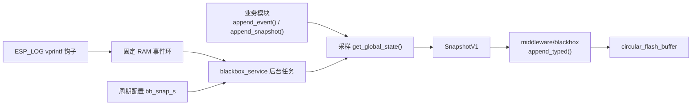

# blackbox_service

应用层黑匣子服务。该组件在 `middleware/blackbox` 通用循环存储之上定义版本化状态快照，
并统一管理 ESP_LOG 自动采集、关键事件记录、周期快照和 NVS 配置。

## 模块特点

- **应用层策略集中管理**：middleware 只负责通用异步落盘，本组件决定何时保存快照和事件
- **版本化快照协议**：`SnapshotV1` 首字节为版本号，字段变化时新增版本以保持历史日志可解析
- **ESP_LOG 自动采集**：`INFO` 及以上日志触发快照，`WARN` 及以上日志额外保存文本
- **轻量日志钩子**：vprintf 钩子复用静态缓冲并只写固定 RAM 环，后台任务负责向 Flash 队列提交记录
- **周期快照**：后台任务按 NVS 配置周期采样，间隔为 `0` 时关闭
- **结构化快照限流**：默认限制相邻快照至少间隔 `100ms`，关键事件可强制记录
- **关键状态接口**：`append_event()` 优先保存事件文本，再尝试追加状态快照
- **多行诊断接口**：`append_text_event()` 仅写文本，不重复追加快照，适合启动参数块

## 文件职责

| 文件 | 职责 |
|------|------|
| `src/blackbox_service.cpp` | 服务初始化、公开事件接口和公开配置接口 |
| `src/blackbox_snapshot.cpp` | `SnapshotV1` 状态采样与结构化记录写入 |
| `src/blackbox_config.cpp` | `bb_snap_s` NVS 配置和运行期线程安全访问 |
| `src/blackbox_log_capture.cpp` | ESP_LOG 钩子、Log V1 解析和固定 RAM 事件环 |
| `src/blackbox_worker.cpp` | 自动日志事件消费和周期快照任务 |
| `private_include/blackbox_service_internal.h` | 组件内部接口，不向其他组件暴露 |

## 数据流



## SnapshotV1

| 字段 | 类型 | 说明 |
|------|------|------|
| `version` | `uint8_t` | 快照版本，当前为 1 |
| `flags` | `GlobalStateFlags` | 诊断状态位 |
| `protect_states` | `protect_states_t` | 四路保护状态 |
| `voltage_mV` / `current_uA` | 整数 | 电压与电流 |
| `meter_mwh` | `float` | LP Core 开机以来累计能量，单位 mWh |
| `board_temperature` / `chip_temperature` | `int16_t` | 温度，单位 0.01°C |

不要直接持久化 `GlobalState`。字段语义变化时新增快照版本，并在读取端分版本解析。

## ESP_LOG 规则

| ESP_LOG 级别 | 行为 |
|-------------|------|
| `INFO` | 保存一条全局快照 |
| `WARN` / `ERROR` | 保存格式为 `[级别][TAG] 正文` 的文本，再尝试保存一条全局快照 |
| `DEBUG` / `VERBOSE` | 忽略 |

为避免 Flash 错误形成反馈循环，自动采集排除 `Blackbox`、`BlackBox` 和
`CircularFlashBuffer` TAG。为避免 WiFi 驱动启动日志产生大量低价值快照，还会排除
`wifi`、`wifi_init`、`phy_init`、`pp` 和 `net80211` TAG。应用层
`WiFiManager` 与 `WifiService` 日志仍会正常记录。当前解析逻辑基于工程启用的 ESP-IDF Log V1；
切换到 Log V2 时需要同步调整。

Web 请求审计使用 `WebBackend` TAG 的 `ESP_LOGI`，会输出到串口并进入 Web RAM 实时日志。
该 TAG 不触发自动快照，避免页面轮询持续写 Flash；非只读请求仍由 Web 中间件显式写入黑匣子事件。

## 集成与使用

```cpp
#include "blackbox_service.h"

// Blackbox::init() 和 NVS 初始化完成后尽早调用
BlackboxService::init();

// 写入一条结构化快照
BlackboxService::append_snapshot();

// 关键状态变化忽略 100ms 最小间隔
BlackboxService::append_snapshot(true);

// 写入关键状态变化，并尝试追加当前快照
BlackboxService::append_event("Output disabled: reason=%d", reason);

// 配置、审计和启动诊断块只写文本，避免追加无必要快照
BlackboxService::append_text_event("boot: flash_bytes=%lu", flash_size);

// 设置周期快照，单位秒；0 表示关闭
ESP_ERROR_CHECK(BlackboxService::set_snapshot_interval_s(10, "ShellCommand"));
```

## API

| API | 说明 |
|-----|------|
| `init()` | 恢复 NVS 配置、创建后台任务并安装 ESP_LOG 捕获钩子 |
| `append_snapshot(force=false)` | 采样当前 `GlobalState` 并写入 `STRUCTURED` 记录；默认受 `100ms` 最小间隔限制 |
| `append_event(fmt, ...)` | 保存关键状态变化或故障文本，再尝试追加全局快照 |
| `append_text_event(fmt, ...)` | 仅保存文本事件，不追加快照；配置、审计和操作记录默认使用该接口 |
| `get_snapshot_interval_s()` | 获取周期快照间隔，`0` 表示关闭 |
| `set_snapshot_interval_s(seconds, source)` | 设置周期快照间隔并持久化，返回 NVS 写入结果；调用方传入自身静态 TAG |

## 日志约定

- `SnapshotV1` 二进制布局保持不变，时间使用记录头已有的毫秒时间戳。
- 默认使用 `append_text_event()`；只有状态切换、故障现场等需要关联设备状态时才使用 `append_event()`。
- 启动基础诊断块在其他功能启动前使用 `append_text_event()` 分行记录，并逐行同步落盘；关键初始化步骤前另写入阶段标记。
- 调用来源由业务组件传入自身编译期 `TAG` 或局部静态字符串，黑匣子组件不维护来源枚举。
- 允许记录 SSID、IP 和 MAC；禁止记录 WiFi 密码和 HTTP 请求体。

## NVS Key

| Key | 类型 | 默认值 | 说明 |
|-----|------|-------:|------|
| `bb_snap_s` | blob(uint32_t) | `0` | 周期快照间隔，单位秒；`0` 表示关闭 |

## 环境与依赖

| 类别 | 要求 |
|------|------|
| 框架 | ESP-IDF v6.0+ |

<!-- dependency-links:start -->
## 依赖导航

工程内直接依赖：

- [`global_state`](../global_state/README.md)（`app`）
- [`blackbox`](../../middleware/blackbox/README.md)（`middleware`）
- [`HXC_NVS`](../../bsp/HXC_NVS/README.md)（`bsp`）

> 本节按当前 `CMakeLists.txt` 的 `REQUIRES` / `PRIV_REQUIRES` 维护。
<!-- dependency-links:end -->
