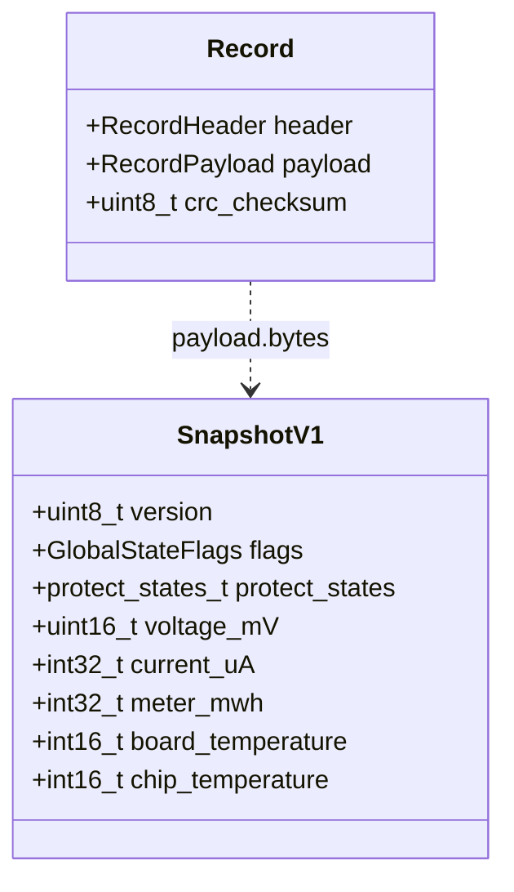

# blackbox_structured

黑匣子结构化数据日志模块，定义业务相关的 payload 格式并将当前系统状态写入黑匣子。位于 app 层，是 middleware/blackbox 的上层消费者。

## 模块特点

- **业务数据定义在 app 层**：`SnapshotV1` 是独立于运行时 `GlobalState` 的落盘协议
- **版本化快照**：首字节为版本号，字段变化时新增版本以保持历史日志可解析
- **编译期大小检查**：`static_assert` 确保 payload 不超过 `Blackbox::PAYLOAD_SIZE`
- **自动获取当前状态**：`append_snapshot()` 自动从 `get_global_state()` 采样

## 架构与数据流




## 数据结构

### SnapshotV1（20/25 字节）

| 字段 | 类型 | 说明 |
|------|------|------|
| `version` | `uint8_t` | 快照版本，当前为 1 |
| `flags` | `GlobalStateFlags` | 诊断状态位 |
| `protect_states` | `protect_states_t` | 四路保护状态 |
| `voltage_mV` / `current_uA` | 整数 | 电压与电流 |
| `meter_mwh` | `int32_t` | LP Core 开机以来累计能量，写入时由 `GlobalState::meter_uwh / 1000` 转换 |
| `board_temperature` / `chip_temperature` | `int16_t` | 温度，单位 0.01°C |

> 不要直接持久化 `GlobalState`。字段语义变化时新增快照版本并在读取端分版本解析。

## 集成与使用

```cpp
#include "blackbox_structured.h"

// 写入一条结构化日志（自动采样当前 GlobalState）
BlackboxStructured::append_snapshot();

// 读取时解读 payload
auto raw = Blackbox::read(0);
if (raw.header.type == Blackbox::LogType::STRUCTURED) {
    BlackboxStructured::SnapshotV1 payload;
    memcpy(&payload, raw.payload.bytes, sizeof(payload));
    printf("电压: %dmV, 电流: %duA\n",
           payload.voltage_mV,
           payload.current_uA);
}
```

## API 参考

### `esp_err_t append_snapshot()`

采样当前 `GlobalState` 并作为 `STRUCTURED` 类型写入黑匣子。

## 环境与依赖

| 类别 | 要求 |
|------|------|
| 框架 | ESP-IDF v6.0+ |
| 组件依赖 | `blackbox`, `global_state` |
