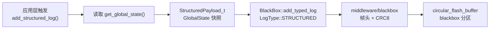
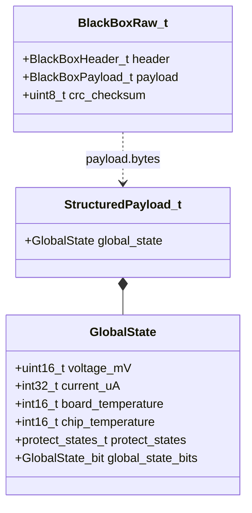

# blackbox_structured

黑匣子结构化数据日志模块，定义业务相关的 payload 格式并将当前系统状态写入黑匣子。位于 app 层，是 middleware/blackbox 的上层消费者。

## 模块特点

- **业务数据定义在 app 层**：`StructuredPayload_t` 包含 `GlobalState`，与 middleware 层解耦
- **编译期大小检查**：`static_assert` 确保 payload 不超过 `BlackBox::PAYLOAD_SIZE`
- **自动获取当前状态**：`add_structured_log()` 自动从 `get_global_state()` 采样

## 架构与数据流





## 数据结构

### StructuredPayload_t（25 字节可用空间内）

| 字段 | 类型 | 说明 |
|------|------|------|
| `global_state` | `GlobalState` | 全局状态快照（15 字节） |

> 当前 payload 仅使用 15/25 字节，剩余空间可按需扩展（如添加事件标志位、错误码等）。

## 集成与使用

```cpp
#include "blackbox_structured.h"

// 写入一条结构化日志（自动采样当前 GlobalState）
BlackBoxStructured::add_structured_log();

// 读取时解读 payload
auto raw = BlackBox::get_log(0);
if (raw.header.type == BlackBox::LogType::STRUCTURED) {
    BlackBoxStructured::StructuredPayload_t payload;
    memcpy(&payload, raw.payload.bytes, sizeof(payload));
    printf("电压: %dmV, 电流: %duA\n",
           payload.global_state.voltage_mV,
           payload.global_state.current_uA);
}
```

## API 参考

### `esp_err_t add_structured_log()`

采样当前 `GlobalState` 并作为 `STRUCTURED` 类型写入黑匣子。

## 环境与依赖

| 类别 | 要求 |
|------|------|
| 框架 | ESP-IDF v6.0+ |
| 组件依赖 | `blackbox`, `global_state` |
