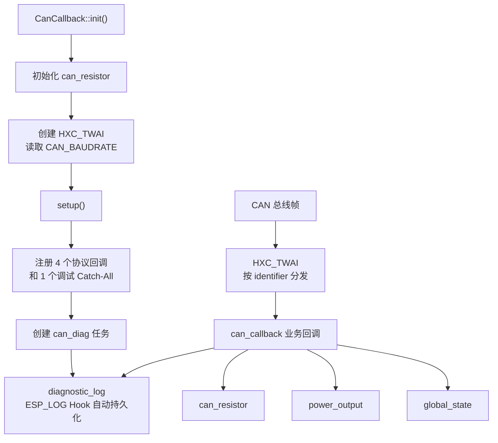

# can_callback

`can_callback` 是设备 CAN 应用协议的入口。它初始化 CAN 终端电阻和 TWAI 驱动，注册设备支持的命令，并启动一个诊断任务记录总线异常。

初次阅读时可以先记住：`HXC_TWAI` 负责收发和按 ID 分发，`can_callback` 负责“收到某条命令后做什么”。

## 设计目标

- 集中注册设备 CAN 命令，避免业务回调散落在不同模块。
- 使用 NVS 保存设备 ID 和波特率。
- 将输出控制、终端电阻控制和状态查询连接到对应业务组件。
- 每秒检查 CAN 错误计数，变化时输出 `WARN` 诊断事件并强制记录状态快照。

## 架构



回调执行过程已经在下方协议表中逐条列出，因此这里不再展开每个回调的时序图。

## CAN ID 规则

设备命令 ID 由基础设备 ID 和命令偏移相加得到：

```text
实际帧 ID = CAN_ID + CALLBACK_ID
```

| 偏移 | 名称 | 作用 |
|------|------|------|
| `0x00` | `CALLBACK_PING` | 原样回复收到的帧 |
| `0x01` | `CALLBACK_GET_STATE` | 返回 8 字节设备状态 |
| `0x02` | `CALLBACK_SET_OUTPUT` | 开关输出 |
| `0x03` | `CALLBACK_SET_RESISTOR` | 开关 CAN 终端电阻 |

默认 `CAN_ID` 为 `0x400`。`GET_STATE` 回复 ID 大于 `0x7ff` 时使用扩展帧，否则使用标准帧。

## 协议表

| 请求 ID | 请求数据 | 处理动作 | 回复 |
|---------|----------|----------|------|
| `CAN_ID + 0x00` | 任意 | 调用 `send(msg)` 原样回传 | 与请求相同 |
| `CAN_ID + 0x01` | 无要求 | 读取 `global_state` 和终端电阻状态 | `CALLBACK_GET_STATE_DATA_t` |
| `CAN_ID + 0x02` | `data[0] == 0x01` 表示开启，其他值表示关闭 | 调用 `PowerOutput::on()` 或 `off()`，并输出持久化诊断事件 | 无 |
| `CAN_ID + 0x03` | `data[0] == 0x01` 表示开启，其他值表示关闭 | 调用 `CanResistor::set()`，并输出持久化诊断事件 | 无 |
| `-1` | 任意 | 调试 Catch-All：打印所有收到的帧 | 无 |

> Catch-All 会打印每条 CAN 帧。总线流量较大或准备发布时，应评估是否保留。

## 状态回复格式

`CALLBACK_GET_STATE_DATA_t` 使用 `packed` 布局，大小为 8 字节。CAN 单帧最多携带 8 字节，因此新增字段前必须检查大小。

| 字段 | 类型 | 单位或含义 |
|------|------|------------|
| `voltage_mV` | `uint16_t` | mV |
| `current_mA` | `int16_t` | 电流绝对值，mA |
| `Board_temperature` | `int8_t` | TMP235 板温，1 摄氏度 |
| `Chip_temperature` | `int8_t` | 芯片内温，1 摄氏度 |
| `output_state` | 1 bit | 输出状态 |
| `current_direction` | 1 bit | 代码中 `current_uA > 0` 时为 `1` |
| `CAN_resistor` | 1 bit | CAN 终端电阻状态 |
| `reserved` | 5 bit | 保留 |
| `UVP_flag` | 2 bit | 欠压保护状态 |
| `OVP_flag` | 2 bit | 过压保护状态 |
| `OTP_flag` | 2 bit | 过温保护状态 |
| `OCP_flag` | 2 bit | 过流保护状态 |

## NVS 配置

| 变量 | 默认值 | 说明 |
|------|--------|------|
| `CAN_BAUDRATE` | `1_Mbps` | 初始化 TWAI 时读取，修改后需重新初始化或重启 |
| `CAN_ID` | `0x400` | 注册回调时读取，修改后需重新初始化或重启 |

## 使用方式

```cpp
#include "can_callback.h"

ESP_ERROR_CHECK(CanCallback::init());

if (CanCallback::is_available()) {
    HXC_TWAI& bus = CanCallback::get_can_bus();
    bus.send(&msg);
}
```

`get_can_bus()` 会直接解引用内部指针。只有 `init()` 成功或 `is_available()` 返回 `true` 后才能调用。

## 添加新命令

1. 在 `CALLBACK_ID` 中增加偏移值。
2. 在 `CanCallback::init()` 中调用 `add_can_receive_callback_func()` 注册回调。
3. 明确请求数据长度、回复格式和标准帧/扩展帧要求。
4. 若回复结构可能超过 8 字节，增加 `static_assert`。
5. 更新本 README 的协议表。

## 环境与依赖

- ESP-IDF v6.0+
- C++20

<!-- dependency-links:start -->
## 依赖导航

工程内直接依赖：

- [`global_state`](../global_state/README.md)（`app`）
- [`power_output`](../power_output/README.md)（`app`）
- [`protect`](../protect/README.md)（`app`）
- [`can_resistor`](../../middleware/can_resistor/README.md)（`middleware`）
- [`hardware`](../../bsp/hardware/README.md)（`bsp`）
- [`HXC_NVS`](../../bsp/HXC_NVS/README.md)（`bsp`）
- [`HXC_TWAI`](../../bsp/HXC_TWAI/README.md)（`bsp`）
- [`diagnostic_log`](../../common/diagnostic_log/README.md)（`common`）

> 本节按当前 `CMakeLists.txt` 的 `REQUIRES` / `PRIV_REQUIRES` 维护。
<!-- dependency-links:end -->
