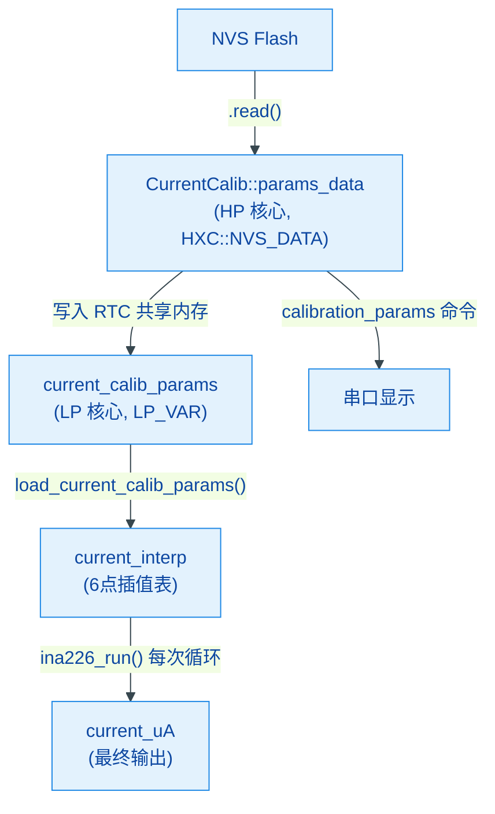

# 电流校准组件 (Current Calibration)

## 概述

本组件实现了 INA226 大电流功率计的**正交解耦标定与温度补偿**方案，运行在 ESP32 的 LP（ULP）协处理器上。方案将电流测量的误差源拆分为两个独立的维度：

- **电流域（冷态非线性）**：通过基准线性系数 + 6 点分段线性插值修正
- **温度域（温漂）**：通过线性温漂系数进行 ppm 级全局补偿

## 面临的物理挑战

| 挑战 | 描述 |
|------|------|
| 低端非线性与死区 | 0~1A 区间受 INA226 失调电压和底噪影响，呈现非线性 |
| 高端温漂 | 15A~25A 持续工作时分流器发热（60℃~80℃），正温度系数导致阻值变大，相同电流下检测电压偏高，读数偏大 |
| 瞬态热延迟 | 40A 瞬态电流下分流器仍为冷态，若应用高温补偿则会产生过度补偿 |
| ULP 算力瓶颈 | LP 核心无硬件浮点单元，内存极小，无法运行复杂浮点运算或重型容器 |

## 数学模型

### 物理世界完整模型

INA226 读取的 ADC 原始电压：

$$V_{ADC} = [I \cdot R(T) + V_{Seebeck}(\nabla T) + V_{Offset}] \cdot (1 + E_{Gain}) + V_{Noise}$$

在 ULP 协处理器中实时求解此多变量耦合方程不现实，因此进行正交解耦简化。

### 步骤 1：电流域简化（冷态 $T = T_0$）

当系统冷态（$\Delta T = 0$），模型坍缩为：

$$V_{ADC} = (I \cdot R_0 + V_{Offset}) \cdot (1 + E_{Gain})$$

电流 $I$ 的表达式：

$$I = \frac{V_{ADC}}{R_0 \cdot (1 + E_{Gain})} - \frac{V_{Offset}}{R_0}$$

可见 $I / V_{ADC}$ 不是常数，而是随电流变化的非线性函数。代码将其拆分为**线性基准 + 非线性偏移**：

```
current_uA = current_base_K × shunt_register_raw + interpolate(shunt_register_raw) × 100
```

- `current_base_K × shunt_register_raw`：线性基准项，给出电流的一阶近似
- `interpolate(shunt_register_raw)`：6 点分段线性插值修正项，吸收 $R_0$ 初始公差、$E_{Gain}$ 和 $V_{Offset}$ 带来的非线性偏移

### 步骤 2：温度域简化

忽略二阶温度系数 $\beta$ 和塞贝克热电势 $V_{Seebeck}$，阻值方程简化为：

$$R(T) \approx R_0 \cdot [1 + \alpha(T - T_0)]$$

引入系统级温漂系数 `temperature_K`（单位：ppm/℃），得到固件温补公式：

```
delta_temp = (Board_temperature - BASE_TEMPERATURE) / 100    // 偏离基准温度的整数度数
temp_comp_uA = (current / 1000) × temperature_K × delta_temp / 1000
current_final = current - temp_comp_uA
```

这等价于 `temp_comp_uA = current × temperature_K × delta_temp / 1,000,000`，即标准 ppm 漂移修正。两次除以 1000 而非一次除以 1,000,000 是为了避免大电流（数百万 uA）时的整数溢出。

### 40A 瞬态处理

当瞬态电流超出 25A 校准上限时，插值引擎自动**继承最大校准点的偏移值**（Clamp）。此时 PCB 温度传感器仍为常温，温漂补偿量接近 0，完美契合"瞬态大电流 = 冷态大电流"的物理本质。

## 数据结构

### `params_t` — 校准参数（NVS 持久化）

定义在 `CurrentCalib.h` 中：

```c
struct point_t {
    int16_t register_value;     // INA226 Shunt 寄存器原始值
    int16_t offset_current_100uA;  // 该寄存器值对应的电流偏移修正量（单位：100uA）
} __attribute__((packed, aligned(4)));

struct params_t {
    uint16_t current_base_K;    // 基准线性系数（单位：uA / register LSB）
    point_t   points[6];        // 6 个校准点
    int16_t   temperature_K;    // 温漂系数（单位：ppm/℃）
} __attribute__((packed, aligned(4)));
```

总大小：2 + 6×4 + 2 = **28 字节**（4 字节对齐，跨核心共享安全）。

| 字段 | 类型 | 单位 | 说明 |
|------|------|------|------|
| `current_base_K` | `uint16_t` | uA/LSB | 线性基准系数 |
| `points[0..5].register_value` | `int16_t` | LSB | 校准点处的 Shunt 寄存器原始值 |
| `points[0..5].offset_current_100uA` | `int16_t` | 100uA | 校准点处线性基准与真实电流的偏差 |
| `temperature_K` | `int16_t` | ppm/℃ | 每偏离基准温度 1℃ 的电流漂移 ppm 值 |
| `BASE_TEMPERATURE` | `constexpr int32_t` | 0.01℃ | 标定基准温度 |

### `current_base_K` 的物理含义

INA226 Shunt 电压寄存器的 1 LSB = 2.5 μV。`current_base_K` 表示 **Shunt 寄存器每增加 1 LSB 时，对应的电流增量**，单位为 `uA/LSB`。

对于真实采样电阻值为 $R_{shunt}$ 的合金分流器，有：

$$V_{shunt} = raw \times 2.5\mu V$$

$$I = \frac{V_{shunt}}{R_{shunt}}$$

若 $R_{shunt}$ 使用 $\mu\Omega$ 作为单位，则：

$$I(A) = raw \times \frac{2.5}{R_{shunt}(\mu\Omega)}$$

换算到固件使用的 `uA` 单位后：

$$I(\mu A) = raw \times \frac{2.5 \times 10^6}{R_{shunt}(\mu\Omega)}$$

因此：

$$current\_base\_K = \frac{2.5 \times 10^6}{R_{shunt}(\mu\Omega)} \quad (\text{uA/LSB})$$

也可以写成毫欧形式：

$$current\_base\_K = \frac{2500}{R_{shunt}(m\Omega)} \quad (\text{uA/LSB})$$

### `current_base_K` 与真实采样电阻的相互转换

如果已知真实采样电阻值，可以直接计算应写入的 `current_base_K`：

```text
current_base_K = 2,500,000 / Rshunt_uΩ
current_base_K = 2,500 / Rshunt_mΩ
```

由于 `current_base_K` 在固件中是整数，实际写入时建议四舍五入：

```text
current_base_K = round(2,500,000 / Rshunt_uΩ)
```

如果已知当前固件里的 `current_base_K`，也可以反推等效采样电阻值：

```text
Rshunt_uΩ = 2,500,000 / current_base_K
Rshunt_mΩ = 2,500 / current_base_K
```

这两个反推值表示固件当前线性基准项所等效的采样电阻值，可用于判断 `current_base_K` 是否与实际焊接的分流器匹配。

**示例 1：已知采样电阻，计算 `current_base_K`**

假设真实采样电阻为 `2mΩ`：

```text
Rshunt_mΩ = 2
current_base_K = 2500 / 2 = 1250
```

应写入：

```text
calibration_basek 1250
```

此时 Shunt 寄存器每增加 1 LSB，线性基准电流增加 `1250uA`，也就是 `1.25mA`。

**示例 2：已知 `current_base_K`，反推等效采样电阻**

假设当前参数为：

```text
current_base_K = 1114
```

则等效采样电阻为：

```text
Rshunt_uΩ = 2,500,000 / 1114 ≈ 2244.17uΩ
Rshunt_mΩ = 2,500 / 1114 ≈ 2.244mΩ
```

这说明当前 `current_base_K = 1114` 等效于约 `2.244mΩ` 的采样电阻。

**示例 3：结合真实电流和寄存器值校准**

如果万用表测得真实电流为 `1.23A`，INA226 Shunt 原始寄存器值为 `1104`：

```text
真实电流 = 1.23A = 1,230,000uA
current_base_K = 1,230,000 / 1104 ≈ 1114
```

反推其等效采样电阻：

```text
Rshunt_mΩ = 2500 / 1114 ≈ 2.244mΩ
```

也就是说，这次单点校准相当于告诉固件：当前整条采样链路（分流器真实阻值、焊接电阻、PCB 铜箔、电压采样路径和 INA226 增益误差综合之后）等效为约 `2.244mΩ`。

> 注意：通过真实电流和寄存器值算出的 `current_base_K` 不一定只反映分流器本体阻值，它还会吸收焊接、电路走线、INA226 增益误差等整条测量链路的一阶误差。因此工程上应优先使用实测电流法校准；只有在没有电流校准条件时，才建议根据标称采样电阻值估算。

## 算法运行流程

完整算法在 LP 核心的 `ina226_run()` 中执行（`ulp_main.cpp`）：

```
1. 读取 INA226 Shunt Voltage 寄存器 → shunt_register_raw
2. 死区判断：|shunt_register_raw × current_base_K| < current_dead_zone_uA → current_uA = 0
3. 线性基准 + 插值修正：
   no_temp_cali_current_uA = current_base_K × shunt_register_raw
                           + interpolate(shunt_register_raw) × 100
4. 温漂补偿：
   delta_temp = (Board_temperature - BASE_TEMPERATURE) / 100
   temp_comp_uA = (no_temp_cali_current_uA / 1000) × temperature_K × delta_temp / 1000
   current_uA = no_temp_cali_current_uA - temp_comp_uA
```

### 插值引擎

`UlpNonEquidistantInterp<int16_t, int16_t, 6>` 实现非等间距 6 点分段线性插值：

- **奇对称**：校准表仅存储正数点，负输入取绝对值插值后取反，即 $f(-x) = -f(x)$
- **二分查找**：O(log N) 时间复杂度定位输入所在区间
- **界外截断**：超出校准范围的输入继承边界点值（Clamp），不外推

## 数据流



## 校准操作流程

> ⚠️ **必读**：复刻本工程后，**至少要校准 `current_base_K`**，否则电流读数不会准确。其他校准项（插值点、温漂系数）根据条件和精度需求选做。

### 进入工厂模式

通过串口终端连接设备，执行：

```
factory_mode
```

此命令解锁以下校准命令：`calibration_basek`、`calibration_current_temperatureK`、`calibration_current_points`。

---

### 校准 `current_base_K`（必做）

`current_base_K` 是电流测量的线性基准系数，直接决定读数是否准确。提供简易版和专业版两种方式。

#### 简易版（只需万用表）

适合：没有电子负载和标准电流源的个人复刻者。

**准备**：一台能测电流的普通万用表（精度 0.01A 即可）。

1. **串入万用表**：将万用表拨到电流档，串联到待测回路中（如负载与设备之间）
2. **通电读取**：给设备上电，让负载工作（任何负载都行，LED 灯带、电机、电阻丝都可以，只要电流稳定）
3. **同时读两个数**：
   - 万用表显示的真实电流（如 `1.23A`）
   - 串口执行 `ina226_register`，记下输出的 `current` 值（即 `shunt_register_raw`）
4. **计算**：

```
current_base_K = 真实电流(uA) / shunt_register_raw
```

例如万用表读 `1.23A = 1,230,000 uA`，`shunt_register_raw = 1104`：

```
current_base_K = 1230000 / 1104 = 1114
```

5. **写入**：

```
calibration_basek <计算结果>
```

6. **重启验证**：执行 `reboot`，再对比万用表读数与设备显示是否一致

> 💡 简易版只需要一把万用表和任意负载，5 分钟即可完成。校准后常温下的电流精度通常可达 2%~3%，满足一般使用需求。

#### 专业版（需电子负载）

适合：有电子负载/标准电流源的产线或实验室，追求更高精度。

**条件**：电子负载或可编程电流源、环境温度接近 `BASE_TEMPERATURE`。

1. **控制环境温度**：在接近 `BASE_TEMPERATURE` 的室温下操作（避免风扇直吹或日晒）
2. **施加精确电流**：用电子负载输出 1A 恒定电流（1A 是常用工作点，信噪比适中且分流器不会发热）
3. **快速读数**：

```
ina226_register        # 读取当前 shunt_register_raw
```

4. **计算并写入**：

```
current_base_K = 真实电流(uA) / shunt_register_raw
calibration_basek <value>
```

> 💡 专业版在受控温度下使用精确电流源，校准后常温精度可优于 1%。如需进一步消除非线性误差，继续校准插值点。

---

### 校准插值点（选做，提升全量程精度）

如果只有简易设备，此步可跳过。校准插值点能消除低端非线性（失调电压）和全量程的非线性偏差。

在冷态下（分流器不发热），依次施加 6 个不同电流，记录每个电流下的 Shunt 寄存器原始值和偏差：

> ⚠️ 大电流点必须在**通电后 2 秒内**完成读数，读完立刻断电，否则分流器发热导致冷态数据失效。

对于每个校准点，计算偏差：
```
offset_current_uA = 真实电流(uA) - (current_base_K × shunt_register_raw)
注意：内部存储单位为100uA，固件自动完成换算
```

然后逐点写入：

```
calibration_current_points <index> <register_value> <offset_current_uA>
```

| index | 建议测试电流 | 说明 |
|-------|-------------|------|
| 0 | ~0.1A | 低端，吸收失调电压影响 |
| 1 | ~2A | 低-中过渡段 |
| 2 | ~5A | 中等电流 |
| 3 | ~9A | 中-高过渡段 |
| 4 | ~12A | 大电流 |
| 5 | ~23A | 近满量程 |

**示例**：在 $I_{ref}$ 标准电流下，读得 `shunt_register_raw = X`：

```
线性基准值 = current_base_K × X
偏差(uA) = I_ref(uA) - 线性基准值
calibration_current_points <index> <X> <偏差(uA)>
```

### 校准温漂系数（选做，提升高温精度）

需要大电流持续加热设备并测量温度变化，适合产线或有完整设备的实验室。

1. 施加 20A~25A 恒定电流，使板子持续发热
2. 等待 PCB 温度稳定（如 65℃），记录此时真实电流值和温度
3. 计算温漂系数：

```
temperature_K = (真实电流偏差_ppm) / (温度变化℃)
```

其中：
```
真实电流偏差_ppm = (测量电流 - 真实电流) / 真实电流 × 1,000,000
温度变化℃ = 稳定温度(0.01℃单位) / 100 - BASE_TEMPERATURE / 100
```

设置：

```
calibration_current_temperatureK <value>
```

**示例**：稳态大电流下 PCB 温度升高，设备显示电流偏大（正温度系数导致阻值增大，相同电流下检测电压偏高）：

```
假设：真实电流 25A，设备显示 25.5A（偏大 0.5A）
偏差 ppm = (25.5 - 25.0) / 25.0 × 1,000,000 = +20000 ppm
温度变化 = 65 - 35 = 30℃（高于 BASE_TEMPERATURE）
temperature_K = +20000 / 30 ≈ +667
calibration_current_temperatureK 667
```

> **`temperature_K` 的符号含义**：正温度系数分流器在温度升高时阻值增大，导致检测电压偏高、读数偏大，因此 `temperature_K` 通常为正值。补偿公式 `current_uA = no_temp_cali - temp_comp` 在温度高于基准时 `delta_temp > 0`，正的 `temperature_K` 使 `temp_comp > 0`，从而减去过量的读数。

---

### 验证与重启

设置完成后重启设备：

```
reboot
```

重启后用 `calibration_params` 命令确认参数已正确保存：

```
calibration_params
```

## 查看当前校准参数

```
calibration_params
```

输出示例：

```
Current calibration params:
Calibration current basek: <current_base_K>
Calibration current current points:
Calibration index 0: reg_raw_value <p0.register_value>, no_offset_mA <...>, cali_offset_uA <p0.offset_current_100uA×100>
  ...
Calibration index 5: reg_raw_value <p5.register_value>, no_offset_mA <...>, cali_offset_uA <p5.offset_current_100uA×100>
Calibration current temperatureK: <temperature_K>
```

## 精度分析

| 误差源 | 量级 | 说明 |
|--------|------|------|
| 二阶温漂截断（忽略 $\beta$） | < 0.15% (~37mA@25A) | 锰铜合金 $\beta \approx -0.5\text{ppm}/℃^2$，在 55℃ 温升下可忽略 |
| 分段线性插值 | < 0.05% | 6 点密集覆盖，弦长足够短 |
| 热延迟与动态热梯度 | 1%~2%（瞬态） | 仅在剧烈动态工况下存在，稳态为 0 |
| 40A 瞬态外推 | < 0.05% | 继承 25A 系数，$V_{Offset}$ 占比可忽略 |
| 死区截断 | 取决于 `current_dead_zone_uA` | `current_dead_zone_uA` 对应的小电流以下归零 |

## 文件结构

```
current_calibration/
├── CMakeLists.txt                      # 组件构建配置
├── README.md                           # 本文档
└── include/
    ├── CurrentCalib.h                   # params_t / point_t 数据结构定义
    └── current_calibration.h            # 默认值与 NVS 持久化声明
```

相关运行时代码位于：

| 文件 | 作用 |
|------|------|
| `main/ulp_app/ulp_main.cpp` | LP 核心主程序，校准算法实际执行处 |
| `main/ulp_app/ulp_Interp.hpp` | 非等间距分段线性插值模板类 |
| `main/ulp_loader/ulp_loader.cpp` | HP 核心 → LP 核心的校准参数加载器 |
| `components/app/shell_command/src/shell_command.cpp` | 工厂校准串口命令 |

<!-- dependency-links:start -->
## 依赖导航

工程内直接依赖：

- [`HXC_NVS`](../../bsp/HXC_NVS/README.md)（`bsp`）

> 本节按当前 `CMakeLists.txt` 的 `REQUIRES` / `PRIV_REQUIRES` 维护。
<!-- dependency-links:end -->
