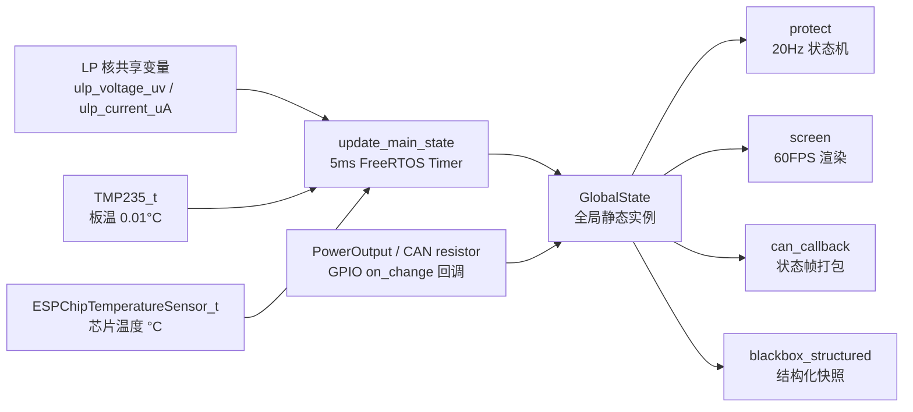
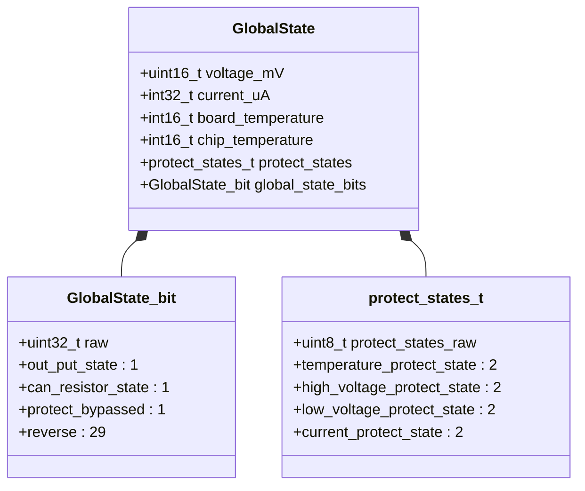

# global_state

全局状态共享模块，提供系统运行时数据的单例访问点，供其他模块（如 protect、UI、通信）统一读写电压、电流、温度及保护状态等关键量。

## 模块特点

- **单例引用**：`get_global_state()` 返回全局唯一 `GlobalState` 引用，零拷贝共享
- **位域压缩**：`GlobalState_bit` 使用位域管理布尔标志，4 字节容纳 32 个开关量
- **`packed` 对齐**：结构体 `__attribute__((packed))` 保证内存布局一致，适合 DMA / 持久化场景
- **与 protect 联动**：内嵌 `protect_states_t` 直接承载保护状态

## 架构与数据流





## 数据结构

| 字段 | 类型 | 说明 |
|------|------|------|
| `voltage_mV` | `uint16_t` | 电压，单位 mV |
| `current_uA` | `int32_t` | 电流，单位 μA |
| `board_temperature` | `int16_t` | 板载温度，单位 0.01°C |
| `chip_temperature` | `int16_t` | 芯片内部温度，单位 0.01°C |
| `protect_states` | `protect_states_t` | 保护状态位域 |
| `global_state_bits` | `GlobalState_bit` | 通用状态位域（输出、CAN 终端电阻、保护旁路等） |

## 集成与使用

```cpp
#include "global_state.h"

auto& state = get_global_state();
state.voltage_mV = 12000;
state.current_uA = 1500000;
bool out = state.global_state_bits.state_bit.out_put_state;
```

## 环境与依赖

- **软件**：ESP-IDF v6.0+、C++11
- **组件依赖**：`protect`（提供 `protect_states_t` 类型定义）
