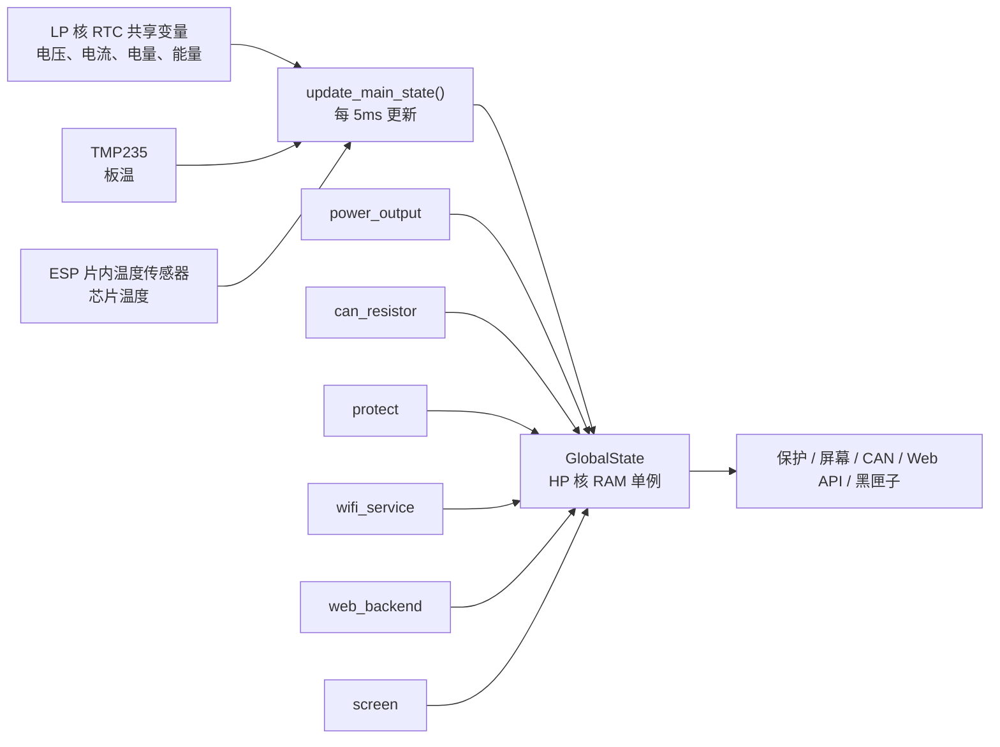
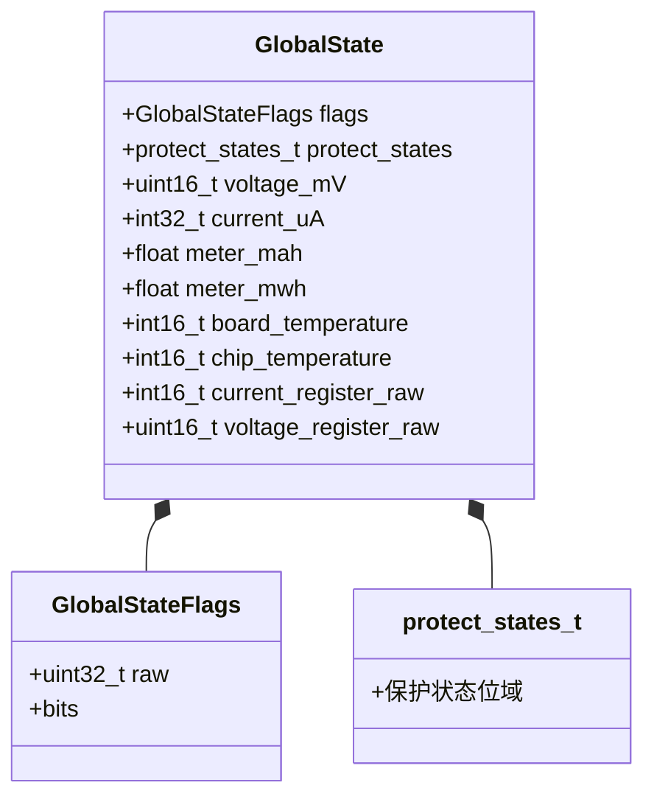

# global_state

`global_state` 是 HP 核运行期状态的共享入口。它把测量值、温度、保护状态和各模块诊断标志集中到一个 `GlobalState` 实例中，供保护、屏幕、CAN、Web 和黑匣子读取。

电压、电流和 INA226 原始寄存器通过 `update_global_measurement()` 同批次发布；
需要跨字段一致性的调用方使用 `get_global_measurement_snapshot()` 读取。

这里的“全局状态”只保存在 RAM 中，不负责持久化。需要掉电保存的数据由 NVS 或黑匣子组件单独处理。

## 设计目标

- 让应用层模块读取同一份实时状态，避免重复采样和多份缓存。
- 用明确的单位保存整数，减少嵌入式代码中的浮点运算。
- 用 32 位位域集中保存开关量和诊断状态。
- 保持结构体固定为 28 字节，便于快照记录。

## 数据流



## 数据结构

字段顺序会影响内存布局。以下顺序与 `include/global_state.h` 一致：



| 字段 | 类型 | 单位 | 来源或用途 |
|------|------|------|------------|
| `flags` | `GlobalStateFlags` | - | 各模块写入的运行状态和诊断标志 |
| `protect_states` | `protect_states_t` | - | `protect` 写入的保护状态 |
| `voltage_mV` | `uint16_t` | mV | LP 核测量值转换后写入 |
| `current_uA` | `int32_t` | uA | LP 核测量值，正负号表示方向 |
| `meter_mah` | `float` | mAh | LP 核累计电量的展示值 |
| `meter_mwh` | `float` | mWh | LP 核累计能量的展示值 |
| `board_temperature` | `int16_t` | 0.01 摄氏度 | TMP235 板载传感器 |
| `chip_temperature` | `int16_t` | 0.01 摄氏度 | ESP 芯片内部传感器 |
| `current_register_raw` | `int16_t` | 原始值 | INA226 分流电压寄存器 |
| `voltage_register_raw` | `uint16_t` | 原始值 | INA226 总线电压寄存器 |

`static_assert(sizeof(GlobalState) == 28)` 会在编译期检查结构大小。修改字段时不要只改 README，也要确认对齐和黑匣子快照是否仍然符合预期。

## Flags 明细

`GlobalStateFlags` 占 4 字节。可以用 `flags.raw` 整体记录，也可以用 `flags.bits.<name>` 访问单个标志。

| 位域 | 写入模块 | 说明 |
|------|----------|------|
| `output_enabled` | `power_output` | 输出是否开启 |
| `can_resistor_enabled` | `can_resistor` | CAN 终端电阻是否开启 |
| `protect_bypassed` | `protect` | 是否绕过保护 |
| `protect_initialized` | `protect` | 保护状态机是否已初始化 |
| `lp_core_running` | `app_main` | LP 核是否已运行 |
| `lp_ina226_initialized` | `app_main` | LP 核侧 INA226 是否初始化成功 |
| `lp_i2c_error` | `app_main` | LP 核 I2C 初始化或访问是否出现错误 |
| `lp_ina226_read_timeout` | `app_main` | INA226 连续 1 秒没有完整采样 |
| `wifi_service_initialized` | `wifi_service` | WiFi 服务是否初始化 |
| `wifi_enabled` | `wifi_service` | WiFi 是否启用 |
| `wifi_sta_connected` | `wifi_service` | STA 是否连接路由器 |
| `wifi_ap_mode` | `wifi_service` | 是否处于 AP 配网模式 |
| `wifi_has_saved_sta` | `wifi_service` | 是否保存过 STA 配置 |
| `wifi_web_enabled_on_boot` | `wifi_service` | 是否配置为启动时开启 Web |
| `web_backend_running` | `web_backend` | Web 后端是否运行 |
| `screen_initialized` | `screen` | 屏幕是否初始化完成 |
| `blackbox_enabled` | `app_main` | 黑匣子是否可用 |

> `lp_ina226_read_timeout` 置位时 LP 核会清零电压、电流，复用 UVP 链路执行保守关断；完整采样恢复后自动清零。

## 使用方式

```cpp
#include "global_state.h"

auto& state = get_global_state();

// 读取实时状态
int32_t current_uA = state.current_uA;
bool output_on = state.flags.bits.output_enabled;

// 同一批次读取电压、电流和 INA226 原始寄存器
GlobalMeasurementSnapshot measurement = get_global_measurement_snapshot();

// 模块更新自己负责的标志
state.flags.bits.screen_initialized = true;
```

## 注意事项

- `get_global_state()` 返回引用，不会复制结构体。
- 普通业务状态仍按简单整数读写；测量相关四个字段由独立临界区提供同批次快照。
- 单位不要混用：温度是 `0.01 摄氏度`，电流是 `uA`，电压是 `mV`。
- `energy_meter` 保留精确的 `int64_t uAh/uWh` HP 缓存，供可重置计量会话使用。
- INA226 原始寄存器随主状态一起同步，业务模块不会绕过跨核锁直接读取 RTC 内存。

## 环境与依赖

- ESP-IDF v6.0+
- C++20

<!-- dependency-links:start -->
## 依赖导航

工程内直接依赖：

- [`protect`](../protect/README.md)（`app`）

> 本节按当前 `CMakeLists.txt` 的 `REQUIRES` / `PRIV_REQUIRES` 维护。
<!-- dependency-links:end -->
