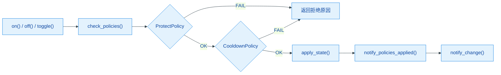

# power_output

功率输出控制模块，基于策略链（Policy Chain）架构管理输出开关操作。每次操作（开/关/切换）依次经过所有已注册策略的检查，全部通过后才执行，支持灵活扩展新的开关约束条件。

## 模块特点

- **策略链架构**：开关条件以策略对象形式注册，按顺序依次检查，任一策略拒绝即阻止操作
- **可扩展**：继承 `OutputPolicy` 实现自定义策略，调用 `add_policy()` 即可加入检查链
- **保护联动**：内置 `ProtectPolicy`，保护状态激活时自动阻止开启输出，保护触发时强制关闭
- **冷却延时**：内置 `CooldownPolicy`，ON/OFF 冷却时间独立设置，防止快速反复切换
- **零堆分配**：策略链和回调列表使用固定大小静态数组，无动态内存分配
- **状态回调**：输出状态变更时通知所有注册的回调函数

## 架构与原理



### 策略接口

每个策略需实现两个方法：

| 方法 | 说明 |
|------|------|
| `check(op, current_state)` | 检查操作是否允许，返回 `OutputResult::OK` 或拒绝原因 |
| `on_state_applied(op, new_state)` | 操作执行后的通知，用于更新策略内部状态（如冷却计时器） |

### 内置策略

| 策略 | 文件 | 检查逻辑 | on_state_applied 逻辑 |
|------|------|----------|----------------------|
| `ProtectPolicy` | `protect_policy.hpp` | 仅 ON 操作检查 `have_protect()`，OFF 始终允许 | 无操作 |
| `CooldownPolicy` | `cooldown_policy.hpp` | ON 操作检查距上次 OFF 的冷却时间，OFF 操作检查距上次 ON 的冷却时间 | 记录对应方向的时间戳 |

### 冷却策略工作方式

冷却时间按操作方向独立设置：

| 常量 | 默认值 | 说明 |
|------|--------|------|
| `OUTPUT_ON_COOLDOWN_MS` | 500 | OFF→ON 冷却：上次 OFF 后多久才能再 ON |
| `OUTPUT_OFF_COOLDOWN_MS` | 0 | ON→OFF 冷却：上次 ON 后多久才能再 OFF |

### 保护联动

初始化时注册保护状态变更回调，当任意保护条件升级为 `PROTECT_STATE_PROTECT` 时，强制关闭输出并通知策略链。

## 文件结构

```
power_output/
├── include/
│   ├── power_output.h          模块 API、枚举、OutputPolicy 基类
│   ├── protect_policy.hpp      保护策略（声明+实现）
│   └── cooldown_policy.hpp     冷却策略（声明+实现）
├── src/
│   └── power_output.cpp        模块核心逻辑
├── CMakeLists.txt
└── README.md
```

## 集成与使用

```cpp
#include "power_output.h"

// 初始化：GPIO 5 输出
PowerOutput::init(GPIO_NUM_5);

// 控制输出
auto result = PowerOutput::on();
if (result != PowerOutput::OutputResult::OK) {
    // 处理拒绝原因
}

PowerOutput::off();
PowerOutput::toggle();

// 查询状态
bool state = PowerOutput::get_state();

// 注册状态变更回调
PowerOutput::add_on_change_callback([](bool new_state) {
    printf("输出状态: %s\n", new_state ? "ON" : "OFF");
});
```

## 添加自定义策略

继承 `OutputPolicy` 并实现 `check()` 和 `on_state_applied()`，建议以独立 `.hpp` 文件管理：

```cpp
// max_on_time_policy.hpp
#include "power_output.h"
#include "esp_timer.h"

class MaxOntimePolicy : public PowerOutput::OutputPolicy {
public:
    explicit MaxOntimePolicy(uint32_t max_ms) : _max_ms(max_ms) {}

    OutputResult check(OutputOperation op, bool current_state) override {
        // 仅在开启时检查，关闭始终允许
        return OutputResult::OK;
    }

    void on_state_applied(OutputOperation op, bool new_state) override {
        if (new_state) {
            _on_time_us = esp_timer_get_time();
        }
    }

private:
    uint32_t _max_ms;
    int64_t _on_time_us = 0;
};

// 注册策略
static MaxOntimePolicy max_on_policy(5000); // 最长开启 5s
PowerOutput::add_policy(&max_on_policy);
```

## API 参考

### `esp_err_t init(gpio_num_t output_gpio)`

初始化模块，配置输出 GPIO。内部自动注册 `ProtectPolicy` 和 `CooldownPolicy`，并监听保护状态变更。冷却时间由 `OUTPUT_ON_COOLDOWN_MS` / `OUTPUT_OFF_COOLDOWN_MS` 常量定义。

### `esp_err_t deinit()`

反初始化模块，关闭输出并清理回调与策略链。

### `OutputResult on()`

开启输出。经过策略链检查，全部通过后执行。

### `OutputResult off()`

关闭输出。经过策略链检查，全部通过后执行。

### `OutputResult toggle()`

切换输出状态。根据当前状态决定执行 ON 或 OFF 操作，经策略链检查后执行。

### `bool get_state()`

返回当前输出状态。

### `void add_on_change_callback(OnOutputChangeCallback cb)`

注册输出状态变更回调，每次状态切换时调用。最多注册 8 个回调。

### `void add_policy(OutputPolicy* policy)`

注册自定义策略到策略链末尾。策略对象的生命周期由调用方管理。最多注册 8 个策略。

### OutputResult 枚举

| 值 | 说明 |
|----|------|
| `OK` | 操作成功 |
| `FAIL_NOT_INIT` | 模块未初始化 |
| `FAIL_PROTECT_ACTIVE` | 保护状态激活，阻止开启 |
| `FAIL_COOLDOWN_ACTIVE` | 冷却时间未到，阻止操作 |

## 环境与依赖

| 类别 | 要求 |
|------|------|
| 框架 | ESP-IDF v5.x |
| RTOS | FreeRTOS |
| 组件依赖 | `cpp_gpio_driver`, `hardware`, `global_state`, `protect`, `esp_timer`, `log`, `freertos` |
