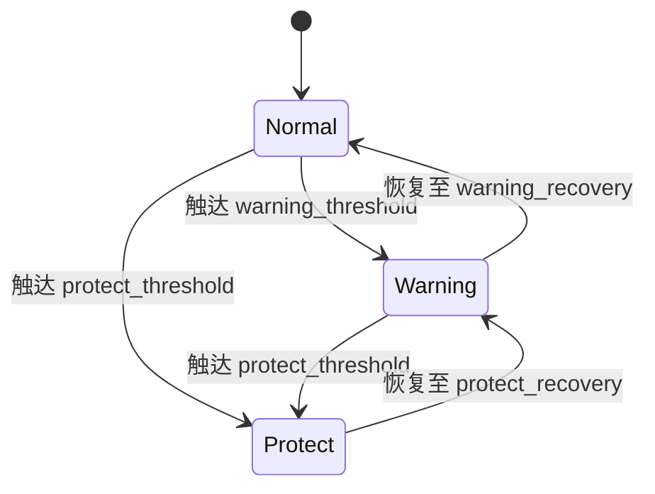
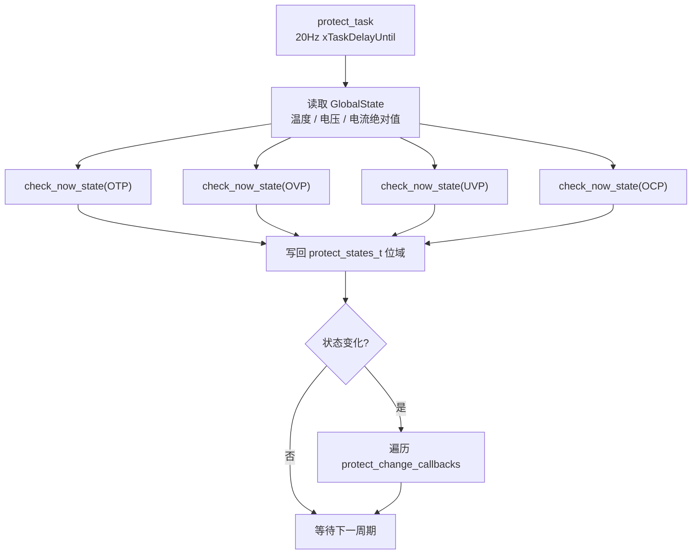
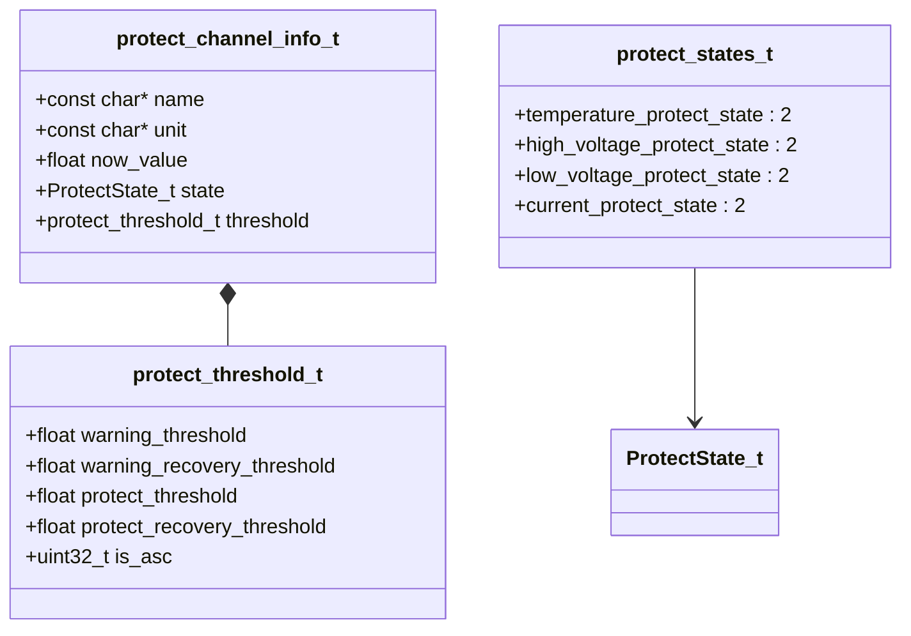

# protect

过流 / 过压 / 欠压 / 过温保护模块，基于 FreeRTOS 任务以 20 Hz 轮询 `global_state` 中的实时数据，按双阈值（告警 + 保护）及滞回逻辑判定状态跃迁，并通过回调通知外部模块。

## 模块特点

- **四级保护维度**：温度、高压、低压、电流，各维度独立判定
- **三态状态机**：`NORMAL → WARNING → PROTECT`，保护解除后经 WARNING 二次确认才回 NORMAL
- **滞回恢复**：告警恢复阈值与触发阈值分离，避免边界抖动
- **双向阈值**：`is_asc` 标志支持越限触发（过流/过压）和越下限触发（欠压）
- **回调机制**：状态变化时触发注册的回调函数
- **保护旁路**：保护检测始终运行，工厂模式可旁路输出阻断与强制关断

## 架构与原理







保护模块将“真实故障状态”和“是否执行保护动作”拆分为两个概念：

- `protect_has_active_fault()` / `have_protect()`：只表示当前是否有任一维度处于 `PROTECT` 状态。
- `protect_should_block_output()`：表示当前是否应该阻止输出开启或强制关断输出。

当 `protect_bypassed = 1` 时，保护任务仍会继续检测、更新状态、触发状态变化回调，屏幕/CAN/Shell 仍能看到真实保护状态；但 `PowerOutput` 的保护策略不会阻止输出开启，保护触发回调也不会强制关断输出。

## 集成与使用

```cpp
#include "protect.h"

protect_init();

add_on_protect_change_callback([](ProtectState_t last, ProtectState_t now) {
    if (now == PROTECT_STATE_PROTECT) {
        // 执行保护动作
    }
});
```

保护输出阻断开关：

```cpp
protect_set_bypassed(false, "ShellCommand");  // 默认安全状态：保护生效
protect_set_bypassed(true, "FactoryMode");    // 工厂模式：保护旁路，只检测不阻断输出

bool fault = protect_has_active_fault();
bool block = protect_should_block_output();
```

## 默认阈值

| 维度 | 告警阈值 | 告警恢复 | 保护阈值 | 保护恢复 | 方向 |
|------|---------|---------|---------|---------|------|
| 温度 | 60°C | 55°C | 80°C | 75°C | 升序 |
| 高压 | 25.5V | 25.3V | 27.5V | 27.0V | 升序 |
| 低压 | 6.6V | 7.2V | 4.7V | 5.0V | 降序 |
| 电流 | 15A | 15A | 25A | 25A | 升序 |

## API 参考

| API | 说明 |
|-----|------|
| `protect_init()` | 启动保护检测任务（优先级 5，2KB 栈） |
| `protect_deinit()` | 停止任务并清除保护状态 |
| `protect_init_ok()` | 返回是否完成首次检测 |
| `add_on_protect_change_callback(cb)` | 注册状态变化回调 |
| `have_protect()` | 是否有任一维度处于 PROTECT 状态 |
| `protect_has_active_fault()` | 是否有任一维度处于 PROTECT 状态，语义同 `have_protect()` |
| `protect_set_bypassed(bypassed, source)` | 设置保护旁路，调用方传入自身静态 TAG；`false`=保护生效，`true`=只检测不阻断输出 |
| `protect_is_bypassed()` | 返回当前保护旁路状态 |
| `protect_should_block_output()` | 是否应该阻止输出开启或强制关断输出 |
| `protect_get_channel_count()` | 获取保护通道数量 |
| `protect_get_channel_info(index, info)` | 读取指定保护通道的名称、单位、当前值、状态和阈值 |

## Shell 命令

每次保护状态切换都会记录通道、前后状态、当前值、阈值、旁路状态、输出状态和
INA226 原始寄存器，并强制追加一条状态快照。`WARNING`、`PROTECT` 和恢复过程都会保留。

`shell_command` 模块注册了 `protect` 命令用于查询和控制保护阻断：

| 命令 | 说明 |
|------|------|
| `protect` | 显示保护开关、旁路状态、active fault，以及 OTP/OVP/UVP/OCP 的当前值、状态、告警阈值、保护阈值和恢复阈值 |
| `protect 1` | 开启保护阻断；如果当前已有 PROTECT 故障，会立即关闭输出 |
| `protect 0` | 关闭保护阻断，保护检测仍继续运行 |
| `factory_mode` | 进入工厂模式并自动执行保护旁路 |

## 环境与依赖

- **软件**：ESP-IDF v6.0+、FreeRTOS、C++11
- **组件依赖**：`global_state`
