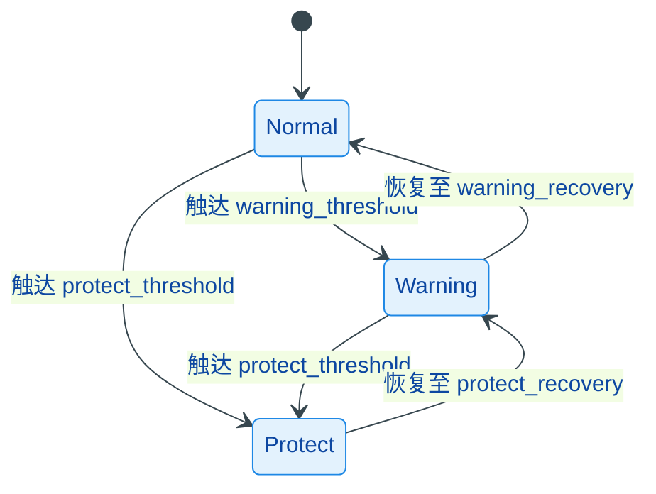

# protect

过流 / 过压 / 欠压 / 过温保护模块，基于 FreeRTOS 任务以 20 Hz 轮询 `global_state` 中的实时数据，按双阈值（告警 + 保护）及滞回逻辑判定状态跃迁，并通过回调通知外部模块。

## 模块特点

- **四级保护维度**：温度、高压、低压、电流，各维度独立判定
- **三态状态机**：`NORMAL → WARNING → PROTECT`，保护解除后经 WARNING 二次确认才回 NORMAL
- **滞回恢复**：告警恢复阈值与触发阈值分离，避免边界抖动
- **双向阈值**：`is_asc` 标志支持越限触发（过流/过压）和越下限触发（欠压）
- **回调机制**：状态变化时触发注册的回调函数

## 架构与原理



## 集成与使用

```cpp
#include "protect.h"

protect_init();

add_on_protect_change_callback([](ProtectState_t last, ProtectState_t now) {
    if (now == PROTECT_STATE_PROTECT) {
        // 执行保护动作
    }
});
```

## 默认阈值

| 维度 | 告警阈值 | 告警恢复 | 保护阈值 | 保护恢复 | 方向 |
|------|---------|---------|---------|---------|------|
| 温度 | 60°C | 55°C | 80°C | 75°C | 升序 |
| 高压 | 25.5V | 25.3V | 27.5V | 27.0V | 升序 |
| 低压 | 6.6V | 7.2V | 4.7V | 5.0V | 降序 |
| 电流 | 15A | 15A | 25A | 25A | 升序 |

## API 参考

| API | 说明 |
|-----|------|
| `protect_init()` | 启动保护检测任务（优先级 5，2KB 栈） |
| `protect_deinit()` | 停止任务并清除保护状态 |
| `protect_init_ok()` | 返回是否完成首次检测 |
| `add_on_protect_change_callback(cb)` | 注册状态变化回调 |
| `have_protect()` | 是否有任一维度处于 PROTECT 状态 |

## 环境与依赖

- **软件**：ESP-IDF v5.x、FreeRTOS、C++11
- **组件依赖**：`global_state`
