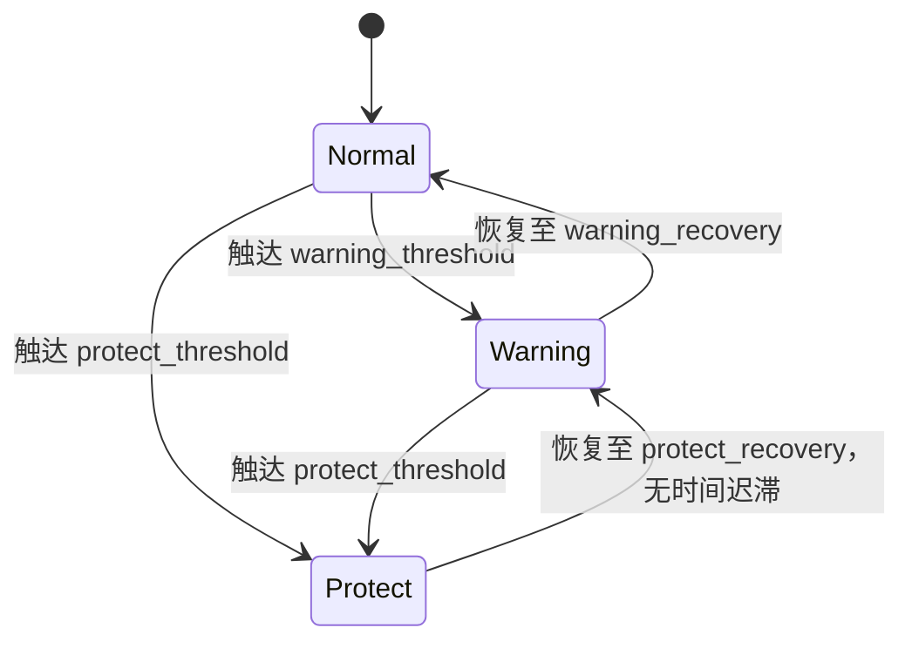
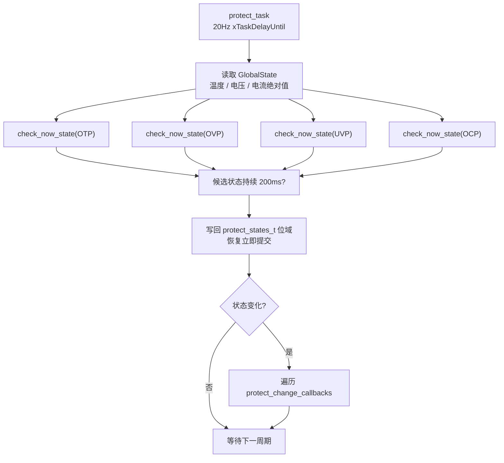
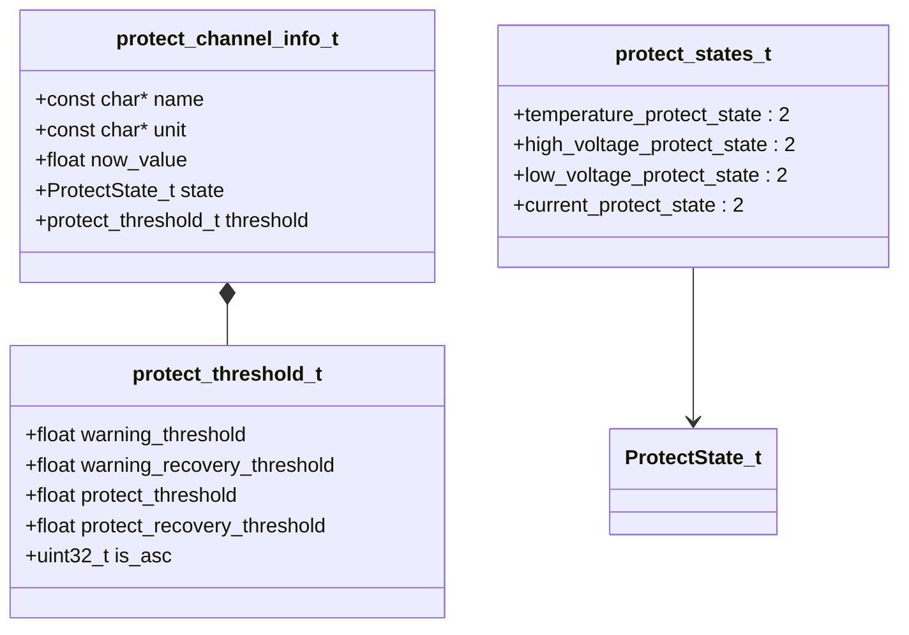

# protect

过流 / 过压 / 欠压 / 过温保护模块，基于 FreeRTOS 任务以 20 Hz 轮询 `global_state` 中的实时数据，按双阈值（告警 + 保护）判定状态跃迁，并通过回调通知外部模块。

## 模块特点

- **四级保护维度**：温度、高压、低压、电流，各维度独立判定
- **三态状态机**：`NORMAL → WARNING → PROTECT`，保护解除时立即按阈值恢复到更轻状态
- **阈值恢复**：告警恢复阈值与触发阈值分离，避免边界抖动；恢复动作不再额外做时间迟滞
- **触发确认**：OTP 触发确认 `200 ms`；OVP / UVP / OCP 依赖 INA226，触发确认 `2000 ms`
- **测量降级**：INA226 未初始化、I2C 错误或读取超时时，OVP / UVP / OCP 不触发输出阻断
- **双向阈值**：`is_asc` 标志支持越限触发（过流/过压）和越下限触发（欠压）
- **回调机制**：状态变化时触发注册的回调函数
- **保护旁路**：保护检测始终运行，工厂模式可旁路输出阻断与强制关断
- **阈值持久化**：四组阈值整体保存到 NVS，首次无配置时使用默认值，修改后立即生效

## 架构与原理


```mermaid
stateDiagram-v2
    [*] --> Normal
    Normal --> Warning : 触达 warning_threshold
    Normal --> Protect : 触达 protect_threshold
    Warning --> Protect : 触达 protect_threshold
    Warning --> Normal : 恢复至 warning_recovery
    Protect --> Warning : 恢复至 protect_recovery，无时间迟滞
```


```mermaid
flowchart TD
    Tick["protect_task<br/>20Hz xTaskDelayUntil"] --> Read["读取 GlobalState<br/>温度 / 电压 / 电流绝对值"]
    Read --> OTP["check_now_state(OTP)"]
    Read --> OVP["check_now_state(OVP)"]
    Read --> UVP["check_now_state(UVP)"]
    Read --> OCP["check_now_state(OCP)"]
    OTP --> Debounce["候选状态持续 200ms?"]
    OVP --> Debounce
    UVP --> Debounce
    OCP --> Debounce
    Debounce --> Store["写回 protect_states_t 位域<br/>恢复立即提交"]
    Store --> Changed{"状态变化?"}
    Changed -->|是| Callback["遍历 protect_change_callbacks"]
    Changed -->|否| Delay["等待下一周期"]
    Callback --> Delay
```


```mermaid
classDiagram
    class protect_threshold_t {
        +float warning_threshold
        +float warning_recovery_threshold
        +float protect_threshold
        +float protect_recovery_threshold
        +uint32_t is_asc
    }
    class protect_channel_info_t {
        +const char* name
        +const char* unit
        +float now_value
        +ProtectState_t state
        +protect_threshold_t threshold
    }
    class protect_states_t {
        +temperature_protect_state : 2
        +high_voltage_protect_state : 2
        +low_voltage_protect_state : 2
        +current_protect_state : 2
    }
    protect_channel_info_t *-- protect_threshold_t
    protect_states_t --> ProtectState_t
```

保护模块将“真实故障状态”和“是否执行保护动作”拆分为两个概念：

- `protect_has_active_fault()` / `have_protect()`：只表示当前是否有任一维度处于 `PROTECT` 状态。
- `protect_should_block_output()`：表示当前是否应该阻止输出开启或强制关断输出。

当 `protect_bypassed = 1` 时，保护任务仍会继续检测、更新状态、触发状态变化回调，屏幕/CAN/Shell 仍能看到真实保护状态；但 `PowerOutput` 的保护策略不会阻止输出开启，保护触发回调也不会强制关断输出。

状态恶化会经过触发确认。OTP 使用 `200 ms`，INA226 相关通道 OVP / UVP / OCP 使用
`2000 ms`，用于过滤电机反电动势、I2C 瞬断和机械振动引起的短时异常。恢复为更轻状态
不做时间迟滞，候选状态恢复为当前状态或变化为另一候选状态时，原计时立即取消。

INA226 相关通道只有在 `lp_ina226_initialized = 1`、`lp_i2c_error = 0` 且
`lp_ina226_read_timeout = 0` 时才参与保护决策。测量链路降级时，OVP / UVP / OCP
会恢复为 `NORMAL`，`protect_should_block_output()` 也不会因为这些通道的旧状态阻止输出。
OTP 不依赖 INA226，仍保持正常保护能力。

## 集成与使用

```cpp
#include "protect.h"

protect_init();

add_on_protect_change_callback([](ProtectState_t last, ProtectState_t now) {
    if (now == PROTECT_STATE_PROTECT) {
        // 执行保护动作
    }
});
```

保护输出阻断开关：

```cpp
protect_set_bypassed(false, "ShellCommand");  // 默认安全状态：保护生效
protect_set_bypassed(true, "FactoryMode");    // 工厂模式：保护旁路，只检测不阻断输出

bool fault = protect_has_active_fault();
bool block = protect_should_block_output();
```

## 默认阈值

| 维度 | 告警阈值 | 告警恢复 | 保护阈值 | 保护恢复 | 方向 |
|------|---------|---------|---------|---------|------|
| 温度 | 60°C | 55°C | 80°C | 75°C | 升序 |
| 高压 | 25.5V | 25.3V | 27.5V | 27.0V | 升序 |
| 低压 | 6.6V | 7.2V | 4.7V | 5.0V | 降序 |
| 电流 | 15A | 15A | 25A | 25A | 升序 |

四组阈值以结构体 blob 保存到 NVS 的 `PROTECT_CFG` 键。保护模块启动时通过
`diagnostic_log` 的 `INFO` 事件记录实际生效的四组阈值，由全局 Hook 自动持久化。
若 NVS 数据非法，则恢复并保存默认值。

修改阈值时统一执行以下校验：

- 所有值必须是有限且非负数。
- 升序通道要求：告警恢复 `<=` 告警 `<=` 保护恢复 `<=` 保护。
- 欠压通道要求：保护 `<=` 保护恢复 `<=` 告警 `<=` 告警恢复。

## API 参考

| API | 说明 |
|-----|------|
| `protect_init()` | 启动保护检测任务（优先级 5，3584 字节栈）和 MOS 诊断任务 |
| `protect_deinit()` | 停止任务并清除保护状态 |
| `protect_init_ok()` | 返回是否完成首次检测 |
| `add_on_protect_change_callback(cb)` | 注册状态变化回调 |
| `have_protect()` | 是否有任一维度处于 PROTECT 状态 |
| `protect_has_active_fault()` | 是否有任一维度处于 PROTECT 状态，语义同 `have_protect()` |
| `protect_set_bypassed(bypassed, source)` | 设置保护旁路，调用方传入自身静态 TAG；`false`=保护生效，`true`=只检测不阻断输出 |
| `protect_is_bypassed()` | 返回当前保护旁路状态 |
| `protect_should_block_output()` | 是否应该阻止输出开启或强制关断输出 |
| `protect_get_channel_count()` | 获取保护通道数量 |
| `protect_get_channel_info(index, info)` | 读取指定保护通道的名称、单位、当前值、状态和阈值 |
| `protect_set_channel_threshold(index, threshold, source)` | 校验、保存并立即应用指定通道阈值 |

## Shell 命令

每次保护状态切换都会记录通道、前后状态、当前值、阈值、旁路状态、输出状态和
INA226 原始寄存器，并强制追加一条状态快照。`WARNING`、`PROTECT` 和恢复过程都会保留。

`shell_command` 模块注册了 `protect` 命令用于查询和控制保护阻断：

| 命令 | 说明 |
|------|------|
| `protect` | 显示保护开关、旁路状态、active fault，以及 OTP/OVP/UVP/OCP 的当前值、状态、告警阈值、保护阈值和恢复阈值 |
| `protect 1` | 开启保护阻断；如果当前已有 PROTECT 故障，会立即关闭输出 |
| `protect 0` | 关闭保护阻断，保护检测仍继续运行 |
| `factory_mode` | 进入工厂模式并自动执行保护旁路 |
| `protect_threshold` | 查询四组保护阈值 |
| `protect_threshold <channel> <warning> <warning_recovery> <protect> <protect_recovery>` | 设置阈值，`channel` 为 `0=OTP`、`1=OVP`、`2=UVP`、`3=OCP` |

## MOS 损坏诊断

MOS 损坏诊断已从 `protect_task` 拆分为独立 FreeRTOS 任务，以 `250 ms` 周期低频运行。
输出关闭后先等待 `3000 ms`，避开 INA226 平均采样、电机惯性和输出电容造成的尾流。
只有 INA226 测量可靠时才会进入检测窗口；测量降级会立即放弃当前窗口。

稳定期结束后，如果检测到的绝对电流持续 `>= 100 mA` 达到 `2000 ms`，任务记录
`mos: suspicious` 事件；持续达到 `5000 ms` 时通过 `ESP_LOGE` 上报
`MOS fault suspected`。输出重新开启、电流回落或 INA226 降级后，诊断窗口会重新开始。

此诊断仅上报硬件故障，不新增保护状态，也不改变输出行为。

## 环境与依赖

- **软件**：ESP-IDF v6.0+、FreeRTOS、C++20

<!-- dependency-links:start -->
## 依赖导航

工程内直接依赖：

- [`global_state`](../global_state/README.md)（`app`）
- [`HXC_NVS`](../../bsp/HXC_NVS/README.md)（`bsp`）
- [`diagnostic_log`](../../common/diagnostic_log/README.md)（`common`）

> 本节按当前 `CMakeLists.txt` 的 `REQUIRES` / `PRIV_REQUIRES` 维护。
<!-- dependency-links:end -->
