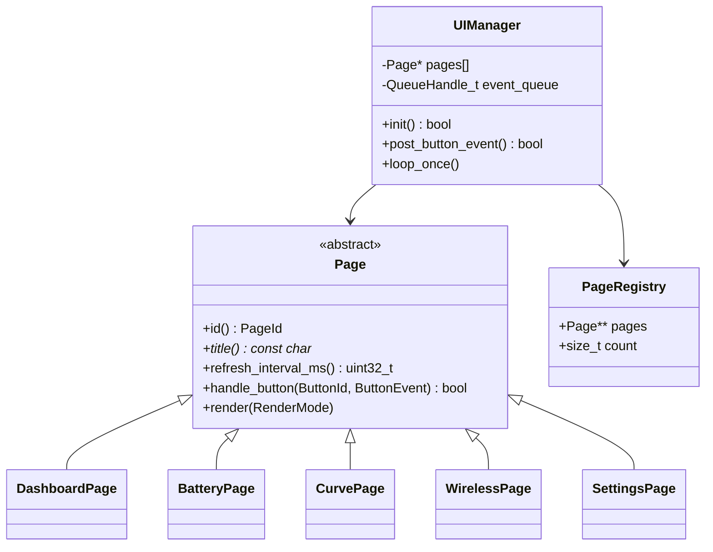
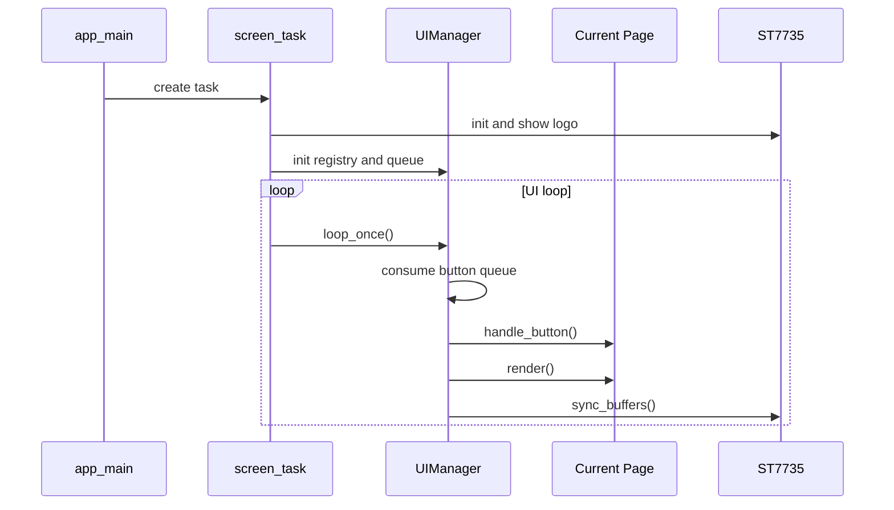
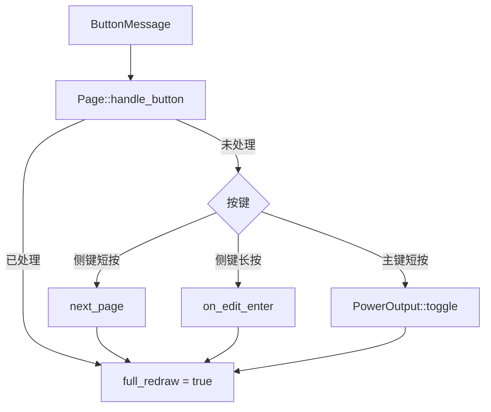
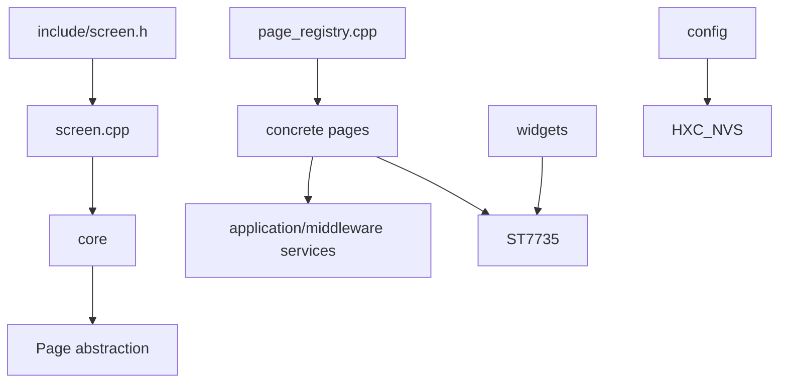

# Screen 架构设计

## 类关系

## 任务时序

页面切换会依次调用旧页面 `on_edit_exit()`、`on_exit()` 和新页面 `on_enter()`。

## 事件分发

页面事件优先于全局默认行为，使 Curve、Wireless 和 Settings 可以复用相同物理按键，
同时避免把页面专属状态写进 `UIManager`。

## 刷新调度

`UIManager` 使用 FreeRTOS tick 计算当前毫秒时间。页面切换或事件处理后忽略页面刷新
周期执行一次完整刷新；其他情况下按 `refresh_interval_ms()` 调度。未到刷新时间时任务
延迟 5ms，避免空转占用 HP Core。

曲线采样独立于当前页面，`CurveHistory::poll()` 每轮 UI 循环都会被调用，因此离开曲线页
后历史数据仍连续。

## 依赖边界

`core` 不包含具体业务服务头文件；具体页面可以依赖业务服务；`widgets` 只依赖显示驱动。
