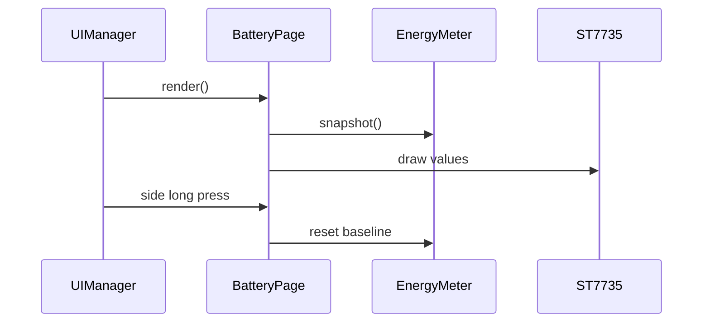

# Battery 页面

页面展示实时 V/A/W、输出状态、共享会话 mWh/mAh、系统运行时间和计量时间。

清零只更新 `EnergyMeter` 基线，不修改 LP Core 累计计数，因此 Web 和 Shell 会同步看到新会话。

## 数值规则

- 实时电压、电流和功率最多显示 3 个数字，小数点不计入数字数。
- 累计值最多显示 6 个数字，随量级增大自动减少小数位。
- 实时电流、功率按绝对值显示；累计电量和能量仍保留 LP Core 的方向符号。
- `S:` 表示系统启动时长，`M:` 表示当前共享计量会话时长。

## 按键

侧键长按调用 `EnergyMeter::reset()` 并记录诊断事件。其他按键返回未处理，由
`UIManager` 执行默认翻页或输出控制。
