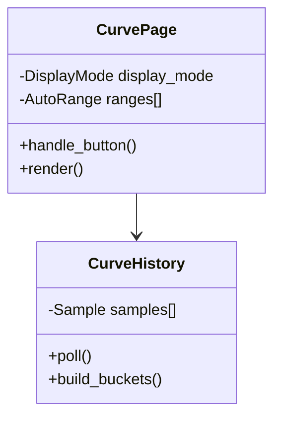
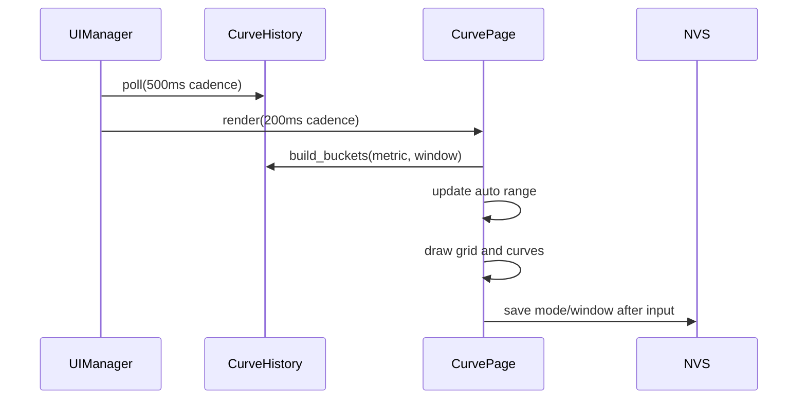

# Curve 页面

## 结构

## 时序

历史缓存固定保存 10 分钟，采样间隔 500ms。短窗口插值铺满横轴，长窗口按像素桶保存最小、最大和平均值。量程超限立即扩张，收缩延迟并渐进执行。

## 数据布局

每个历史点固定 4 字节：`uint16_t voltage_mV` 和 `uint16_t current_mA`。电流存储绝对值，
功率在聚合时由同一采样点的电压、电流计算。缓存容量为 1200 点，不进行堆分配。

## 显示模式

| 模式 | 颜色 | 量程 |
|---|---|---|
| Voltage | 红色 | 独立自动量程 |
| Current | 绿色 | 独立自动量程，接近零时固定零点 |
| Power | 蓝色 | 独立自动量程，接近零时固定零点 |
| All | 红/绿/蓝 | 三个指标分别计算量程后叠加 |

时间窗口支持 10s、30s、2min 和 10min。模式或窗口变化后立即写入 `ui_curve_cfg`；
配置包含版本号，非法数据会恢复为 Voltage + 30s。

## 按键状态

- 普通状态侧键双击：直接切换显示模式。
- 普通状态侧键长按：进入参数编辑。
- 编辑状态侧键短按：切换“显示模式/时间窗口”编辑项。
- 编辑状态主键短按：修改当前编辑项。
- 编辑状态侧键长按：退出编辑。
