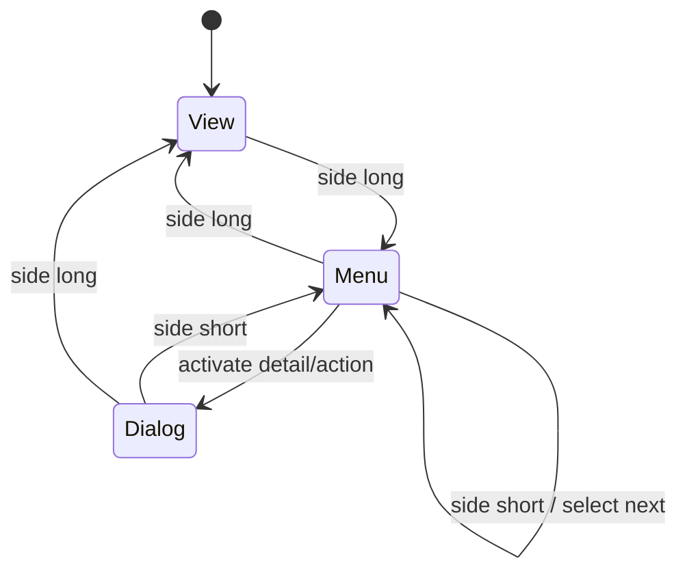
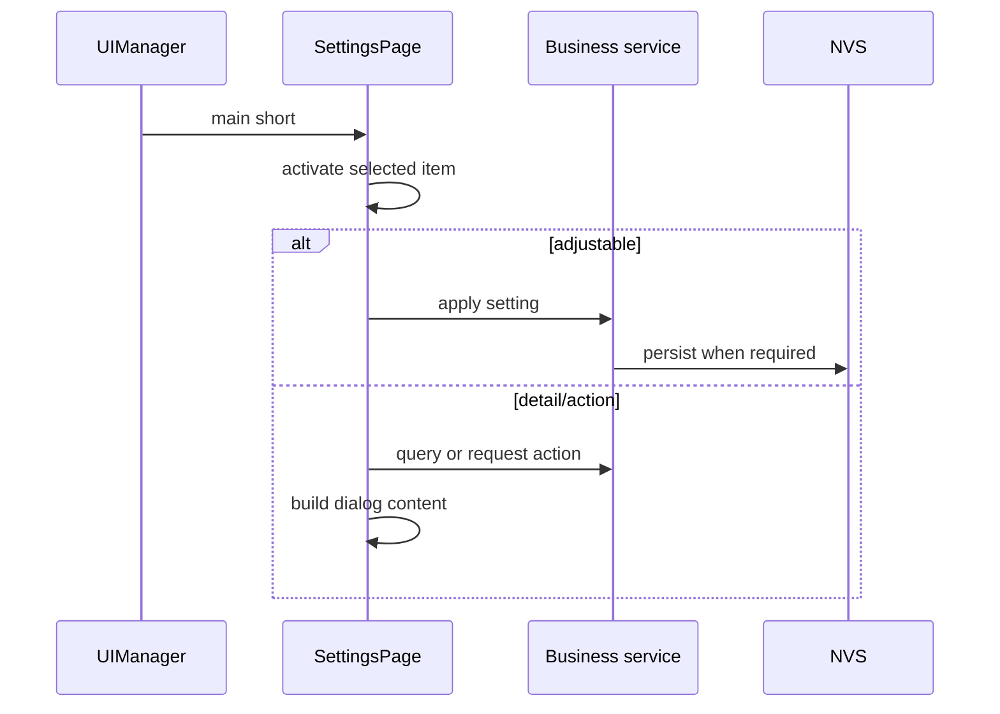
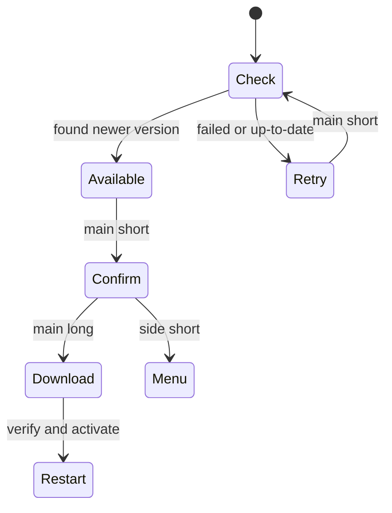

# Settings 页面

设置页包含 View、Menu、Dialog 三种状态，固定显示当前项及前后各一项。

设置业务分为显示、连接和系统诊断三类。所有修改通过对应服务公开接口完成；OTA 使用短按进入确认、长按确认升级的二阶段操作，避免误触。

## 设置项

| 设置项 | 类型 | 持久化/服务 |
|---|---|---|
| Rotate、Bright | 可调 | `display_config` / NVS |
| Web、Protect、BBsnap | 可调 | 对应应用服务 |
| NOWpair、Update | 动作 | ESP-NOW / OTA 异步服务 |
| NOWinfo、Firmware、Blackbox、Calib | 详情 | 只读查询 |
| CANrate、CANRs | 可调 | CAN NVS / 终端电阻服务 |

## OTA 确认流程

弹窗固定使用四行、每行 27 个可见字符的缓冲区，构建内容时必须使用有长度限制的
`snprintf`。设置页在 `on_enter()` 中重新读取旋转和背光配置，避免其他入口修改后显示旧值。
