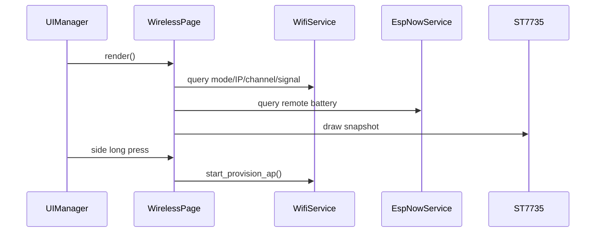

# Wireless 页面

页面先读取 WiFi 模式、IP、信道、信号和遥控开关电量，再绘制状态、信号柱与详情。

长按侧键进入 AP 配网。页面不得直接控制 WiFi 驱动，统一通过 `WifiService`。

## 模式显示

| 模式 | 页面内容 |
|---|---|
| STA | SSID、IP、信道和信号百分比 |
| AP_PROVISION | 配网 AP 名称、AP IP 和满格提示 |
| ESPNOW_ONLY | `ESP-NOW only`、当前信道和遥控开关电量 |
| OFF/错误 | OFF 或最近一次 `esp_err_t` |

遥控开关电量只在本次运行收到合法控制包及电量包后显示，低于或等于 20% 使用红色。
`start_provision_ap()` 可能改变 WiFi/ESP-NOW 共用信道，具体恢复策略由 `WifiService` 和
`espnow_link` 负责，页面不参与链路状态机。
