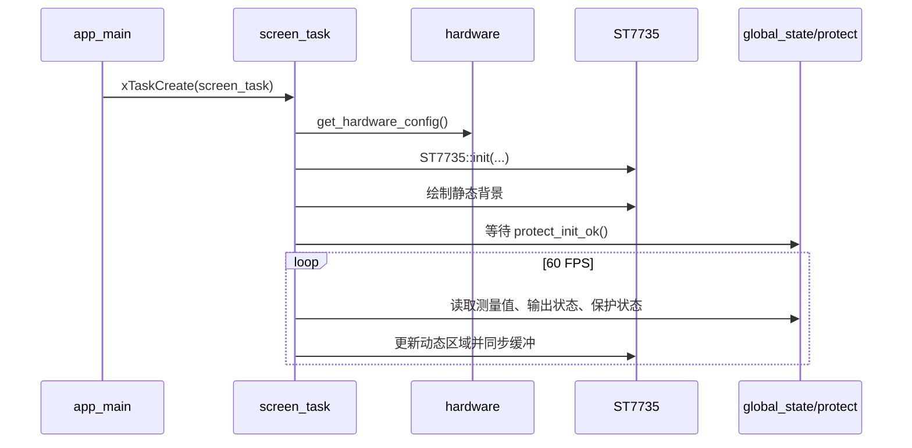

# screen

屏幕显示应用组件，负责初始化 ST7735S TFT，并周期性渲染设备运行状态。

## 模块特点

- **固定显示任务**：`screen_task()` 作为 FreeRTOS 任务运行，当前目标刷新率为 60 FPS
- **硬件配置解耦**：屏幕 SPI、复位、片选、背光等引脚从 `hardware` 组件读取
- **状态集中读取**：显示内容来自 `global_state`，包括电压、电流、功率、温度和输出状态
- **保护状态提示**：读取 `protect_states`，对 OTP、OVP/UVP、OCP 显示 WARNING 或 PROTECT 标识
- **资源复用**：背景、开关图标、告警框、错误框和字体来自 `ui_resources` 与 `Fonts`

## 显示内容

| 区域 | 内容 |
|------|------|
| 主数据区 | 电压、电流、功率、板温 |
| 时间区 | 上电运行时间，格式 `HH:MM:SS` |
| 输出状态 | ON/OFF 图标 |
| 保护状态 | OTP、OVP/UVP、OCP 的告警或保护标识 |

## 启动流程



## 集成与使用

```cpp
#include "screen.h"

xTaskCreate(SCREEN::screen_task, "screen_task", 4096, NULL, 4, NULL);
```

`screen_task()` 内部会初始化 ST7735，因此调用前需要保证 `hardware_config_init()` 已完成。

## API 参考

| API | 说明 |
|-----|------|
| `SCREEN::screen_task(void* arg)` | 屏幕任务入口，初始化屏幕并持续刷新 UI |

## 环境与依赖

- **硬件**：ST7735S 160x80 TFT
- **软件**：ESP-IDF v6.0+、FreeRTOS
- **组件依赖**：`st7735_driver`、`hardware`、`global_state`、`protect`、`ui_resources`、`Fonts`
