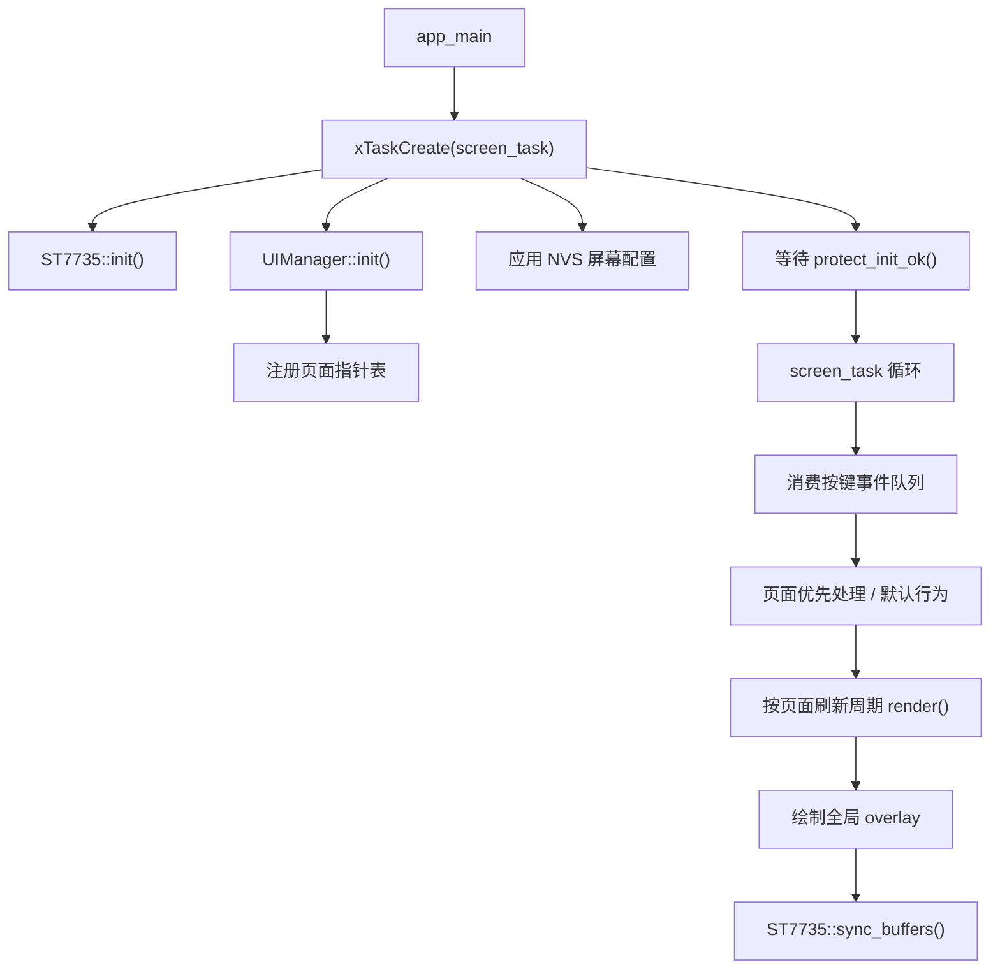
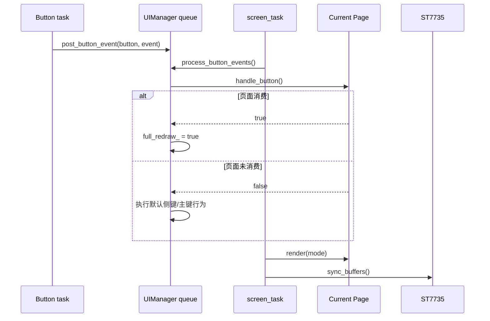

# screen

屏幕 UI 应用组件，负责初始化 ST7735S 160x80 TFT 屏幕，并在 `screen_task()` 中统一管理多页面渲染、按键事件分发、页面切换和全局 UI 提示。

## 模块特点

- **应用层 UI 管理**：`screen` 位于应用层，页面可直接读取 `global_state`、`protect`、`wifi_service`、`can_callback` 等业务状态。
- **多页面架构**：通过 `Page` 基类和 `UIManager` 单例管理主页、电量页、曲线页、无线页、设置页，侧键短按按数组顺序单向循环翻页。
- **跨任务事件队列**：`Button` 回调只调用 `SCREEN::post_button_event()` 投递事件，实际页面切换和状态修改在 `screen_task()` 中串行执行。
- **操作审计**：记录按键类型、当前页面、页面切换和设置页确认修改，不记录周期刷新和绘制。
- **页面刷新周期**：每个页面可通过 `refresh_interval_ms()` 声明刷新周期；按键事件和页面切换会触发一次强制完整刷新。
- **统一编辑提示**：页面进入编辑/菜单状态时，由 `UIManager` 在页面渲染后绘制顶部 1px 黄色提示线。
- **设置持久化**：屏幕旋转和背光档位通过 `HXC_NVS` 保存；设置页选中项仅在本次运行期间保留。
- **资源复用**：静态图标、开关图标、警告/错误标签来自 `ui_resources`，字体来自 `Fonts`。

## 架构与时序





## 页面列表

| 页面 | 类 | 刷新周期 | 说明 |
|------|------|----------|------|
| 主页 | `DashboardPage` | 约 33ms | 显示电压、电流、功率、板温、运行时间、输出状态和保护标签 |
| 电量页 | `BatteryPage` | 250ms | 顶部显示实时电压、电流、功率和输出状态，下方显示累计 `mWh`、`mAh`、系统时间和计量时间；长按侧键清零页面累计值并重新开始计量时间 |
| 曲线页 | `CurvePage` | 200ms | 当前为曲线功能占位页面 |
| 无线页 | `WirelessPage` | 500ms | 顶部显示 WiFi 模式；STA 显示 SSID、IP、信号强度条和信道；AP、关闭及错误状态使用独立布局；长按侧键进入 AP 配网 |
| 设置页 | `SettingsPage` | 200ms | 长按侧键进入菜单，短按侧键切换设置项，短按正面键修改当前设置 |

## 按键行为

### 默认行为

| 按键 | 事件 | 行为 |
|------|------|------|
| 侧键 | 短按 | 单向循环切换到下一页 |
| 侧键 | 长按 | 若当前页支持编辑模式，则进入该页编辑/菜单状态 |
| 侧键 | 超长按 | 预留，当前仅打印日志 |
| 正面键 | 短按 | 调用 `PowerOutput::toggle()` 切换输出 |

### 设置页行为

| 状态 | 按键 | 事件 | 行为 |
|------|------|------|------|
| 普通状态 | 侧键 | 短按 | 下一页 |
| 普通状态 | 侧键 | 长按 | 进入设置菜单 |
| 菜单状态 | 侧键 | 短按 | 切换高亮设置项 |
| 菜单状态 | 正面键 | 短按 | 修改当前设置项 |
| 菜单状态 | 侧键 | 长按 | 退出设置菜单 |

设置页为单层菜单，没有二级编辑状态。所有设置项均通过短按正面键直接切换或循环调整。

### 电量页行为

电量页通过 `energy_meter` 中间件读取 LP Core 自启动以来持续累加的 `uWh` 和 `uAh`。长按侧键时仅更新共享计量基线，不修改 LP Core 的底层积分值；Web 概览页会同步显示清零后的 `mWh`、`mAh` 和计量时间。

`mWh` 和 `mAh` 的数值部分最多显示 6 位数字，小数点不计入位数。页面会随数值增大自动减少小数位数，依次显示为 `999.999`、`9999.99`、`99999.9` 和整数。

## 设置项

| 设置项 | 显示名 | 行为 | 持久化 |
|------|------|------|------|
| 屏幕旋转 | `Rotate` | `0` / `180` 之间切换，立即调用 `ST7735::set_rotation()` | `ui_rot` |
| 背光档位 | `Bright` | 1-5 档循环，映射到 0-255 背光值 | `ui_bl` |
| WiFi 开机启动 | `WiFi boot` | 调用 `WifiService::set_web_enabled_on_boot()` | `wifi_service` 内部 NVS |
| 保护开关 | `Protect` | 调用 `protect_set_bypassed()` | 否，仅运行期 |
| 黑匣子周期快照 | `BB snap` | 在 `OFF`、`1s`、`5s`、`10s`、`30s`、`60s` 之间循环切换 | `blackbox_service` 内部 NVS |
| CAN 波特率 | `CAN baud` | 在 `1M`、`500K`、`250K`、`125K` 之间循环切换，重启后生效 | `CAN_BAUDRATE` |
| CAN 终端电阻 | `CAN term` | 调用 `CanResistor::instance().toggle()` | `can_term` |

## NVS Key

| Key | 类型 | 默认值 | 说明 |
|------|------|------|------|
| `ui_rot` | blob(uint8_t) | `0` | 屏幕是否 180 度旋转，`1` 表示启用 |
| `ui_bl` | blob(uint8_t) | `3` | 背光档位，范围 1-5 |

## 文件结构

```
screen/
├── include/
│   └── screen.h                 公开 API：screen_task、post_button_event
├── private_include/
│   ├── page.h                   Page 抽象基类
│   ├── pages.h                  各页面类声明
│   ├── ui_common.h              公共类型、绘制工具、UI 配置接口
│   └── ui_manager.h             UIManager 声明
├── src/
│   ├── screen.cpp               屏幕任务入口和 ST7735 初始化
│   ├── ui_common.cpp            公共绘制、背光映射、NVS 配置
│   ├── ui_manager.cpp           页面管理、事件分发、渲染调度
│   └── pages.cpp                具体页面渲染和页面内按键行为
├── CMakeLists.txt
└── README.md
```

## 集成与使用

```cpp
#include "screen.h"

xTaskCreate(SCREEN::screen_task, "screen_task", 4096, NULL, 4, NULL);
```

`screen_task()` 内部会初始化 ST7735，因此调用前需要保证 `hardware_config_init()` 已完成。

按键回调不应直接修改 UI 状态，应通过队列投递到屏幕任务：

```cpp
Main_Button.bind_event(ButtonEvent::SHORT_PRESS, []() {
    if (!SCREEN::post_button_event(SCREEN::ButtonId::Main, ButtonEvent::SHORT_PRESS)) {
        PowerOutput::toggle();
    }
});

Side_Button.bind_event(ButtonEvent::SHORT_PRESS, []() {
    SCREEN::post_button_event(SCREEN::ButtonId::Side, ButtonEvent::SHORT_PRESS);
});
```

主按钮保留投递失败回退逻辑，避免屏幕任务未初始化或异常时影响输出控制。

## API 参考

### `void SCREEN::screen_task(void* arg)`

屏幕任务入口。执行 ST7735 初始化、UIManager 初始化、应用 NVS 显示配置、等待保护模块完成首次检查，并持续刷新当前页面。

### `bool SCREEN::post_button_event(ButtonId button, ButtonEvent event)`

向 UIManager 的按键事件队列投递事件。该接口可从 Button 任务调用，成功返回 `true`；若队列尚未创建或写入失败则返回 `false`。

### `enum class ButtonId`

| 值 | 说明 |
|----|------|
| `Main` | 正面主按键 |
| `Side` | 侧边功能按键 |

## 新增页面方式

新增页面时推荐按以下步骤：

1. 在 `PageId` 中添加页面枚举。
2. 继承 `Page` 实现页面类。
3. 在 `UIManager` 中添加页面静态实例。
4. 将页面指针加入 `pages_`，顺序即侧键翻页顺序。
5. 如页面需要拦截按键，重写 `handle_button()`；否则走默认按键行为。

页面渲染建议保持 160x80 固定坐标系。屏幕旋转由 ST7735 驱动处理，页面无需维护两套坐标。

## 环境与依赖

| 类别 | 要求 |
|------|------|
| 硬件 | ST7735S 160x80 TFT |
| 框架 | ESP-IDF v6.0+ |
| RTOS | FreeRTOS |
| 资源组件 | `ui_resources`, `Fonts` |
| BSP/驱动 | `st7735_driver`, `hardware`, `Button`, `HXC_NVS`, `blackbox_service` |
| 应用组件 | `global_state`, `protect`, `wifi_service`, `power_output`, `can_callback` |
| 中间件 | `energy_meter`, `can_resistor` |
