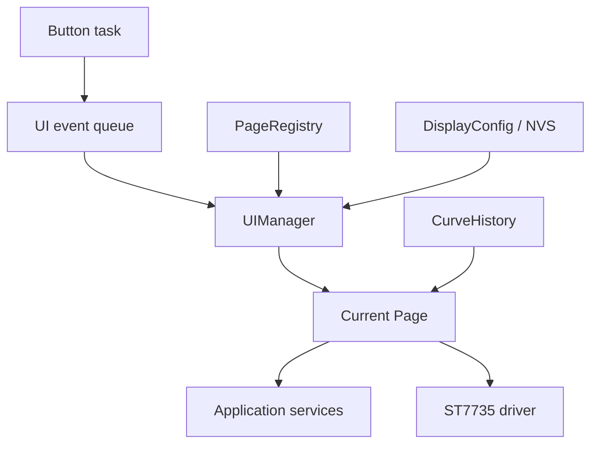

# screen

ESP32-C6 本地屏幕应用组件。组件负责 ST7735S 160×80 显示、页面生命周期、按键事件分发、页面刷新和显示配置持久化。

## 架构


```mermaid
flowchart TD
    Button["Button task"] --> Queue["UI event queue"]
    Queue --> Manager["UIManager"]
    Registry["PageRegistry"] --> Manager
    Manager --> Page["Current Page"]
    Page --> Services["Application services"]
    Page --> Driver["ST7735 driver"]
    Config["DisplayConfig / NVS"] --> Manager
    History["CurveHistory"] --> Page
```

内部按职责分为：

- `core/`：页面抽象、轻量类型、静态注册表和 UI 调度。
- `pages/`：每个具体页面及曲线、设置子域。
- `widgets/`：不依赖业务服务的公共绘制工具。
- `config/`：屏幕旋转、背光和 NVS 持久化。
- `screen.cpp`：LCD、开机画面、按键路由和任务入口。

页面对象由 `page_registry.cpp` 静态创建，运行期不分配页面内存。翻页顺序只在注册表中定义，`UIManager` 不依赖具体页面类型。

## 目录结构

```text
screen/
├── include/screen.h                    对外任务、按键和开机画面 API
├── private_include/
│   ├── core/                           页面抽象、核心类型、注册表、调度器
│   ├── config/                         旋转和背光持久化
│   ├── pages/                          各页面私有声明
│   │   ├── curve/                      曲线页面与历史缓存
│   │   └── settings/                   设置页面
│   └── widgets/                        无业务依赖的公共绘制工具
├── src/
│   ├── screen.cpp                      任务入口、LCD、开机画面和按键绑定
│   ├── core/                           页面注册与事件/刷新调度
│   ├── config/                         NVS 显示配置实现
│   ├── pages/                          各页面独立实现
│   └── widgets/                        公共装饰绘制实现
└── DOC/                                架构和页面详细设计
```

`include/` 仅暴露其他组件真正需要的入口。页面类、注册表和绘制工具全部位于
`private_include/`，其他组件不得直接依赖这些内部接口。

## 启动和运行流程

1. `app_main` 在硬件配置初始化后创建 `screen_task`。
2. `screen_task` 根据硬件版本生成 ST7735 配置并初始化显示驱动。
3. 应用 NVS 中保存的旋转和背光配置，按配置显示开机画面。
4. 等待开机画面时间结束且保护模块完成首次检测。
5. `UIManager::init()` 创建固定长度按键队列并加载静态页面注册表。
6. 主循环持续采集曲线历史、消费按键、按当前页面周期渲染并同步显存。

页面切换和按键处理都在 `screen_task` 中执行。Button 任务只负责无阻塞投递
`ButtonMessage`，因此页面状态和 ST7735 绘制不需要跨任务互斥。

## 页面

| 页面 | 刷新周期 | 详细设计 |
|---|---:|---|
| Dashboard | 约 33ms | [主页](DOC/dashboard.md) |
| Battery | 250ms | [计量页](DOC/battery.md) |
| Curve | 200ms | [曲线页](DOC/curve.md) |
| Wireless | 500ms | [无线页](DOC/wireless.md) |
| Settings | 200ms | [设置页](DOC/settings.md) |

整体任务、注册和事件流见 [架构设计](DOC/architecture.md)。

## 默认按键行为

| 按键 | 事件 | 默认行为 |
|---|---|---|
| 侧键 | 短按 | 切换到注册表中的下一页 |
| 侧键 | 长按 | 当前页面支持编辑时进入编辑状态 |
| 侧键 | 超长按 | 当前保留，仅记录日志 |
| 主键 | 短按 | 通过 `PowerOutput::toggle()` 切换输出 |

页面的 `handle_button()` 拥有优先处理权。页面返回 `true` 后不再执行默认行为，并在
下一轮强制完整刷新。详细的页面专属按键见各页面文档。

## 使用

```cpp
xTaskCreate(SCREEN::screen_task, "screen_task", 3584, nullptr, 4, nullptr);
ESP_ERROR_CHECK(SCREEN::init_buttons());
```

调用前必须完成 `hardware_config_init()`。Button 回调不得直接修改 UI，应通过 `post_button_event()` 投递给屏幕任务。主按键投递失败时保留直接调用 `PowerOutput::toggle()` 的安全回退。

### 公开 API

| API | 说明 |
|---|---|
| `screen_task(void*)` | 初始化 LCD 并运行 UI 主循环 |
| `init_buttons()` | 绑定主键、侧键事件并初始化 GPIO |
| `post_button_event()` | 从其他任务无阻塞投递 UI 按键事件 |
| `get_start_logo_duration_ms()` | 读取开机画面时长，`0` 表示关闭 |
| `set_start_logo_duration_ms()` | 限幅并持久化开机画面时长 |

## 扩展页面

1. 在 `core/ui_types.h` 增加稳定 `PageId`。
2. 新建独立页面头文件和实现文件并继承 `Page`。
3. 在 `core/page_registry.cpp` 创建静态实例并加入页面表。
4. 将源文件加入 `CMakeLists.txt`。
5. 在 `DOC/` 增加页面数据流、交互和依赖说明。

新增页面时保持以下边界：

- 页面只通过应用服务公开接口执行操作，不复制保护、输出或网络策略。
- 页面对象由注册表静态持有，不使用 `new`、动态容器或运行期注册。
- 页面头文件只包含自身成员所需类型，业务依赖尽量留在 `.cpp`。
- 通用绘制能力只有在两个以上页面复用时才下沉到 `widgets/`。
- 页面新增 NVS 数据时必须包含版本或合法性校验，并更新本 README 的 Key 表。

页面使用 160×80 固定逻辑坐标；旋转由显示驱动处理。业务操作必须调用现有服务接口，禁止页面直接操作输出 GPIO。

## 持久化键

| Key | 说明 |
|---|---|
| `ui_rot` | 180° 旋转 |
| `ui_bl` | 1～5 档背光 |
| `ui_curve_cfg` | 曲线显示模式和时间窗口 |
| `ui_logo_ms` | 开机画面时长 |

## 资源和容量

- 按键事件队列固定为 8 项，投递不等待。
- 曲线缓存固定保存 1200 个采样点，每点 4 字节。
- 页面实例、注册表、绘图工作缓冲均采用静态容量。
- 当前页面都执行整屏重绘；`RenderMode` 保留完整刷新语义，不代表驱动已做局部 DMA。

## 约束

- 页面、注册表、曲线缓存和事件队列使用固定容量。
- `core` 与 `widgets` 不依赖 WiFi、OTA 等具体业务。
- 页面可以读取业务状态，但一次渲染应尽量先形成局部快照。
- 所有跨任务输入都在 `screen_task` 串行消费。
- 页面回调不得阻塞等待网络、队列或长时间外设操作；耗时业务应由对应服务异步执行。
- 修改任务栈、缓存或页面成员后应重新检查固件体积和 `screen_task` 栈余量。

## 详细文档

- [核心架构、类关系和事件时序](DOC/architecture.md)
- [Dashboard 实时测量主页](DOC/dashboard.md)
- [Battery 共享计量页](DOC/battery.md)
- [Curve 历史曲线页](DOC/curve.md)
- [Wireless 无线状态与配网页](DOC/wireless.md)
- [Settings 设置、详情与动作页](DOC/settings.md)
