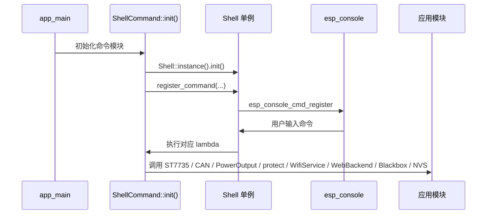
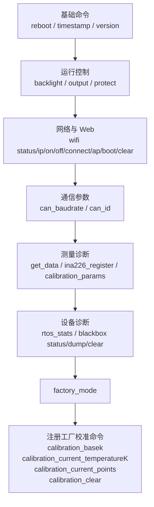

# shell_command

Shell 命令注册模块，在 `ShellCommand` 命名空间内集中管理所有应用层命令的注册与实现。

## 模块特点

- **集中管理**：所有命令在 `init()` 中统一注册，添加命令只需修改一处
- **Lambda 实现**：命令处理函数以 lambda 表达式内联，命令定义与实现紧邻，可读性高
- **标准注释**：每条命令遵循统一注释模板，包含用途、用法、参数和注意事项
- **WiFi/Web/ESP-NOW 控制入口**：`wifi` 命令统一显示共用射频状态；关闭 IP 网络时保留 ESP-NOW
- **黑匣子维护入口**：通过 `blackbox` 命令查询状态、拉取日志、同步清空日志分区和写入测试标记

## 注册与执行时序





## 集成与使用

```cpp
#include "shell_command.h"

// 内部会调用 Shell::instance().init()
ShellCommand::init();
```

## 添加新命令

在 `shell_command.cpp` 的 `init()` 函数中，按以下模板追加：

```cpp
/**
 * @brief  <命令名> - <简要描述>
 * @usage  <命令名> [参数列表]
 * @param  <参数1> - <参数说明>
 * @note   <注意事项>
 */
shell.register_command(ShellCommand_t("<命令名>", "<help文本>", "<hint文本>",
    [](int argc, char** argv) -> int {
        // 命令实现
        return 0;
    }));
```

### 示例：添加带参数的命令

```cpp
/**
 * @brief  echo - 回显输入文本
 * @usage  echo <text>
 * @param  text - 要回显的文本
 */
shell.register_command(ShellCommand_t("echo", "Echo input text", "<text>",
    [](int argc, char** argv) -> int {
        for (int i = 1; i < argc; i++) {
            printf("%s ", argv[i]);
        }
        printf("\n");
        return 0;
    }));
```

## 已注册命令

| 命令 | 说明 | 参数 |
|------|------|------|
| `reboot` | 重启设备 | 无 |
| `timestamp` | 获取系统时间戳(微秒) | 无 |
| `version` | 获取固件版本号与编译时间 | 无 |
| `backlight` | 设置/查询屏幕背光亮度 | `[0-255]` |
| `start_logo` | 设置/查询开机画面显示时长；`0` 表示关闭，修改后重启生效 | `[duration_ms]` |
| `can_baudrate` | 设置/查询 CAN 波特率配置值；修改后重启生效 | `[baudrate]` |
| `can_id` | 设置/查询 CAN ID 配置值，重启或重新初始化后用于回调注册 | `[id]` |
| `get_data` | 获取当前电压、电流、板温 | 无 |
| `meter` | 查询或重置 UI/Web/Shell 共用的电量计量会话，输出相对累计值、LP Core 自启动累计值、计量时间、系统时间和实时功率 | `[status|reset]` |
| `blackbox` | 查询黑匣子状态、拉取日志、同步清空日志分区或写入测试标记 | `[status|dump [count\|all]|pull [count\|all]|clear|mark <text>]` |
| `output` | 设置/查询输出状态 | `[0/1]` |
| `protect` | 设置/查询保护阻断状态和各保护通道 | `[0/1]` |
| `protect_threshold` | 查询或设置保护阈值，修改后立即生效并保存到 NVS | `[channel warning warning_recovery protect protect_recovery]` |
| `wifi` | 管理 WiFi/Web 并显示 ESP-NOW 诊断，支持切换 ESPNOW_ONLY、STA 和 AP 配网 | `status|ip|on|off|connect <ssid> [password]|ap|boot [0/1]|clear` |
| `espnow` | 管理 ESP-NOW 单设备配对窗口和已保存 peer | `status|pair [timeout_s]|stop|clear` |
| `ina226_register` | 查看 INA226 原始寄存器指针值 | 无 |
| `calibration_params` | 查看电流校准参数 | 无 |
| `factory_mode` | 进入工厂模式，旁路保护并注册校准写入命令 | 无 |

### `wifi` 子命令

| 子命令 | 说明 |
|--------|------|
| `wifi` / `wifi status` / `wifi ip` | 打印当前模式、底层 WiFi 状态、Web 是否运行、IP、已保存 SSID、AP SSID、STA/AP MAC、启动开关和最近错误 |
| `wifi on` | 初始化并启动 WebBackend，然后按 NVS 配置启动 WiFiService；优先 STA，失败或未配置时进入 AP 配网 |
| `wifi off` | 关闭 STA/AP 与 Web，进入 `ESPNOW_ONLY`，远程控制链路保持运行 |
| `wifi connect <ssid> [password]` | 启动 WebBackend 并连接指定 STA，成功后保存到 NVS |
| `wifi ap` | 启动 WebBackend 并切换到 AP 配网模式 |
| `wifi boot` | 查询启动时是否自动启用 WiFi/Web |
| `wifi boot <0|1>` | 设置启动时是否自动启用 WiFi/Web |
| `wifi clear` | 清除已保存的 STA SSID 和密码 |

### `espnow` 子命令

| 子命令 | 说明 |
|--------|------|
| `espnow` / `espnow status` | 显示链路状态、配对窗口状态、已配对设备数和当前信道 |
| `espnow pair [timeout_s]` | 开启一次配对窗口，默认 60 秒，范围 1~300 秒 |
| `espnow stop` | 手动退出当前配对窗口 |
| `espnow clear` | 退出配对并清除全部运行期 peer 和 NVS 配对记录 |

每次配对窗口只接入一个设备。配对成功并保存 peer 后，`espnow_service` 会自动退出
配对模式；继续接入其他设备需要再次执行 `espnow pair`。

### `blackbox` 子命令

| 子命令 | 说明 |
|--------|------|
| `blackbox` / `blackbox status` | 打印黑匣子启用状态和已落盘的原始记录数 |
| `blackbox dump [count]` / `blackbox pull [count]` | 先同步在途记录，再按从新到旧顺序输出指定数量的逻辑日志；默认输出最新 100 条。字符串自动拼接且合并后算一条，结构化记录输出十六进制 payload |
| `blackbox dump all` / `blackbox pull all` | 明确请求全量输出所有已落盘日志 |
| `blackbox clear` | 同步清空日志分区；完成后保留一条 `"[Blackbox]: reset"` 标记 |
| `blackbox mark <text>` | 写入单行诊断标记；用于自动化测试定位步骤，文本会截断并过滤换行 |

## 环境与依赖

- **软件**：ESP-IDF v6.0+、C++20

<!-- dependency-links:start -->
## 依赖导航

工程内直接依赖：

- [`blackbox_service`](../blackbox_service/README.md)（`app`）
- [`can_callback`](../can_callback/README.md)（`app`）
- [`current_calibration`](../current_calibration/README.md)（`app`）
- [`espnow_service`](../espnow_service/README.md)（`app`）
- [`global_state`](../global_state/README.md)（`app`）
- [`power_output`](../power_output/README.md)（`app`）
- [`screen`](../screen/README.md)（`app`）
- [`web_backend`](../web_backend/README.md)（`app`）
- [`wifi_service`](../wifi_service/README.md)（`app`）
- [`blackbox`](../../middleware/blackbox/README.md)（`middleware`）
- [`diagnostic_log`](../../common/diagnostic_log/README.md)（`common`）
- [`energy_meter`](../../middleware/energy_meter/README.md)（`middleware`）
- [`espnow_link`](../../middleware/espnow_link/README.md)（`middleware`）
- [`hardware`](../../bsp/hardware/README.md)（`bsp`）
- [`shell`](../../bsp/shell/README.md)（`bsp`）
- [`st7735_driver`](../../bsp/st7735_driver/README.md)（`bsp`）

> 本节按当前 `CMakeLists.txt` 的 `REQUIRES` / `PRIV_REQUIRES` 维护。
<!-- dependency-links:end -->
