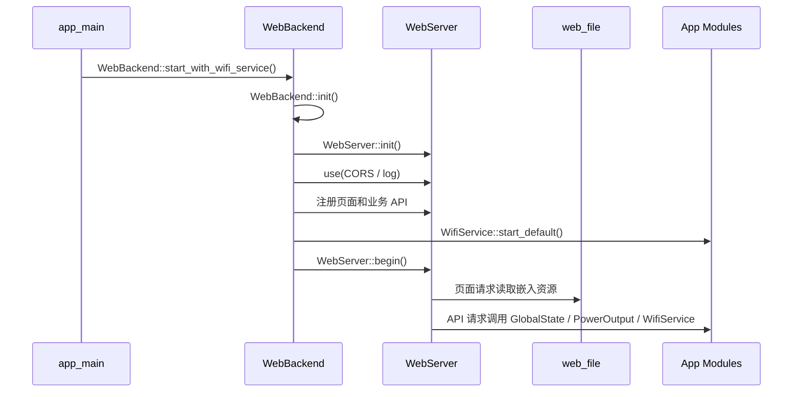

# web_backend

`web_backend` 是设备 Web 后端应用层组件，负责集中注册控制页、配网页和业务 API。底层 HTTP 路由、中间件和请求体读取由 `WebServer` 提供，静态页面资源由 `web_file` 嵌入固件。

## 模块特点

- **集中注册路由**：所有页面和 API 在 `WebBackend::init()` 中注册。
- **按职责拆分实现**：生命周期与路由注册、页面响应、业务 API、日志捕获、JSON 请求解析分别维护在独立源文件中。
- **双页面入口**：主页面用于查看设备状态和控制输出；配网页用于写入 STA WiFi 凭据。
- **设备状态 API**：读取电压、电流、功率、温度、保护状态、输出状态和 WiFi 状态。
- **输出控制 API**：Web 层直接调用 `PowerOutput::on/off/toggle`，输出保护和冷却规则只维护在 `PowerOutput` 策略链中。
- **WiFi 配网 API**：通过 `WifiService` 扫描附近 AP、保存 STA 凭据、切换 AP 配网和查询 WiFi 状态。
- **OTA 升级 API**：流式接收 APP 固件，写入备用分区并校验；用户确认后切换启动分区并重启。
- **黑匣子 API**：分页读取持久化记录、解析版本化快照、导出历史记录、清空分区和设置周期快照。
- **Captive Portal 支持**：AP 配网模式下，未匹配路径可回落到配网页。
- **请求来源审计**：通过 `ESP_LOGI` 记录客户端 IPv4、HTTP 方法和 URI，使串口与 RAM 实时日志一致；写请求额外写入持久化黑匣子。
- **嵌入式内存策略**：响应使用固定静态缓冲，JSON 请求通过 SAX 按字段提取，避免构造完整 JSON DOM。

## 源码结构

| 文件 | 职责 |
|------|------|
| `include/web_backend.h` | 对外公开 API，只暴露初始化、启动、停止和运行状态查询 |
| `private_include/web_backend_internal.h` | 组件内部接口，供多个源文件共享 handler 声明和固定响应缓冲 |
| `src/web_backend.cpp` | 生命周期管理、CORS 中间件、页面/API 路由注册和 404/Captive Portal 回落 |
| `src/page_handlers.cpp` | HTML/CSS 静态资源响应 |
| `src/api_handlers.cpp` | 业务 REST API handler，调用 `PowerOutput`、`WifiService`、`protect` 等应用模块 |
| `src/log_capture.cpp` | ESP 日志捕获、RAM 环形缓冲和请求日志中间件 |
| `src/request_json.cpp` | 请求 JSON 字段读取，基于 nlohmann JSON SAX 接口 |
| `src/ota_handlers.cpp` | OTA 状态、固件流式上传、二次确认激活和远端更新占位接口 |

`private_include` 只通过 `PRIV_INCLUDE_DIRS` 加入本组件编译，不作为跨组件公共头文件使用。其他组件应只包含 `web_backend.h`。

## 内存与 JSON 策略

Web 后端运行在 ESP32-C6 上，RAM 和任务栈都有限，因此当前实现遵循以下约束：

- 响应正文使用 `response_buffer`、`detail_response_buffer`、`scan_response_buffer` 等固定静态缓冲。
- 拼接长 JSON 响应时使用带边界检查的追加函数，缓冲不足时返回 `response_too_large`。
- 请求 JSON 不使用 `nlohmann::json::parse()` 构造 DOM，而使用 SAX 事件流只提取 handler 关心的字段。
- HTTP 请求体不进入日志；业务 handler 只记录必要字段。SSID 可以记录，WiFi 密码禁止记录。
- OTA 固件上传不进入 JSON 缓冲，而通过 `WebServer::stream_body()` 使用固定缓冲流式写入分区。
- 字符串字段复制到调用方提供的固定长度数组，例如 WiFi SSID/password。
- 输出 JSON 仍使用 `snprintf` 手动生成，避免引入运行期堆分配和更大的代码体积。

对 Web 技术不熟悉时可以按下面理解：

- **路由**：URL 路径和处理函数的绑定，例如 `/api/state` 绑定到状态查询 handler。
- **handler**：真正处理一次 HTTP 请求的函数，负责读取请求、调用业务模块、返回响应。
- **middleware**：进入 handler 前统一执行的函数，适合做 CORS、请求日志、鉴权等公共逻辑。
- **CORS/OPTIONS**：浏览器跨来源调用 API 前可能发送的预检请求，本组件统一返回允许的请求方法和 Header。
- **SAX JSON**：解析器逐个回调 key/value，不生成完整对象树，更适合嵌入式设备。

## 路由表

| 路径 | 方法 | 说明 |
|------|------|------|
| `/` | GET | STA 模式返回主页面，AP 配网模式返回配网页 |
| `/index.html` | GET | 返回主页面 |
| `/charts.html` | GET | 返回趋势曲线页面 |
| `/control.html` | GET | 返回控制设置页面 |
| `/status.html` | GET | 返回状态诊断页面 |
| `/logs.html` | GET | 返回实时日志页面 |
| `/blackbox.html` | GET | 返回历史日志页面 |
| `/firmware.html` | GET | 返回固件升级页面 |
| `/app.css` | GET | 返回 Web 公共样式 |
| `/provision` | GET | 返回配网页 |
| `/provision.html` | GET | 返回配网页 |
| `/api/state` | GET | 返回设备状态、保护状态、输出状态和 WiFi 状态 |
| `/api/meter/reset` | POST | 重置屏幕与 Web 共用的电量计量基线和计量时间 |
| `/api/output` | POST | 设置或切换输出状态 |
| `/api/reboot` | POST | 延迟 300ms 后重启设备 |
| `/api/system` | GET | 返回硬件版本、固件版本、当前 APP 分区、MAC 地址、构建时间和运行时间 |
| `/api/backlight` | GET/POST | 查询或设置屏幕背光亮度 |
| `/api/protect` | GET/POST | 查询保护详情或开启/关闭保护功能 |
| `/api/can` | GET/POST | 查询或设置 CAN 波特率和设备 ID |
| `/api/calibration` | GET | 查询电流校准参数 |
| `/api/diagnostics` | GET | 查询 INA226 原始寄存器等诊断数据 |
| `/api/logs` | GET | 按 `since` 增量读取最近 8KB 实时 ESP 日志 |
| `/api/logs/clear` | POST | 清空实时日志缓冲区 |
| `/api/blackbox` | GET | 按 `start` 原始记录游标和 `limit` 逻辑记录数分页读取持久化日志 |
| `/api/blackbox/clear` | POST | 清空黑匣子持久化日志；完成后保留 reset 标记 |
| `/api/blackbox/config` | POST | 设置周期快照间隔，`snapshot_interval_s=0` 表示关闭 |
| `/api/wifi/status` | GET | 返回 WiFiService 模式、IP、SSID、信号、信道和 STA/AP MAC 地址 |
| `/api/wifi/scan` | GET | 扫描附近 WiFi AP，返回 SSID、RSSI、信道和认证类型 |
| `/api/wifi/on` | POST | 按 NVS 配置启动 WiFi/Web |
| `/api/wifi/connect` | POST | 保存并连接 STA WiFi |
| `/api/wifi/ap` | POST | 切换到 AP 配网模式 |
| `/api/wifi/off` | POST | 关闭 WiFiService 管理的网络功能 |
| `/api/wifi/boot` | POST | 设置启动时是否自动启用 WiFi/Web |
| `/api/wifi/clear` | POST | 清除已保存的 STA 凭据 |
| `/api/ota/status` | GET | 查询 OTA 状态、备用分区容量、已写入长度和待升级版本 |
| `/api/ota/upload` | POST | 以 `application/octet-stream` 流式上传 APP 固件，写入备用分区并校验 |
| `/api/ota/activate` | POST | 激活已校验固件，切换启动分区并延迟重启 |
| `/api/ota/abort` | POST | 中止上传或放弃尚未激活的待升级固件 |
| `/api/ota/remote/check` | GET | 预留远端版本检查接口，当前返回 `not_configured` |
| `/api/ota/remote/download` | POST | 预留远端固件拉取接口，当前返回 `not_configured` |

## 集成方式

```cpp
#include "web_backend.h"

WebBackend::start_with_wifi_service();
```

`start_with_wifi_service()` 会内部完成 `WebBackend::init()`，并按 `WifiService` 的 NVS 配置决定是否启动 WiFi/Web。

设备对外访问地址由当前 WiFi 模式决定：

- STA 模式：使用 `WifiService::get_ip()` 获取路由器分配的 IP。
- AP 配网模式：使用 `WifiService::get_ip()` 获取 AP 配网 IP，该地址由 `wifi_service.h` 中的 `AP_IP_OCTET*` 常量定义。

## API 示例

### GET `/api/state`

返回当前测量数据、输出状态、保护状态和 WiFi 状态。

```json
{
  "voltage_v": 7.651,
  "current_a": 0.000,
  "power_w": 0.000,
  "board_temp_c": 34.27,
  "chip_temp_c": 33.50,
  "energy_mwh": 12.345,
  "charge_mah": 1.234,
  "meter_time_ms": 41005,
  "output_on": false,
  "protect_bypassed": false,
  "uptime_ms": 41005,
  "protect": {
    "otp": 0,
    "ovp": 0,
    "uvp": 0,
    "ocp": 0
  },
  "wifi": {
    "mode": "sta",
    "state": 1,
    "ip": "<device-ip>",
    "ap_ssid": "<provision-ap-ssid>",
    "sta_mac": "<sta-mac>",
    "ap_mac": "<ap-mac>",
    "boot_enabled": true,
    "last_error": "none"
  }
}
```

### POST `/api/output`

请求：

```json
{"state": true}
```

响应：

```json
{
  "ok": true,
  "reason": "ok",
  "output_on": true
}
```

`reason` 可能为 `protect_active`、`cooldown_active`、`not_initialized` 等，具体来自 `PowerOutput::OutputResult`。

### GET `/api/wifi/status`

响应：

```json
{
  "mode": "sta",
  "state": 1,
  "ip": "<device-ip>",
  "saved_ssid": "<saved-ssid>",
  "ap_ssid": "<provision-ap-ssid>",
  "rssi": -41,
  "signal_percent": 100,
  "channel": 6,
  "channel_available": true,
  "sta_mac": "<sta-mac>",
  "ap_mac": "<ap-mac>",
  "boot_enabled": true,
  "last_error": "none"
}
```

### POST `/api/wifi/connect`

请求：

```json
{
  "ssid": "<ssid>",
  "password": "<password>"
}
```

连接成功后保存到 NVS；失败时回到 AP 配网模式。

### GET `/api/wifi/scan`

响应：

```json
{
  "ok": true,
  "count": 2,
  "aps": [
    {"ssid": "Example", "rssi": -41, "channel": 6, "auth": "wpa2", "secure": true},
    {"ssid": "OpenWifi", "rssi": -70, "channel": 11, "auth": "open", "secure": false}
  ]
}
```

扫描由用户在配网页触发。AP 配网模式下底层使用 APSTA，扫描期间配网热点保持运行，但无线链路可能有短暂延迟。

### POST `/api/wifi/ap`

切换到 AP 配网模式。响应中的 `ip` 来自 `WifiService::get_ip()`，不应在调用方写死。

### POST `/api/wifi/off`

停止 DNS 劫持、关闭 Captive Portal，并停止底层 WiFi。

## 请求流程



## 注意事项

- Web 输出控制不复制保护逻辑，必须通过 `PowerOutput` 执行。
- 配网页提交的 SSID/password 只在 `WifiService::connect_sta(..., true)` 成功后写入 NVS。
- 配网页保留手动输入 SSID 兜底，扫描只用于辅助选择。
- 不要在 README 或前端调用方写死设备 IP；统一通过 API 返回值或 `WifiService::get_ip()` 获取。
- 路由路径属于 Web 后端接口契约，修改时需要同步前端页面和 README。
- 新增内部函数优先放在现有职责文件中；只有跨源文件共享的声明才放入 `private_include/web_backend_internal.h`。
- 新增 API 请求体字段时优先复用 `request_json.cpp` 的轻量字段读取工具，避免重新写字符串查找逻辑。
- 新增响应时优先估算最大响应长度，并选择合适的固定响应缓冲区。
- OTA 上传使用原始二进制请求体，不使用 `multipart/form-data`；浏览器文件选择体验不受影响。
- OTA 上传完成后只校验固件，必须由用户通过 `/api/ota/activate` 二次确认后才切换启动分区。

## 依赖

| 组件 | 用途 |
|------|------|
| `WebServer` | HTTP 路由、中间件、请求和响应封装 |
| `web_file` | 固件内嵌 HTML 页面资源 |
| `wifi_service` | WiFi 状态、AP 配网和 NVS 凭据管理 |
| `json` | 请求 JSON SAX 解析 |
| `global_state` | 设备测量状态 |
| `energy_meter` | 屏幕、Web 和 Shell 共用的相对电量计量会话 |
| `power_output` | 输出控制策略链 |
| `protect` | 保护状态查询 |
| `st7735_driver` | 背光亮度查询和设置 |
| `can_callback` | CAN 波特率和设备 ID 配置 |
| `current_calibration` | 电流校准参数查询 |
| `hardware` | 硬件版本信息 |
| `esp_app_format` | 固件版本信息 |
| `json` | 请求 JSON SAX 解析 |
| `esp_timer` | 运行时间 |
| `esp_http_server` | HTTP header/CORS 底层接口 |
| `ota_manager` | APP 固件校验、OTA 分区选择和启动分区切换 |
