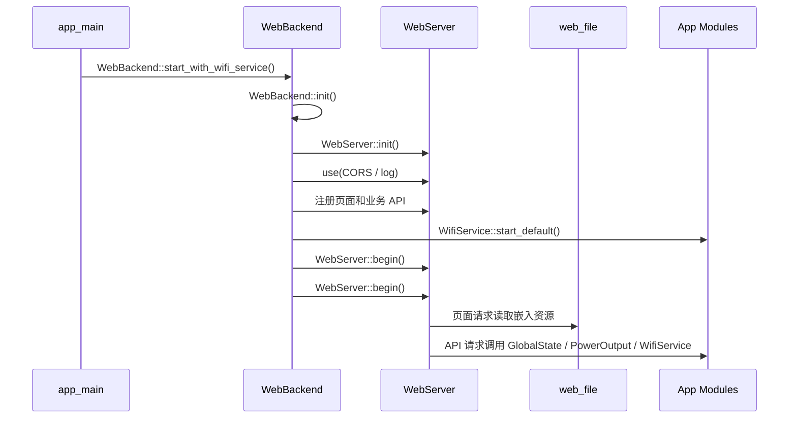

# web_backend

`web_backend` 是设备 Web 后端应用层组件，负责集中注册控制页、配网页和业务 API。底层 HTTP 路由、中间件和请求体读取由 `WebServer` 提供，静态页面资源由 `web_file` 嵌入固件。

## 模块特点

- **集中注册路由**：所有页面和 API 在 `WebBackend::init()` 中注册。
- **双页面入口**：主页面用于查看设备状态和控制输出；配网页用于写入 STA WiFi 凭据。
- **设备状态 API**：读取电压、电流、功率、温度、保护状态、输出状态和 WiFi 状态。
- **输出控制 API**：Web 层直接调用 `PowerOutput::on/off/toggle`，输出保护和冷却规则只维护在 `PowerOutput` 策略链中。
- **WiFi 配网 API**：通过 `WifiService` 扫描附近 AP、保存 STA 凭据、切换 AP 配网和查询 WiFi 状态。
- **Captive Portal 支持**：AP 配网模式下，未匹配路径可回落到配网页。

## 路由表

| 路径 | 方法 | 说明 |
|------|------|------|
| `/` | GET | STA 模式返回主页面，AP 配网模式返回配网页 |
| `/index.html` | GET | 返回主页面 |
| `/charts.html` | GET | 返回趋势曲线页面 |
| `/control.html` | GET | 返回控制设置页面 |
| `/status.html` | GET | 返回状态诊断页面 |
| `/logs.html` | GET | 返回实时日志页面 |
| `/blackbox.html` | GET | 返回黑匣子日志入口页面 |
| `/app.css` | GET | 返回 Web 公共样式 |
| `/provision` | GET | 返回配网页 |
| `/provision.html` | GET | 返回配网页 |
| `/api/state` | GET | 返回设备状态、保护状态、输出状态和 WiFi 状态 |
| `/api/output` | POST | 设置或切换输出状态 |
| `/api/reboot` | POST | 延迟 300ms 后重启设备 |
| `/api/system` | GET | 返回硬件版本、固件版本、IDF 版本、MAC 地址、构建时间和运行时间 |
| `/api/backlight` | GET/POST | 查询或设置屏幕背光亮度 |
| `/api/protect` | GET/POST | 查询保护详情或开启/关闭保护功能 |
| `/api/can` | GET/POST | 查询或设置 CAN 波特率和设备 ID |
| `/api/calibration` | GET | 查询电流校准参数 |
| `/api/diagnostics` | GET | 查询 INA226 原始寄存器等诊断数据 |
| `/api/logs` | GET | 按 `since` 增量读取最近 8KB 实时 ESP 日志 |
| `/api/logs/clear` | POST | 清空实时日志缓冲区 |
| `/api/wifi/status` | GET | 返回 WiFiService 状态和 STA/AP MAC 地址 |
| `/api/wifi/scan` | GET | 扫描附近 WiFi AP，返回 SSID、RSSI、信道和认证类型 |
| `/api/wifi/on` | POST | 按 NVS 配置启动 WiFi/Web |
| `/api/wifi/connect` | POST | 保存并连接 STA WiFi |
| `/api/wifi/ap` | POST | 切换到 AP 配网模式 |
| `/api/wifi/off` | POST | 关闭 WiFiService 管理的网络功能 |
| `/api/wifi/boot` | POST | 设置启动时是否自动启用 WiFi/Web |
| `/api/wifi/clear` | POST | 清除已保存的 STA 凭据 |

## 集成方式

```cpp
#include "web_backend.h"

WebBackend::start_with_wifi_service();
```

`start_with_wifi_service()` 会内部完成 `WebBackend::init()`，并按 `WifiService` 的 NVS 配置决定是否启动 WiFi/Web。

设备对外访问地址由当前 WiFi 模式决定：

- STA 模式：使用 `WifiService::get_ip()` 获取路由器分配的 IP。
- AP 配网模式：使用 `WifiService::get_ip()` 获取 AP 配网 IP，该地址由 `wifi_service.h` 中的 `AP_IP_OCTET*` 常量定义。

## API 示例

### GET `/api/state`

返回当前测量数据、输出状态、保护状态和 WiFi 状态。

```json
{
  "voltage_v": 7.651,
  "current_a": 0.000,
  "power_w": 0.000,
  "board_temp_c": 34.27,
  "chip_temp_c": 33.50,
  "output_on": false,
  "protect_bypassed": false,
  "uptime_ms": 41005,
  "protect": {
    "otp": 0,
    "ovp": 0,
    "uvp": 0,
    "ocp": 0
  },
  "wifi": {
    "mode": "sta",
    "state": 1,
    "ip": "<device-ip>",
    "ap_ssid": "<provision-ap-ssid>",
    "sta_mac": "<sta-mac>",
    "ap_mac": "<ap-mac>",
    "boot_enabled": true,
    "last_error": "none"
  }
}
```

### POST `/api/output`

请求：

```json
{"state": true}
```

响应：

```json
{
  "ok": true,
  "reason": "ok",
  "output_on": true
}
```

`reason` 可能为 `protect_active`、`cooldown_active`、`not_initialized` 等，具体来自 `PowerOutput::OutputResult`。

### GET `/api/wifi/status`

响应：

```json
{
  "mode": "sta",
  "state": 1,
  "ip": "<device-ip>",
  "saved_ssid": "<saved-ssid>",
  "ap_ssid": "<provision-ap-ssid>",
  "sta_mac": "<sta-mac>",
  "ap_mac": "<ap-mac>",
  "boot_enabled": true,
  "last_error": "none"
}
```

### POST `/api/wifi/connect`

请求：

```json
{
  "ssid": "<ssid>",
  "password": "<password>"
}
```

连接成功后保存到 NVS；失败时回到 AP 配网模式。

### GET `/api/wifi/scan`

响应：

```json
{
  "ok": true,
  "count": 2,
  "aps": [
    {"ssid": "Example", "rssi": -41, "channel": 6, "auth": "wpa2", "secure": true},
    {"ssid": "OpenWifi", "rssi": -70, "channel": 11, "auth": "open", "secure": false}
  ]
}
```

扫描由用户在配网页触发。AP 配网模式下底层使用 APSTA，扫描期间配网热点保持运行，但无线链路可能有短暂延迟。

### POST `/api/wifi/ap`

切换到 AP 配网模式。响应中的 `ip` 来自 `WifiService::get_ip()`，不应在调用方写死。

### POST `/api/wifi/off`

停止 DNS 劫持、关闭 Captive Portal，并停止底层 WiFi。

## 请求流程



## 注意事项

- Web 输出控制不复制保护逻辑，必须通过 `PowerOutput` 执行。
- 配网页提交的 SSID/password 只在 `WifiService::connect_sta(..., true)` 成功后写入 NVS。
- 配网页保留手动输入 SSID 兜底，扫描只用于辅助选择。
- 不要在 README 或前端调用方写死设备 IP；统一通过 API 返回值或 `WifiService::get_ip()` 获取。
- 路由路径属于 Web 后端接口契约，修改时需要同步前端页面和 README。

## 依赖

| 组件 | 用途 |
|------|------|
| `WebServer` | HTTP 路由、中间件、请求和响应封装 |
| `web_file` | 固件内嵌 HTML 页面资源 |
| `wifi_service` | WiFi 状态、AP 配网和 NVS 凭据管理 |
| `global_state` | 设备测量状态 |
| `power_output` | 输出控制策略链 |
| `protect` | 保护状态查询 |
| `esp_timer` | 运行时间 |
| `esp_http_server` | HTTP header/CORS 底层接口 |
