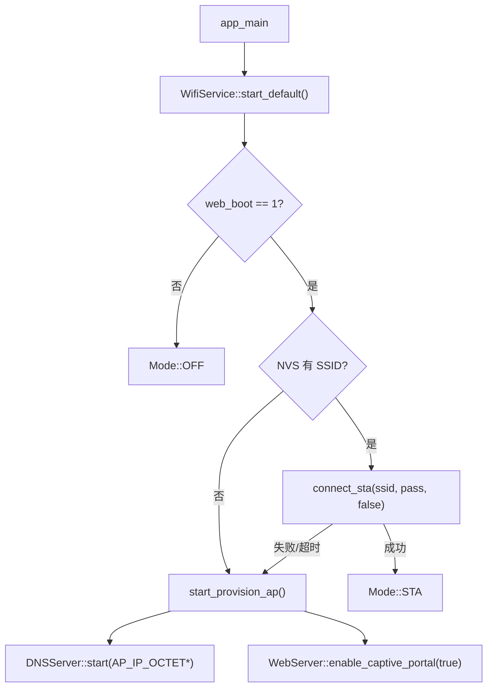

# wifi_service

`wifi_service` 是 WiFi/Web 的应用层服务组件，位于底层 `wifi_manager`、`DNSServer` 和 `WebServer` 之上，负责统一管理设备联网策略、NVS 配置和 AP 配网模式。

## 模块特点

- **NVS 持久化配置**：保存 STA SSID、密码和启动时是否启用 WiFi/Web 的开关。
- **自动启动策略**：启动时优先尝试连接已保存 STA，失败或未配置时自动进入 AP 配网模式。
- **AP 配网兜底**：配网热点使用 `WPM-Lite-XXXXXX` 命名，后缀来自设备 MAC，默认开放无密码。
- **DNS 劫持**：AP 配网模式下启动 `DNSServer`，将域名请求解析到组件配置的 AP IP，用于 Captive Portal。
- **统一状态入口**：Shell 命令和 Web API 均通过 `WifiService` 查询/控制 WiFi 状态，避免重复实现状态机。

## NVS Key

| Key | 类型 | 默认值 | 说明 |
|------|------|------|------|
| `wifi_ssid` | string | `""` | 已保存的 STA SSID |
| `wifi_pass` | string | `""` | 已保存的 STA 密码，开放网络可为空 |
| `web_boot` | blob(uint8_t) | `1` | 启动时是否自动启用 WiFi/Web，`1` 启用，`0` 禁用 |

## 启动流程



## 集成方式

```cpp
#include "web_backend.h"

WebBackend::start_with_wifi_service();
```

应用入口推荐通过 `WebBackend::start_with_wifi_service()` 启动 WiFi/Web；该函数内部会按 NVS 配置调用 `WifiService::start_default()`，避免 `app_main` 直接编排 Web 和 WiFi 启动细节。

## API 参考

### `esp_err_t init()`

初始化 NVS、底层 `WiFiManager`，并生成默认配网 AP 名称。

### `esp_err_t start_default()`

按 NVS 配置启动默认网络模式。若 `web_boot` 为 0，则保持关闭；若保存了 STA 凭据则尝试连接；连接失败或未配置时进入 AP 配网模式。

### `esp_err_t connect_sta(const char* ssid, const char* password, bool save)`

连接指定 WiFi。`save=true` 时，连接成功后将 SSID 和密码写入 NVS。

### `esp_err_t start_provision_ap()`

启动开放 AP、DNS 劫持和 WebServer Captive Portal 回落。默认访问地址由 `wifi_service.h` 中的 `AP_IP_OCTET1` ~ `AP_IP_OCTET4` 定义。

### `esp_err_t stop()`

停止 DNS 劫持、关闭 Captive Portal，并停止底层 WiFi。

### `esp_err_t set_web_enabled_on_boot(bool enabled)`

设置启动时是否自动启用 WiFi/Web。该配置会写入 NVS。

### `esp_err_t clear_saved_sta()`

清除已保存的 STA SSID 和密码。

### 查询函数

| 函数 | 说明 |
|------|------|
| `is_initialized()` | 查询组件是否已初始化 |
| `is_web_enabled_on_boot()` | 查询启动启用开关 |
| `has_saved_sta()` | 查询是否保存了 STA SSID |
| `is_provisioning()` | 查询是否处于 AP 配网模式 |
| `get_mode()` | 获取当前 `Mode` |
| `get_config()` | 获取 NVS 配置快照 |
| `get_ap_ssid()` | 获取配网热点 SSID |
| `get_last_error()` | 获取最近一次错误描述 |
| `get_ip()` | 获取当前对外访问 IP |
| `get_wifi_state()` | 获取底层 `wifi_manager` 状态 |

## AP 网段配置

AP 配网模式的 IP 地址集中定义在 `wifi_service.h`：

具体地址值见 `wifi_service.h` 中的 `AP_IP_OCTET1` ~ `AP_IP_OCTET4`。

后续需要修改配网网段时，修改这组常量即可；`WifiService::start_provision_ap()` 会将底层 AP netif、DNS 劫持地址和 AP 模式返回 IP 同步到这组常量。

## Shell 配合

`shell_command` 中的 `wifi` 命令通过本组件实现：

```text
wifi status
wifi on
wifi off
wifi connect <ssid> [password]
wifi ap
wifi boot <0|1>
wifi clear
```

## 依赖

| 组件 | 用途 |
|------|------|
| `wifi_manager` | 底层 STA/AP WiFi 驱动封装 |
| `HXC_NVS` | 配置持久化 |
| `DNSServer` | AP 配网模式 DNS 劫持 |
| `WebServer` | Captive Portal 开关 |
| `esp_wifi` | WiFi 接口类型和 MAC 查询 |
