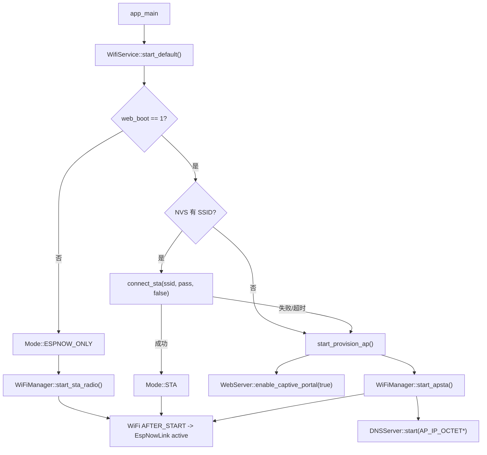

# wifi_service

`wifi_service` 是 WiFi、Web 与 ESP-NOW 共用射频的策略组件。它位于
`wifi_manager`、`espnow_link`、`espnow_service`、`DNSServer` 和 `WebServer`
之上，统一管理 STA、AP 配网和 ESPNOW_ONLY 模式。

## 模块特点

- **NVS 持久化配置**：保存 STA SSID、密码、启动开关和 ESP-NOW 默认信道；写入失败会返回错误，凭据成对更新失败时尝试恢复上一组配置。
- **自动启动策略**：启动时优先尝试连接已保存 STA，失败或未配置时自动进入 AP 配网模式。
- **断线自动恢复**：STA 运行期意外断线后按 `1s`、`2s`、`4s`、`8s`、`16s`、`30s`
  指数退避自动重连，恢复 IP 后重置退避状态。
- **AP 配网兜底**：配网热点使用 `WPM-Lite-XXXXXX` 命名，后缀来自设备 MAC，默认开放无密码。
- **APSTA 扫描配网**：AP 配网模式下保持热点在线，同时使用 STA 接口扫描附近 WiFi，供 Web 配网页选择 SSID。
- **DNS 劫持**：AP 配网模式下启动 `DNSServer`，将域名请求解析到组件配置的 AP IP，用于 Captive Portal。
- **统一状态入口**：Shell 命令和 Web API 均通过 `WifiService` 查询/控制 WiFi 状态，避免重复实现状态机。
- **ESP-NOW-only 模式**：Web 关闭时保留 STA 射频和 ESP-NOW，不连接路由器也不启动 HTTP 服务。

## NVS Key

| Key | 类型 | 默认值 | 说明 |
|------|------|------|------|
| `wifi_ssid` | string | `""` | 已保存的 STA SSID |
| `wifi_pass` | string | `""` | 已保存的 STA 密码，开放网络可为空 |
| `web_boot` | blob(uint8_t) | `1` | 启动时是否自动启用 WiFi/Web，`1` 启用，`0` 禁用 |
| `espnow_ch` | blob(uint8_t) | `1` | ESPNOW_ONLY 默认信道 |

## 启动流程



## 集成方式

```cpp
#include "web_backend.h"

WebBackend::start_with_wifi_service();
```

应用入口通过 `WebBackend::start_with_wifi_service()` 启动。该函数始终先调用
`WifiService::start_default()`；若进入 ESPNOW_ONLY 则不启动 HTTP。

## API 参考

### `esp_err_t init()`

初始化 NVS、`WiFiManager`、`EspNowLink` 和控制器角色的 `EspNowService`，
并生成默认配网 AP 名称。ESP-NOW 不由 `app_main` 直接初始化。

### `esp_err_t start_default(const char* source)`

按 NVS 配置启动默认网络模式。若 `web_boot` 为 0，则进入 ESPNOW_ONLY；
若保存了 STA 凭据则尝试连接；连接失败或未配置时进入 AP 配网模式。

### `esp_err_t connect_sta(const char* ssid, const char* password, bool save, const char* source)`

连接指定 WiFi。单次连接超时后自动重试一次；`save=true` 时，连接成功后将 SSID 和密码写入 NVS。
进入 STA 模式后，运行期意外断线会由后台任务自动重连。显式切换 AP、停止服务或重新配置 STA
会取消旧的重连计划。

### `esp_err_t start_provision_ap(const char* source)`

启动开放 APSTA 配网模式、DNS 劫持和 WebServer Captive Portal 回落。默认访问地址由 `wifi_service.h` 中的 `AP_IP_OCTET1` ~ `AP_IP_OCTET4` 定义。

### `esp_err_t scan_ap_list(ScanResult* results, size_t max_results, size_t* out_count)`

扫描附近 WiFi AP，并写入调用方提供的固定缓冲区。当前默认最多返回 `WIFI_SCAN_MAX_RESULTS` 个结果，过滤隐藏 SSID 和重复 SSID，结果包含 SSID、RSSI、信道和认证模式。

### `esp_err_t stop(const char* source)`

停止 DNS 劫持和 Captive Portal，然后切换到 `ESPNOW_ONLY`，不关闭 ESP-NOW 射频。

### `esp_err_t set_web_enabled_on_boot(bool enabled, const char* source)`

设置启动时是否自动启用 WiFi/Web。该配置会写入 NVS。

### `esp_err_t clear_saved_sta(const char* source)`

清除已保存的 STA SSID 和密码。

### 查询函数

| 函数 | 说明 |
|------|------|
| `is_initialized()` | 查询组件是否已初始化 |
| `is_web_enabled_on_boot()` | 查询启动启用开关 |
| `has_saved_sta()` | 查询是否保存了 STA SSID |
| `is_provisioning()` | 查询是否处于 AP 配网模式 |
| `get_mode()` | 获取当前 `Mode` |
| `get_config()` | 获取 NVS 配置快照 |
| `get_ap_ssid()` | 获取配网热点 SSID |
| `get_last_error()` | 获取最近一次错误描述 |
| `get_ip()` | 获取当前对外访问 IP |
| `get_wifi_state()` | 获取底层 `wifi_manager` 状态 |

### 扫描结果结构

| 字段 | 说明 |
|------|------|
| `ssid` | AP 名称 |
| `rssi` | 信号强度，单位 dBm |
| `channel` | 主信道 |
| `authmode` | ESP-IDF `wifi_auth_mode_t` |

## AP 网段配置

AP 配网模式的 IP 地址集中定义在 `wifi_service.h`：

具体地址值见 `wifi_service.h` 中的 `AP_IP_OCTET1` ~ `AP_IP_OCTET4`。

后续需要修改配网网段时，修改这组常量即可；`WifiService::start_provision_ap()` 会将底层 AP netif、DNS 劫持地址和 AP 模式返回 IP 同步到这组常量。

控制 API 的 `source` 由调用组件传入自身静态 `TAG`。日志允许保存 SSID、IP 和错误码，
但任何路径都禁止写入 WiFi 密码。

## Shell 配合

`shell_command` 中的 `wifi` 命令通过本组件实现：

```text
wifi status
wifi on
wifi off
wifi connect <ssid> [password]
wifi ap
wifi boot <0|1>
wifi clear
```

<!-- dependency-links:start -->
## 依赖导航

工程内直接依赖：

- [`espnow_service`](../espnow_service/README.md)（`app`）
- [`global_state`](../global_state/README.md)（`app`）
- [`DNSServer`](../../middleware/DNSServer/README.md)（`middleware`）
- [`espnow_link`](../../middleware/espnow_link/README.md)（`middleware`）
- [`time_service`](../../middleware/time_service/README.md)（`middleware`）
- [`WebServer`](../../middleware/WebServer/README.md)（`middleware`）
- [`HXC_NVS`](../../bsp/HXC_NVS/README.md)（`bsp`）
- [`wifi_manager`](../../bsp/wifi_manager/README.md)（`bsp`）
- [`diagnostic_log`](../../common/diagnostic_log/README.md)（`common`）

> 本节按当前 `CMakeLists.txt` 的 `REQUIRES` / `PRIV_REQUIRES` 维护。
<!-- dependency-links:end -->
