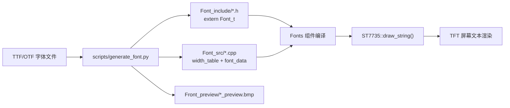

# Fonts

点阵字体资源模块，提供 DENGB 字体家族的多种字高变体（12/16/20/默认），以编译期常量数组形式存储字形灰度数据和宽度表，供 `st7735_driver` 渲染文本。

## 模块特点

- **等高变宽**：字体为等高不等宽设计，每个字符独立宽度表
- **多字高预置**：DENGB12 / DENGB16 / DENGB20 / DENGB（15px）
- **预览位图**：`Front_preview/` 目录含各字体的渲染预览 BMP

## 生成与渲染流程



## 文件结构

```
Fonts/
├── Font_include/   # 头文件，提供 Font_t 外部引用及字高常量
├── Font_src/       # .cpp 源文件，含字形宽度表与像素数据
└── Front_preview/  # BMP 预览图 + TTF 源字体文件
```

## 集成与使用

```cpp
#include "DENGB16.h"

ST7735::draw_string(0, 0, "Hello", ST7735::WHITE, ST7735::BLACK, DENGB16);
```

## 字体生成工具

使用 `scripts/generate_font.py` 从 TTF/OTF 字体文件生成兼容 `Font_t` 格式的 C++ 头文件、源文件及预览位图。

### 环境准备

```bash
pip install -r scripts/requirements.txt
```

### 用法

```bash
python scripts/generate_font.py <字体文件> <字体大小> <字体名称>
```

| 参数 | 说明 |
|------|------|
| `字体文件` | TTF/OTF 字体文件路径 |
| `字体大小` | 渲染字号（像素），如 12、16、20 |
| `字体名称` | 生成的 C++ 标识符名，如 `DENGB16` |

### 示例

```bash
# 在项目根目录执行，输出到 Fonts/DENGB16/ 目录
python scripts/generate_font.py Fonts/Front_preview/DENGB.TTF 16 DENGB16
```

生成结果：

```
DENGB16/
├── DENGB16.h           # 放入 Font_include/
├── DENGB16.cpp         # 放入 Font_src/
└── DENGB16_preview.bmp # 放入 Front_preview/
```

生成后需手动将 `.h` / `.cpp` / `_preview.bmp` 移至对应目录，并在 `CMakeLists.txt` 的 `SRC_DIRS` / `INCLUDE_DIRS` 覆盖范围内。

### 生成格式说明

- 字符范围：ASCII 32–126（共 95 个可打印字符）
- 每字符像素数据：`font_height × advance_width` 字节，灰度值 0–255
- 渲染时 `st7735_driver` 对灰度值做 RGB565 插值，实现抗锯齿效果

## 环境与依赖

- **组件依赖**：`st7735_driver`（提供 `Font_t` 类型定义）
