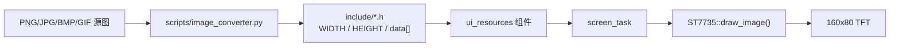

# ui_resources

UI 图形资源模块，以 `const uint16_t[]` RGB565 小端序数组形式存储界面元素图片，供 `st7735_driver` 的 `draw_image()` 直接调用。

## 资源列表

| 文件 | 尺寸 | 说明 |
|------|------|------|
| `ui_close.h` | 38×14 | 关闭图标 |
| `ui_open.h` | 38×14 | 开启图标 |
| `ui_static.h` | 18×74 | 静态 UI 元素 |
| `ErrorRectangle.h` | 42×18 | 错误标签背景 |
| `WarningRectangle.h` | 42×18 | 警告标签背景 |
| `meter_v_logo.h` | 9×10 | 电量页实时电压图标 |
| `meter_a_logo.h` | 9×10 | 电量页实时电流图标 |
| `meter_w_logo.h` | 12×10 | 电量页实时功率图标 |
| `meter_circle_green.h` | 10×10 | 电量页输出开启图标 |
| `meter_circle_red.h` | 10×10 | 电量页输出关闭图标 |
| `start_logo.h` | 156×77 | 开机画面，居中显示在 160×80 屏幕上 |

## 资源流转



## 集成与使用

```cpp
#include "ui_close.h"

ST7735::draw_image(x, y, CLOSE_WIDTH, CLOSE_HEIGHT, close_data);
ST7735::sync_buffers();
```

## 图片转换工具

使用 `scripts/image_converter.py` 将 PNG/JPG/BMP 等图片转换为 RGB565 小端序 C 语言头文件，供 `draw_image()` 直接使用。

### 环境准备

```bash
pip install -r scripts/requirements.txt
```

### 用法

```bash
python scripts/image_converter.py <输入图片> <输出头文件> [-n 自定义名称]
```

| 参数 | 说明 |
|------|------|
| `输入图片` | 源图片路径（支持 PNG/JPG/BMP/GIF 等） |
| `输出头文件` | 生成的 `.h` 文件路径 |
| `-n, --name` | 自定义数组名称（默认取文件名） |

### 示例

```bash
# 转换单张图片
python scripts/image_converter.py assets/close.png components/assets/ui_resources/include/ui_close.h

# 自定义数组名称
python scripts/image_converter.py -n ErrorRectangle assets/error_rect.png include/ErrorRectangle.h
```

转换后生成的头文件包含：

- `{NAME}_WIDTH` / `{NAME}_HEIGHT` 宏定义
- `{name}_data[]` RGB565 小端序像素数组

直接放入 `include/` 目录即可被组件自动包含。建议图片尺寸不超过 160×80（显示屏分辨率）。

## 环境与依赖

- **组件依赖**：无。该组件仅导出编译期 RGB565 数组。
- **使用方**：`screen` 通过 `st7735_driver::draw_image()` 绘制资源。
