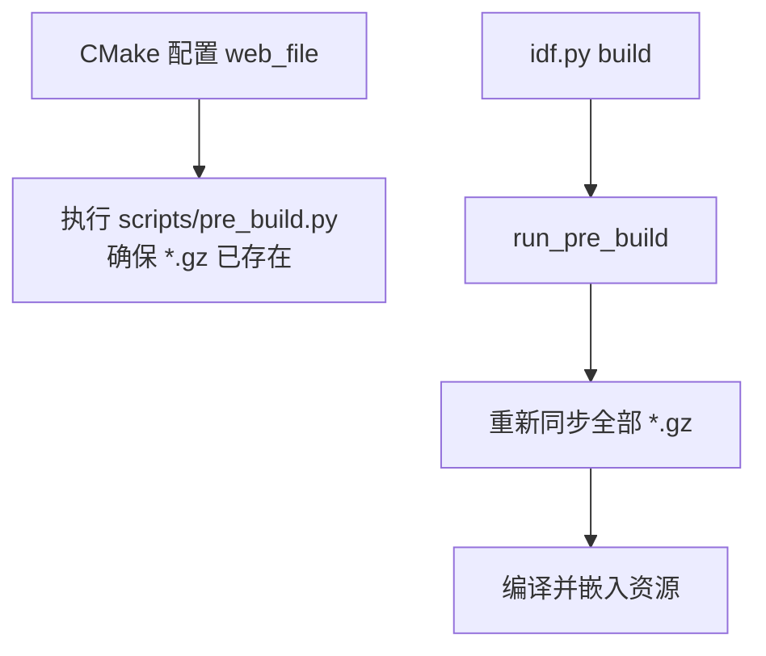

# web_file

`web_file` 将 Web 页面和 CSS 压缩后嵌入固件。设备运行时不需要文件系统：浏览器请求页面时，后端直接把 Flash 中的 gzip 数据返回给浏览器。

## 为什么要压缩

HTML 和 CSS 文本重复较多，gzip 通常能显著减少固件中的静态资源体积，也能减少 WiFi 传输量。压缩发生在构建期，不占用 ESP32-C6 的运行期 CPU 和 RAM。

## 构建与响应流程

```mermaid
flowchart LR
    Raw["HTML / CSS 源文件"] --> Pre["scripts/pre_build.py<br/>gzip level 9, mtime=0"]
    Pre --> Gzip["*.gz 生成文件<br/>不提交 Git"]
    Gzip --> Embed["CMake EMBED_FILES"]
    Embed --> Flash["固件 .rodata"]
    Flash --> File["EmbeddedFile<br/>data + size"]
    File --> Backend["web_backend 页面 handler"]
    Backend --> Send["WebServer::send_html_gzip()<br/>或 send_gzip()"]
    Send --> Header["HTTP Content-Encoding: gzip"]
    Header --> Browser["浏览器自动解压"]
```



`mtime=0` 让压缩结果可重复生成。源文件内容不变时，gzip 文件字节也保持不变。

## 构建时机



`components/assets/web_file/*.gz` 已写入 `.gitignore`。它们是构建产物，不应手工修改或提交。

## 当前资源

| C++ 符号 | 源文件 | 用途 |
|----------|--------|------|
| `index_html_file` | `index.html` | 实时概览页面 |
| `charts_html_file` | `charts.html` | 趋势曲线页面 |
| `control_html_file` | `control.html` | 控制设置页面 |
| `status_html_file` | `status.html` | 状态诊断页面 |
| `logs_html_file` | `logs.html` | 实时日志页面 |
| `blackbox_html_file` | `blackbox.html` | 历史日志入口页面 |
| `firmware_html_file` | `firmware.html` | APP 固件上传、校验与激活页面 |
| `provision_html_file` | `provision.html` | AP 配网页 |
| `app_css_file` | `app.css` | 公共样式 |

`charts.html` 使用在线 Chart.js。CDN 加载失败时只有曲线页不可用，其他页面仍可工作。

## 使用方式

HTML 和 CSS 已经是 gzip 数据，必须使用 gzip 响应函数：

```cpp
#include "web_file.h"
#include "web_server.h"

WebServer::send_html_gzip(request, index_html_file.data, index_html_file.size);
WebServer::send_gzip(request, 200, "text/css", app_css_file.data, app_css_file.size);
```

不要对这些资源调用 `send_html()`，否则浏览器会把压缩字节当作普通 HTML。

## 添加静态资源

1. 将原始文件放入 `components/assets/web_file/`。
2. 在 `scripts/pre_build.py` 的 `WEB_FILES` 中加入源文件名。
3. 在本组件 `CMakeLists.txt` 的 `WEB_GZIP_FILES` 中加入 `<文件名>.gz`。
4. 在 `src/web_file.cpp` 中声明 `_binary_<文件名>_gz_start/end` 链接符号，并导出 `EmbeddedFile`。
5. 在 `include/web_file.h` 中声明导出的 C++ 符号。
6. 在 `web_backend` 中注册路由，并使用正确的 gzip 响应函数。

文件名中的 `.` 会在链接符号中转换为 `_`。例如 `app.css.gz` 对应 `_binary_app_css_gz_start`。

## API

```cpp
struct EmbeddedFile {
    const char* data;
    size_t size;
};
```

`data` 指向 Flash 中的 gzip 字节，`size` 是压缩后的字节数。这里使用 `EMBED_FILES`，不会额外追加文本结尾 `\0`。

## 环境与依赖

- ESP-IDF v6.0+
- Python 3

<!-- dependency-links:start -->
## 依赖导航

无工程内组件依赖；仅依赖 ESP-IDF 组件或 C/C++ 标准库。

> 本节按当前 `CMakeLists.txt` 的 `REQUIRES` / `PRIV_REQUIRES` 维护。
<!-- dependency-links:end -->
