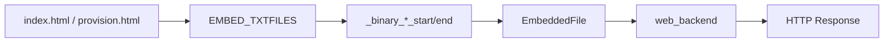

# web_file

Web 静态资源嵌入组件，将 HTML 页面通过 ESP-IDF `EMBED_TXTFILES` 打包进固件，并以 `EmbeddedFile` 形式提供给 Web 后端。

## 模块特点

- **固件内嵌资源**：`index.html` 与 `provision.html` 被嵌入 `.rodata`
- **统一资源结构**：通过 `EmbeddedFile` 暴露 `data` 和 `size`
- **直接服务页面**：`web_backend` 读取本组件资源并通过 `WebServer::send_html()` 返回
- **长度处理**：资源长度计算时减去 `EMBED_TXTFILES` 自动追加的结尾 `\0`

## 当前资源

| 符号 | 文件 | 用途 |
|------|------|------|
| `index_html_file` | `index.html` | 实时概览页面 |
| `charts_html_file` | `charts.html` | 趋势曲线页面 |
| `control_html_file` | `control.html` | 控制设置页面 |
| `status_html_file` | `status.html` | 状态诊断页面 |
| `logs_html_file` | `logs.html` | 实时日志页面 |
| `blackbox_html_file` | `blackbox.html` | 黑匣子日志入口页面 |
| `firmware_html_file` | `firmware.html` | APP 固件上传、校验与激活页面 |
| `provision_html_file` | `provision.html` | AP 配网页 |
| `app_css_file` | `app.css` | Web 公共样式 |

主 Web UI 当前拆分为多个独立页面：实时概览、趋势曲线、控制设置、状态诊断、实时日志、黑匣子日志和固件升级。这样每个页面只请求自己需要的 API，减少无关轮询，也便于后续扩展。

`charts.html` 使用在线 Chart.js。若 CDN 加载失败，仅曲线页面不可用，其他页面继续工作。

`provision.html` 当前支持扫描附近 WiFi、点击选择 SSID、输入密码并提交到 `/api/wifi/connect`；手动输入 SSID 保留为兜底方式。

`firmware.html` 支持手动选择 APP `.bin` 文件、前端容量检查、上传进度、
固件校验结果、版本提示、降级/同版本警告、二次确认激活和设备重启恢复提示。
页面也保留远端检查更新与拉取固件按钮，对应后端占位 API。

## 数据流



## 集成与使用

```cpp
#include "web_file.h"

WebServer::send_html(request, index_html_file.data, index_html_file.size);
WebServer::send_html(request, provision_html_file.data, provision_html_file.size);
```

## API 参考

| 符号/API | 说明 |
|----------|------|
| `EmbeddedFile` | 嵌入资源描述结构，包含 `const char* data` 与 `size_t size` |
| `index_html_file` | 主页面 HTML |
| `provision_html_file` | 配网页 HTML |

## 添加资源

1. 将静态文件放到 `components/assets/web_file/`。
2. 在 `CMakeLists.txt` 的 `EMBED_TXTFILES` 中加入文件名。
3. 在 `web_file.cpp` 中声明 `_binary_<name>_start/end` 符号并导出 `EmbeddedFile`。
4. 在 `web_file.h` 中声明外部符号。

## 环境与依赖

- **软件**：ESP-IDF v6.0+
- **组件依赖**：无
