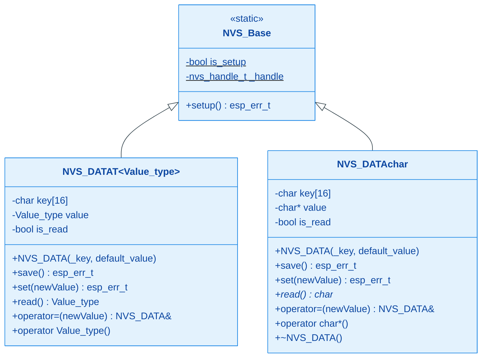
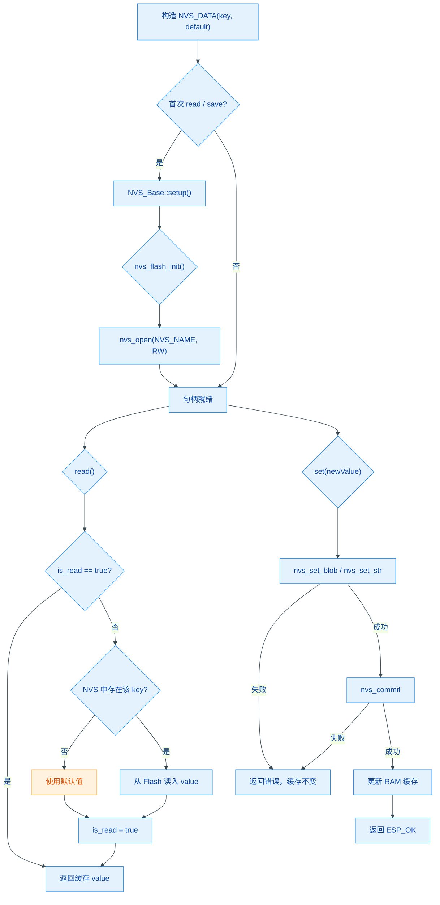

# HXC_NVS

基于 ESP-IDF NVS Flash 的 C++ 封装，提供带缓存的类型化读取和可返回
`esp_err_t` 的可靠写入接口。

## 模块特点

- **模板泛型**：`NVS_DATA<T>` 支持任意可平凡拷贝的基础类型（`int`、`float`、`struct` 等），以 `nvs_set_blob` 统一存储
- **`char*` 特化**：对字符串类型单独特化，使用 `nvs_set_str` / `nvs_get_str`，内部深拷贝管理堆内存
- **错误可传递**：`set()`、`save()` 和 `setup()` 返回原始 `esp_err_t`，业务层可拒绝假成功
- **提交顺序明确**：`nvs_set_*` 失败时不再继续 `commit`，只有提交成功才更新 RAM 缓存
- **兼容运算符**：保留 `operator=` 与 `operator T()`；需要确认持久化结果的业务代码必须使用 `set()`
- **并发初始化**：原子完成标志配合 FreeRTOS Mutex，防止多个任务重复初始化和打开句柄
- **单次读取缓存**：`is_read` 标志避免重复访问 Flash，延长使用寿命
- **零指针安全**：`static_assert` 编译期禁止指针类型误用；key 超长自动截断并告警

## 环境与依赖

| 依赖项 | 版本要求 |
|--------|----------|
| ESP-IDF | v6.0+（依赖 `nvs_flash`、`esp_log` 组件） |
| C++ 标准 | C++20 及以上；当前 ESP-IDF v6.0 构建使用 GNU++26 |
| FreeRTOS | 随 ESP-IDF 附带 |

无额外硬件依赖，仅使用芯片内置 Flash。

## 架构与原理





## 集成与使用

### CMake 集成

组件已通过 `idf_component_register` 注册，在项目顶层 `CMakeLists.txt` 或 `main` 组件的 `REQUIRES` 中添加 `HXC_NVS` 即可。

### 基础类型

```cpp
#include "HXC_NVS.h"

HXC::NVS_DATA<int> boot_count("boot_cnt", 0);
HXC::NVS_DATA<float> calibration("cal_val", 1.0f);

void app_main() {
    // 读取：隐式转换，首次自动从 NVS 加载
    int cnt = boot_count;
    ESP_LOGI("APP", "boot count = %d", cnt);

    // 业务写入检查持久化结果
    ESP_ERROR_CHECK(boot_count.set(cnt + 1));
    ESP_ERROR_CHECK(calibration.set(1.05f));
}
```

### 字符串类型

```cpp
HXC::NVS_DATA<char*> device_name("dev_name", "default");

void app_main() {
    char* name = device_name;   // 读取
    ESP_ERROR_CHECK(device_name.set("meter_01"));
}
```

### 自定义结构体

```cpp
struct Config {
    int mode;
    float threshold;
};

HXC::NVS_DATA<Config> cfg("cfg", {0, 3.3f});

void app_main() {
    Config c = cfg;        // 读取
    c.mode = 2;
    ESP_ERROR_CHECK(cfg.set(c));
}
```

## API 参考

| 方法 / 运算符 | 说明 |
|---|---|
| `NVS_DATA(key, default)` | 构造，`key` 最长 15 字节，超长截断并 log error |
| `NVS_Base::setup()` | 初始化 NVS Flash 并打开共享命名空间，返回初始化错误 |
| `set(newValue)` | 写入并 commit；成功后才更新缓存，推荐业务代码使用 |
| `save()` | 将当前缓存值写入并 commit |
| `read()` | 从 NVS 读取；若 key 不存在返回默认值；首次读取后缓存 |
| `operator=(newValue)` | 兼容接口，内部调用 `set()` 并记录错误，但不能向调用方返回错误 |
| `operator T()` | 隐式转换，自动调用 `read()` |

| 宏 / 常量 | 说明 |
|---|---|
| `NVS_NAME` | 默认 NVS 命名空间名，定义为 `"HXC"` |

**注意事项**：

- 应用启动阶段使用 `ESP_ERROR_CHECK(HXC::NVS_Base::setup())`，不要忽略初始化失败。
- 配置修改接口使用 `set()` 并检查返回值；赋值运算符只用于无需错误反馈的兼容场景。
- `char*` 特化版本先准备新缓冲并完成持久化，成功后才替换旧缓存。
- 所有 `NVS_DATA` 实例共享同一 NVS 命名空间（`NVS_NAME`），不同实例通过 `key` 区分

<!-- dependency-links:start -->
## 依赖导航

无工程内组件依赖；仅依赖 ESP-IDF 组件或 C/C++ 标准库。

> 本节按当前 `CMakeLists.txt` 的 `REQUIRES` / `PRIV_REQUIRES` 维护。
<!-- dependency-links:end -->
