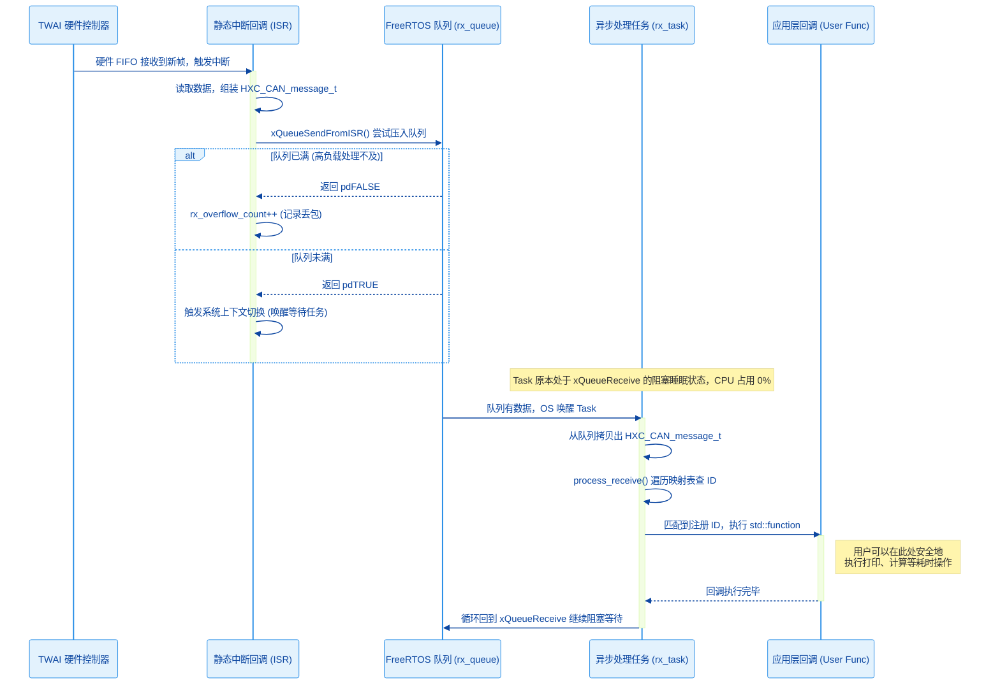
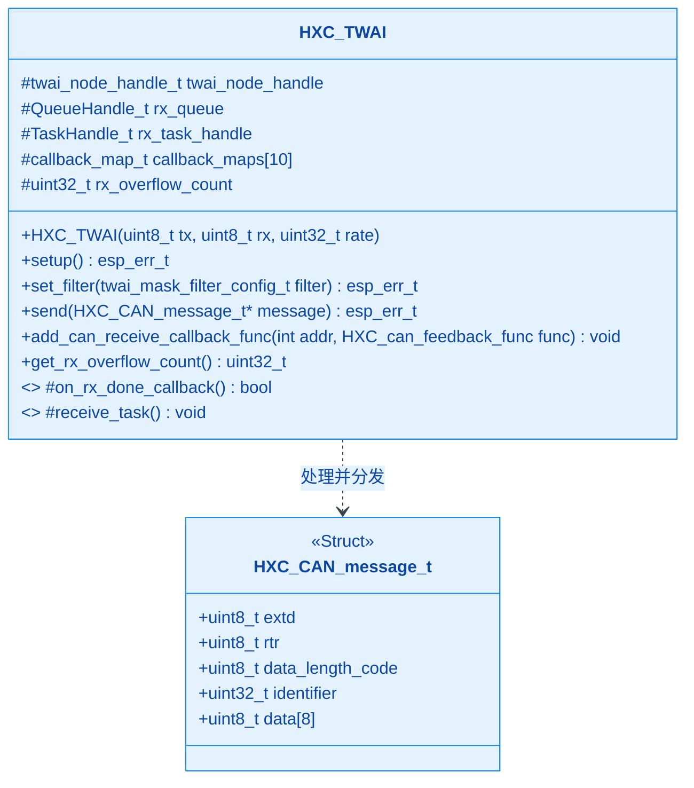
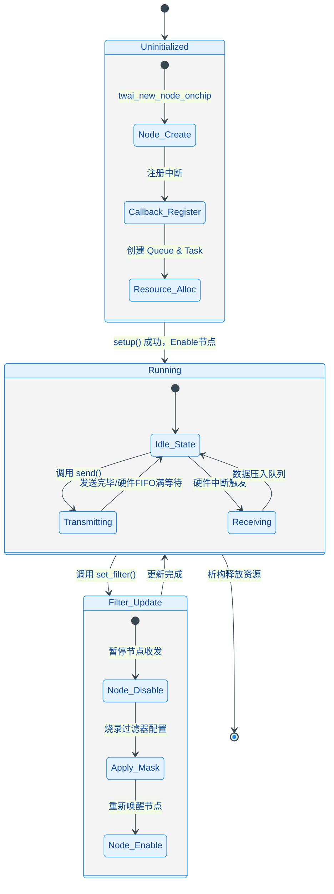

# HXC_TWAI 模块

## 1. 模块简介
`HXC_TWAI` 是战队基于 ESP-IDF 底层 API 深度封装的 CAN (TWAI) 通信驱动类。
在复杂的机器人控制系统中，CAN 总线常常面临极高的数据吞吐量（如多电机高频反馈）。如果处理不当，极易引发看门狗复位或重要数据丢包。本模块采用了 **“中断接收 + FreeRTOS 队列缓冲 + 独立任务分发”** 的异步解耦架构，为上层应用提供了一个高性能、线程安全且极易使用的面向对象接口。

---

## 2. 核心架构与设计原理

为了帮助开发者，尤其是刚接触 FreeRTOS 和底层硬件交互的同学，全方位理解本模块的运作机制，我们提供了以下维度的架构图表。

### 2.1 数据流转时序图 (Sequence Diagram) —— 必读！
**这是理解本模块异步处理机制的核心。** 在嵌入式开发中，中断服务函数（ISR）要求“快进快出”。本模块严格遵循了这一原则，将繁重的数据解析交给了后台任务。



**💡 核心设计思想解析：**
1. **消峰填谷**：当 CAN 总线短时间内涌入大量数据（Burst Traffic）时，中断会迅速将数据塞入 `rx_queue`。只要队列深度（默认 20）足够，就不会丢包。
2. **上下文隔离**：用户注册的 `feedback_func` 是在 `receive_task` 这个普通的 FreeRTOS 任务上下文中执行的，**而不是在中断里**。这意味着你可以在回调函数中安全地使用 `printf`、`vTaskDelay` 或申请锁，绝对不会引发导致系统崩溃的 `Interrupt WDT timeout`。

### 2.2 模块类结构图 (Class Diagram)
本类对外屏蔽了复杂的底层句柄，通过 C++ 特性提供了现代化的 API。



### 2.3 状态机转换图 (State Diagram)
展示底层的生命周期，特别是更新硬件过滤器时必须经历的禁用/使能流程。



---

## 3. 标准使用指南 (基础篇)

### 3.1 实例化与初始化
推荐在全局或类的成员变量中实例化 `HXC_TWAI` 对象。

```cpp
#include "HXC_TWAI.h"

// 实例化：引脚 TX=8, RX=18, 波特率 1Mbps (支持 _Mbps / _Kbps 字面量)
HXC_TWAI can_bus(8, 18, 1_Mbps);

void app_main() {
    // 启动 TWAI 节点及后台任务
    if (can_bus.setup() == ESP_OK) {
        ESP_LOGI("MAIN", "CAN 总线初始化成功！");
    } else {
        ESP_LOGE("MAIN", "CAN 初始化失败，请检查引脚或配置！");
    }
}
```

### 3.2 接收数据：基于 ID 的回调注册 (事件驱动)
你不再需要在 `while(1)` 里死循环查数据。模块内置了软件地址路由器（最大支持 10 个独立 ID）。**利用 C++ 11 的 Lambda 表达式，可以优雅地解耦代码。**

```cpp
// 假设我们要监听底盘电机反馈 (ID: 0x201)
can_bus.add_can_receive_callback_func(0x201, [](HXC_CAN_message_t* msg) {
    // 这里的代码运行在 rx_task 任务上下文中，非常安全
    int16_t speed = (msg->data[0] << 8) | msg->data[1];
    printf("收到 0x201 电机转速: %d\n", speed);
});
```

### 3.3 发送数据：线程安全设计
`send()` 函数内部使用了局部变量拷贝机制，**允许多个不同的 FreeRTOS 任务同时调用 `can_bus.send()`**，无需手动加互斥锁（Mutex）。

```cpp
void send_command_task(void* arg) {
    HXC_CAN_message_t tx_msg;
    tx_msg.identifier = 0x1FF;
    tx_msg.extd = 0;              // 标准帧
    tx_msg.rtr = 0;               // 数据帧
    tx_msg.data_length_code = 8;
    
    uint8_t payload[8] = {0x01, 0x02, 0x00, 0x00, 0x00, 0x00, 0x00, 0x00};
    memcpy(tx_msg.data, payload, 8);

    while(1) {
        if (can_bus.send(&tx_msg) != ESP_OK) {
            ESP_LOGW("TX", "发送缓冲满，指令可能被丢弃！");
        }
        vTaskDelay(pdMS_TO_TICKS(10)); // 100Hz 发送频率
    }
}
```

---

## 4. 高级进阶用法 (专家篇)

为了应对更严苛的性能挑战，初级开发者成长后需要掌握以下高级功能：

### 4.1 硬件验收过滤器 (Hardware Acceptance Filter)
如果在复杂的总线上，单片机只需要接收其中一部分报文，**一定要使用硬件过滤器**。这可以在硬件层面直接屏蔽掉无关 ID，防止无关报文触发中断，极大减轻 CPU 负担。

```cpp
// 示例：仅接收 ID 为 0x2XX 的报文
twai_mask_filter_config_t filter = {
    .acceptance_code = (0x200 << 21), 
    .acceptance_mask = ~(0x0FF << 21), // 掩码 0 表示必须匹配，1 表示忽略 (此处忽略低8位)
    .single_filter = true
};

// 建议在 setup() 之前调用，避免节点中途暂停
can_bus.set_filter(filter);
can_bus.setup();
```

### 4.2 拦截所有未处理报文 (Catch-All 回调)
如果你正在开发一个抓包工具（CAN Sniffer），或者需要处理映射表之外的所有报文，可以将地址设为 `-1`。

```cpp
can_bus.add_can_receive_callback_func(-1, [](HXC_CAN_message_t* msg) {
    // 总线上收到任何报文都会触发此回调
    // 常常用于监控总线健康状态或记录未知的上位机指令
    ESP_LOGI("CAN_SNIFFER", "拦截到未注册 ID: 0x%03lX", msg->identifier);
});
```

### 4.3 系统瓶颈监控与调优
如果系统出现异常（例如机器人动作卡顿），很有可能是 CAN 接收队列溢出了。
可以通过检查溢出计数器来诊断系统瓶颈：

```cpp
uint32_t drops = can_bus.get_rx_overflow_count();
if (drops > 0) {
    ESP_LOGE("DIAG", "警告：软件接收队列已溢出 %lu 次！", drops);
    // 解决方案提示：
    // 1. 去 HXC_TWAI.h 中将 TWAI_RX_QUEUE_LEN 从 20 增大到 50 或 100
    // 2. 检查你注册的 Callback 里是不是存在导致阻塞的低效代码（如死循环）
}
```