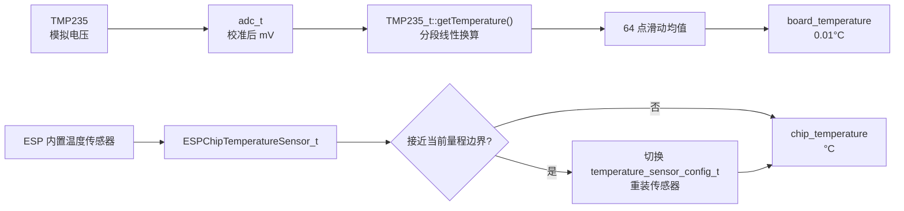

# Temperature

温度采集模块，提供两种温度传感器封装：TMP235 外置温度传感器（板载）与 ESP 芯片内置温度传感器。

## 模块特点

### TMP235（`TMP235.h`）
- **ADC 采集**：基于 `adc_t` 类获取经校准的 mV 值
- **分段线性转换**：三段分段线性公式将 ADC mV 值转换为温度，符合 TMP235 数据手册
- **滑动均值滤波**：64 点环形缓冲区均值，抑制噪声
- **异常诊断**：ADC 读取失败或电压超出 `50~2200mV` 时记录错误，并保留最近一次有效均值

### ESP 芯片内温（`ESPChipTemperatureSensor.h`）
- **自动量程切换**：5 档温度范围，接近边界时自动切换以优化精度
- **精度**：默认范围（-10°C ~ 80°C）±1°C

## 数据流



## 集成与使用

```cpp
#include "TMP235.h"
#include "ESPChipTemperatureSensor.h"

// TMP235 板载温度传感器
TMP235_t& ntc = TMP235_t::instance();
ntc.init(ADC_CHANNEL_0);
int16_t ntc_temp = ntc.getTemperature();  // 0.01°C 单位

// ESP 芯片内置温度传感器
ESPChipTemperatureSensor_t& chip_temp = ESPChipTemperatureSensor_t::instance();
chip_temp.init();
float t = chip_temp.getTemperature();       // °C 单位
```

## API 参考

### TMP235_t

| API | 说明 |
|-----|------|
| `TMP235_t::instance()` | 获取单例引用 |
| `init(adc_channel_t channel)` | 初始化 ADC 通道 |
| `getTemperature()` | 返回温度，0.01°C 单位（int16_t） |

### ESPChipTemperatureSensor_t

| API | 说明 |
|-----|------|
| `ESPChipTemperatureSensor_t::instance()` | 获取单例引用 |
| `init()` | 初始化芯片内置温度传感器 |
| `getTemperature()` | 返回芯片温度，°C 单位（float） |

## 环境与依赖

- **硬件**：TMP235 温度传感器接 ADC 通道
- **软件**：ESP-IDF v6.0+
- **组件依赖**：`ADC`（TMP235）、`esp_driver_tsens`、`esp_hal_ana_conv`
