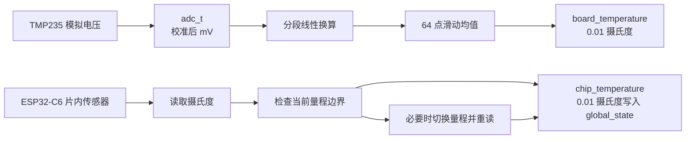
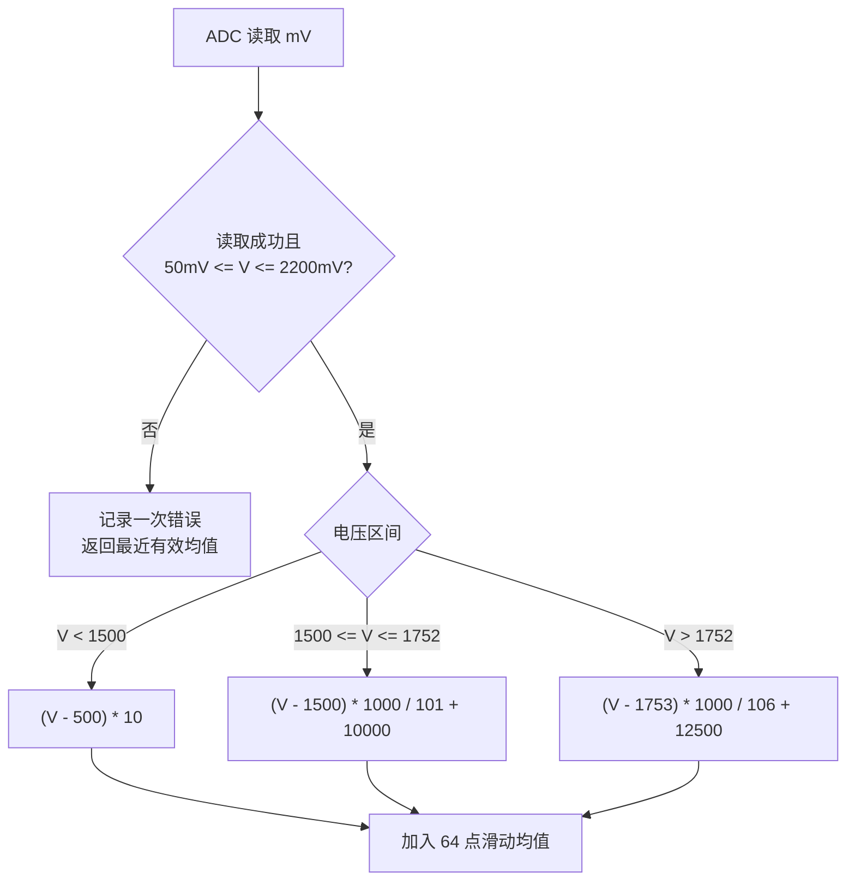
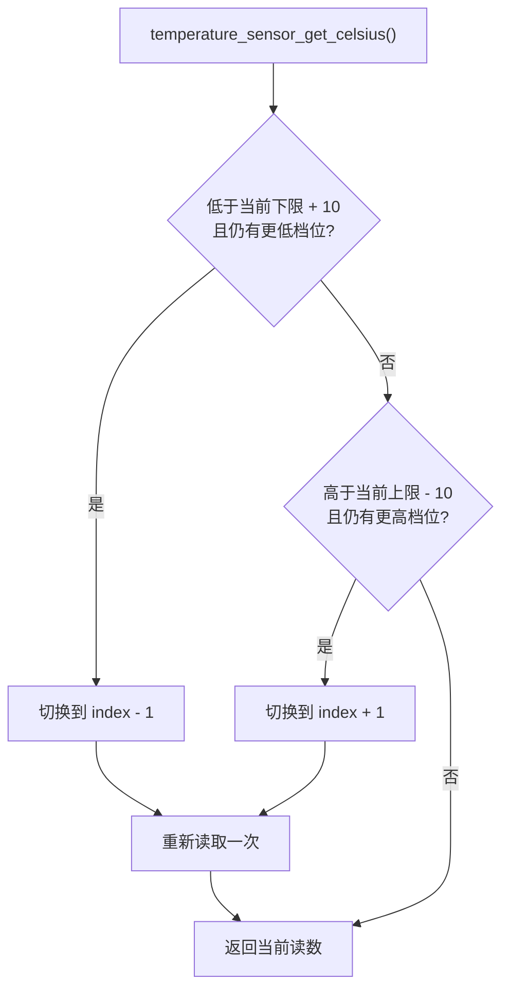

# Temperature

`Temperature` 封装了两种用途不同的温度传感器：

| 传感器 | 测量对象 | 数据来源 | 主要用途 |
|--------|----------|----------|----------|
| `TMP235_t` | 电路板温度 | 外置 TMP235 模拟电压，经 ADC 采样 | 保护判断、电流温漂补偿 |
| `ESPChipTemperatureSensor_t` | ESP32-C6 芯片内部温度 | 芯片内置温度传感器 | 芯片状态监控 |

不要把两者混为一谈。板温更接近功率器件和采样电路环境，芯片内温反映 MCU 自身发热。

## 总体数据流



`app_main` 的 5ms 定时器读取两种传感器，并写入 `global_state`。

## TMP235 板温

### 工作方式

TMP235 输出与温度相关的模拟电压。`TMP235_t` 通过 `adc_t` 获取校准后的 mV 值，再按数据手册对应的分段公式转换为 `0.01 摄氏度`。



### API

```cpp
#include "TMP235.h"

TMP235_t& board_sensor = TMP235_t::instance();
ESP_ERROR_CHECK(board_sensor.init(ADC_CHANNEL_0));
int16_t board_temp = board_sensor.getTemperature(); // 2534 表示 25.34 摄氏度
```

### 注意事项

- `init()` 需要传入硬件配置对应的 ADC 通道。
- 初始化前调用 `getTemperature()` 会返回 `0` 并记录错误。
- ADC 暂时失败或输入越界时，组件保留最近一次有效滑动均值，避免温度瞬间跳变。
- 启动初期有效样本不足 64 个时，均值只使用已经采到的样本。

## ESP 芯片内温

### 为什么需要切换量程

ESP-IDF 为片内温度传感器提供多档可用范围。范围较宽时能覆盖更极端的温度，但精度较低；范围较窄时覆盖区间较小，但精度更高。

因此本组件默认从中间档位 `index = 2` 启动，并在温度靠近当前范围边缘 `10 摄氏度` 内时切换到相邻档位。这样既能覆盖温度变化，也尽量使用更合适的测量档位。

具体档位边界来自 ESP-IDF 的 `temperature_sensor_attributes`，不是本组件写死的常量。



切换档位时会依次 disable、uninstall、install、enable 传感器，然后重新读取一次温度。

### API

```cpp
#include "ESPChipTemperatureSensor.h"

ESPChipTemperatureSensor_t& chip_sensor = ESPChipTemperatureSensor_t::instance();
ESP_ERROR_CHECK(chip_sensor.init());
float chip_temp = chip_sensor.getTemperature(); // 摄氏度
```

### 注意事项

- 本 API 返回 `float` 摄氏度；写入 `global_state.chip_temperature` 时，`app_main` 会乘以 `100`。
- 初始化前调用会返回 `0` 并记录错误。
- 读取失败时返回最近一次读数。

## 环境与依赖

- 硬件：TMP235 连接 ADC 通道；ESP32-C6 片内温度传感器
- ESP-IDF v6.0+

<!-- dependency-links:start -->
## 依赖导航

工程内直接依赖：

- [`ADC`](../ADC/README.md)（`bsp`）

> 本节按当前 `CMakeLists.txt` 的 `REQUIRES` / `PRIV_REQUIRES` 维护。
<!-- dependency-links:end -->
