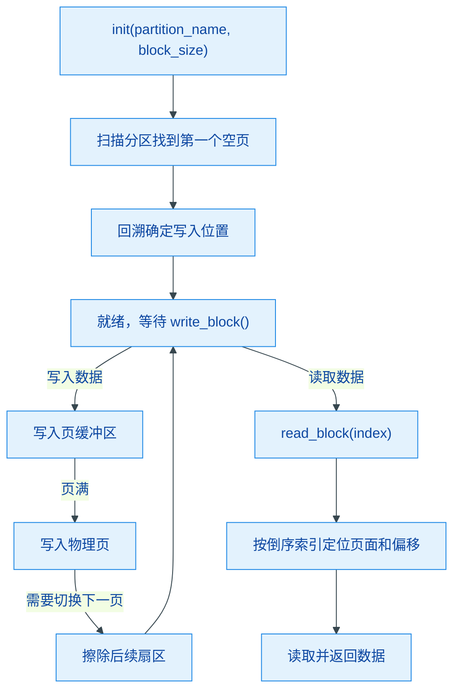

# circular_flash_buffer

基于 ESP32 SPI Flash 分区的通用循环缓冲区驱动，与具体数据结构无关。提供固定大小数据块的循环写入与倒序读取，适合嵌入式场景下的持久化日志/数据记录。

## 模块特点

- **数据结构无关**：以固定大小 `block` 为单位读写，不解析 payload 内容
- **分区自适应**：自动计算分区总页数/扇区数，适配任意大小的 flash 分区
- **循环覆盖**：写满后自动回绕，提前擦除下一扇区，保证写入连续性
- **线程安全**：FreeRTOS 互斥锁保护所有读写操作
- **启停控制**：`set_enable()` 可在读取期间暂停写入，防止数据竞争
- **空块检测**：基于 `BLOCK_SOF` 首字节标识判断有效块，异常重启后可恢复写入位置

## Flash 布局约定

| 参数 | 值 | 说明 |
|------|-----|------|
| `PAGE_SIZE` | 256 字节 | SPI Flash 页大小，硬件决定 |
| `SECTOR_SIZE` | 4096 字节 | SPI Flash 扇区大小，硬件决定 |
| `BLOCK_SOF` | 0xAA | 有效数据块首字节标识 |
| `block_size` | 由 `init()` 参数指定 | 每个数据块大小，必须整除 PAGE_SIZE |

### 数据块要求

- 每个块的**首字节**必须为 `BLOCK_SOF`（0xAA），用于启动时定位最后写入位置
- 空白区域为 Flash 擦除后的 0xFF

## 架构与原理



### 写入流程

1. 数据拷贝到页缓冲区当前偏移位置
2. 立即将整页写回 Flash（保证断电安全）
3. 页满时切换下一页，若进入新扇区则提前擦除后续扇区（预留一个空扇区）
4. 回绕到分区起始时自动覆盖最旧数据

### 启动恢复流程

1. 顺序扫描所有页，找到第一个全 0xFF 的空页
2. 检查前页的 block 首字节是否为 `BLOCK_SOF`，定位最后写入位置
3. 计算已有的 block 数量

## 集成与使用

```cpp
#include "circular_flash_buffer.h"

// 初始化：使用 "blackbox" 分区，每条记录 32 字节
CircularFlashBuffer::init("blackbox", 32);

// 写入一条数据（首字节必须为 BLOCK_SOF）
uint8_t data[32];
data[0] = CircularFlashBuffer::BLOCK_SOF;
// ... 填充数据 ...
CircularFlashBuffer::write_block(data);

// 读取最新一条（index = 0 为最新，倒序）
uint8_t buf[32];
CircularFlashBuffer::read_block(0, buf);

// 获取总条数
uint32_t count = CircularFlashBuffer::get_count();

// 读取期间暂停写入
CircularFlashBuffer::set_enable(false);
// ... 连续读取 ...
CircularFlashBuffer::set_enable(true);
```

## API 参考

### `esp_err_t init(const char* partition_name, size_t block_size)`

初始化循环缓冲区。`partition_name` 为分区表中的分区名，`block_size` 为每条记录的字节数，必须整除 `PAGE_SIZE`。启动时自动扫描分区恢复写入位置。

### `esp_err_t write_block(const uint8_t* data)`

写入一条记录（`block_size` 字节）。数据首字节应为 `BLOCK_SOF`。若缓冲区已禁用则返回 `ESP_ERR_NOT_SUPPORTED`。

### `esp_err_t read_block(uint32_t index, uint8_t* data)`

按倒序读取指定索引的记录，`index=0` 为最新一条。返回 `ESP_ERR_INVALID_ARG` 若索引越界。

### `uint32_t get_count()`

返回已写入的记录总数。

### `void set_enable(bool enable)`

启用/禁用写入。读取期间可禁用以防止新数据写入干扰。

## 环境与依赖

| 类别 | 要求 |
|------|------|
| 框架 | ESP-IDF v6.0+ |
| RTOS | FreeRTOS |
| 硬件 | ESP32 系列，需在分区表中预留 DATA 分区 |
| 组件依赖 | `esp_partition`, `spi_flash`, `freertos`, `log` |
