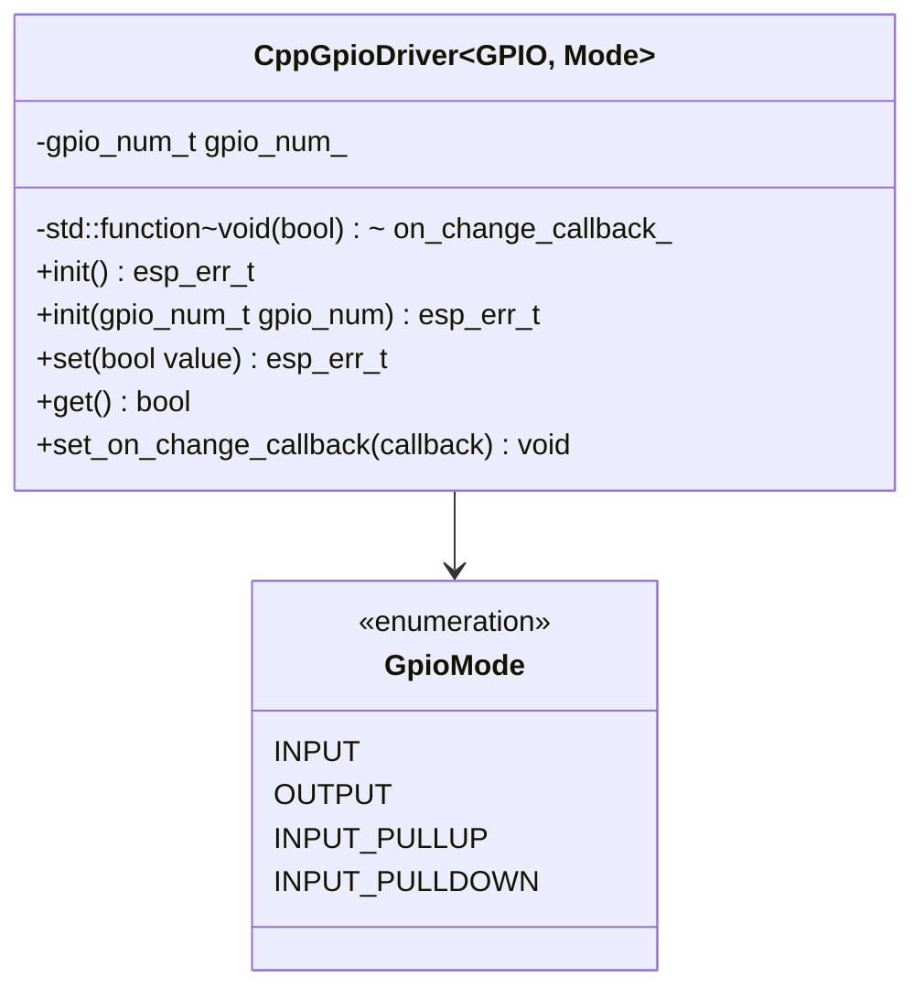
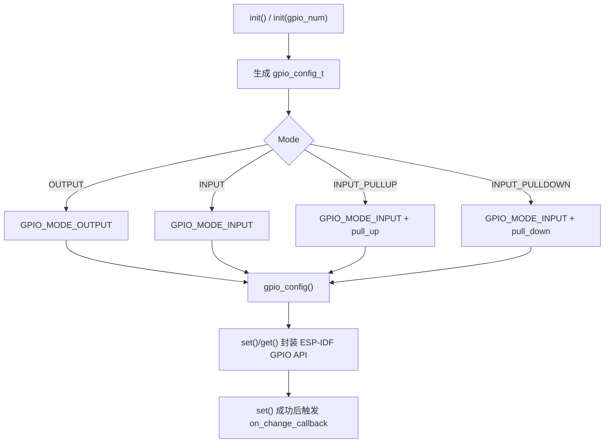

# cpp_gpio_driver

编译期泛型 GPIO 驱动，通过模板参数将引脚号与模式固化到类型中，零运行时开销封装 ESP-IDF `gpio_config` / `gpio_set_level` / `gpio_get_level`。

## 模块特点

- **编译期绑定**：`CppGpioDriver<GPIO_NUM_5, GpioMode::OUTPUT>` 将引脚和模式编码到类型
- **四种模式**：`INPUT`、`OUTPUT`、`INPUT_PULLUP`、`INPUT_PULLDOWN`
- **类型安全**：`set()` 在非 OUTPUT 模式下返回 `ESP_FAIL`

## 类结构与运行流程





## 集成与使用

```cpp
#include "cpp_gpio_driver.hpp"

CppGpioDriver<GPIO_NUM_5, GpioMode::OUTPUT> relay;
relay.init();
relay.set(true);

CppGpioDriver<GPIO_NUM_4, GpioMode::INPUT_PULLUP> btn;
btn.init();
bool pressed = btn.get();
```

## API 参考

| 方法 | 说明 |
|------|------|
| `init()` | 配置 GPIO（模式、上下拉） |
| `set(bool)` | 输出高/低电平，仅 OUTPUT 模式有效 |
| `get() const` | 读取输入电平 |

## 环境与依赖

- **软件**：ESP-IDF v6.0+、C++20

<!-- dependency-links:start -->
## 依赖导航

无工程内组件依赖；仅依赖 ESP-IDF 组件或 C/C++ 标准库。

> 本节按当前 `CMakeLists.txt` 的 `REQUIRES` / `PRIV_REQUIRES` 维护。
<!-- dependency-links:end -->
