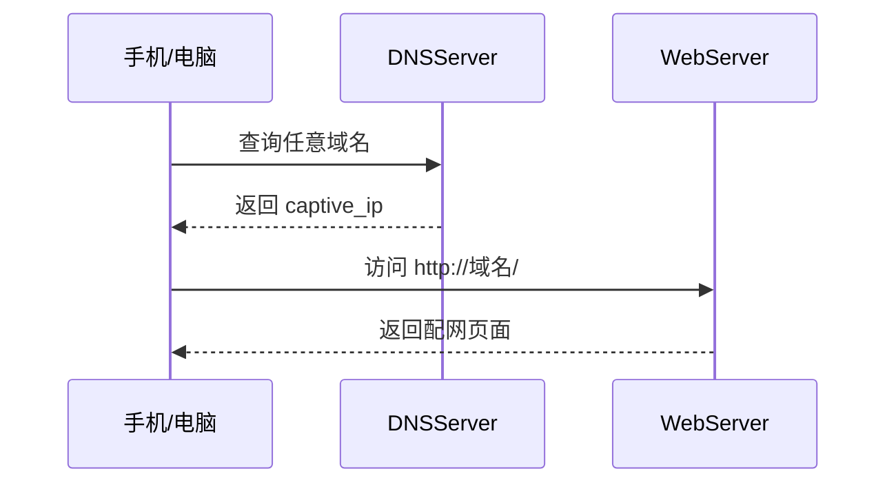
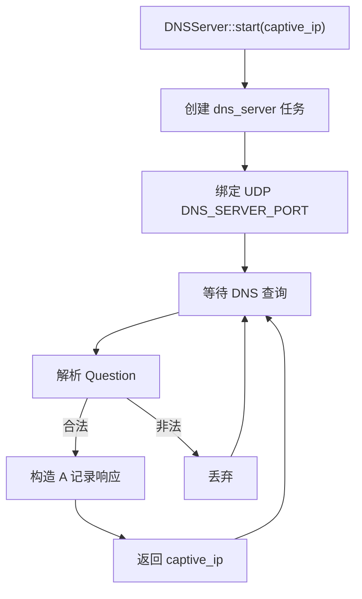

# DNSServer

`DNSServer` 是用于 AP 配网模式的轻量 DNS 劫持中间件。模块监听 UDP DNS 请求，并将合法查询统一解析到调用方传入的 IPv4 地址，通常配合 `WebServer` 的 Captive Portal 回落能力使用。

## 模块特点

- **最小实现**：只处理普通 DNS 查询并返回 A 记录，满足配网页自动弹窗需求。
- **静态缓冲区**：DNS 收发包使用固定 512 字节缓冲区，不在任务循环中动态申请内存。
- **统一解析地址**：所有合法查询统一返回启动时指定的 `captive_ip`。
- **可停止任务**：socket 设置接收超时，`stop()` 后任务可退出。
- **边界检查**：解析 Question Name 时检查 label 长度，避免畸形包越界。

## 工作流程





## 集成与使用

AP 配网模式下的典型用法：

```cpp
#include "dns_server.h"

DNSServer::start(captive_ip);
```

也可以使用四段 IPv4 地址启动：

```cpp
DNSServer::start(ip0, ip1, ip2, ip3);
```

在本工程中，AP 配网 IP 由 `wifi_service.h` 的 `AP_IP_OCTET*` 常量统一定义，`wifi_service` 会把该地址传给 `DNSServer`，不要在调用方或 README 中写死具体网段。

停止服务：

```cpp
DNSServer::stop();
```

## API 参考

### `esp_err_t start(ip4_addr_t captive_ip, uint16_t port = DNS_SERVER_PORT)`

启动 DNS 劫持服务器，所有合法查询都会返回 `captive_ip`。

### `esp_err_t start(uint8_t ip0, uint8_t ip1, uint8_t ip2, uint8_t ip3, uint16_t port = DNS_SERVER_PORT)`

使用四段 IPv4 地址启动 DNS 劫持服务器。

### `esp_err_t stop()`

停止 DNS 服务器任务并关闭 UDP socket。

### `bool is_running()`

查询 DNS 服务器是否处于运行状态。

## DNS 响应范围

当前实现仅用于 Captive Portal，功能范围刻意保持简单：

| 项目 | 支持情况 |
|------|------|
| UDP DNS | 支持 |
| A 记录响应 | 支持 |
| 任意域名劫持 | 支持 |
| 多问题查询 | 仅处理第一条 |
| AAAA 记录 | 不单独处理，仍返回 A 记录 |
| TCP DNS | 不支持 |
| 递归解析 | 不支持 |

## 注意事项

- 该组件只适合 AP 配网弹窗场景，不适合作为完整 DNS 服务器。
- 启动前需要确保网络栈和 AP 接口已经初始化。
- 默认监听端口由 `DNS_SERVER_PORT` 定义。
- Captive Portal 还需要配合 `WebServer` 返回配网页面。

## 环境与依赖

| 类别 | 要求 |
|------|------|
| 框架 | ESP-IDF v6.0+ |
| RTOS | FreeRTOS |
| 网络栈 | lwIP |

<!-- dependency-links:start -->
## 依赖导航

无工程内组件依赖；仅依赖 ESP-IDF 组件或 C/C++ 标准库。

> 本节按当前 `CMakeLists.txt` 的 `REQUIRES` / `PRIV_REQUIRES` 维护。
<!-- dependency-links:end -->
