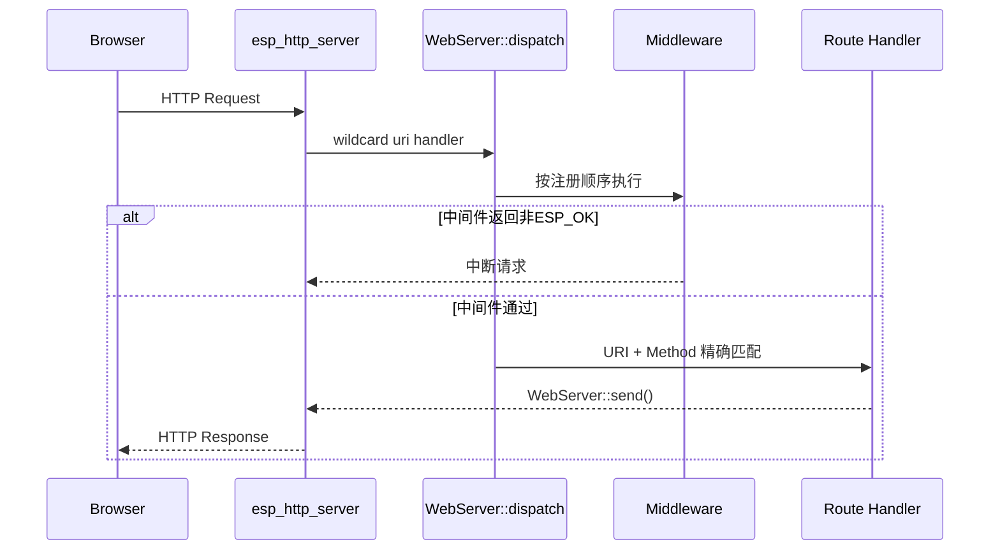
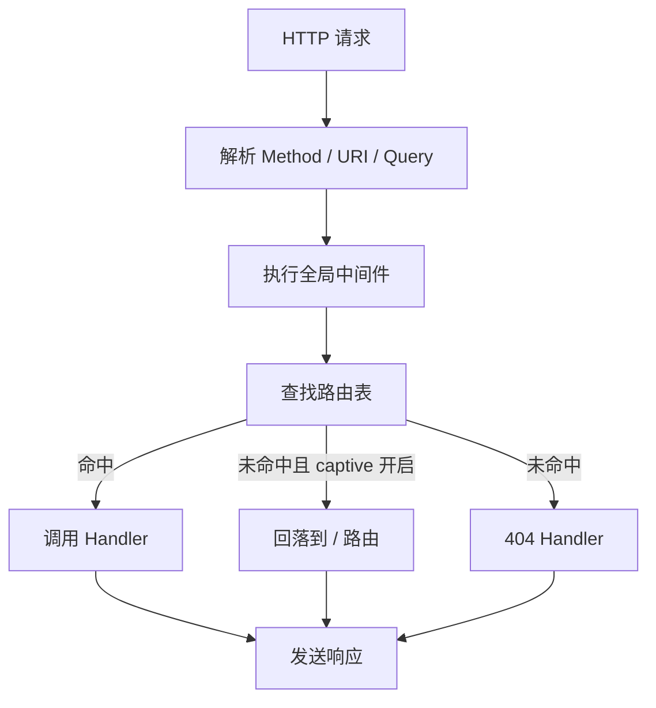

# WebServer

轻量级 HTTP WebServer 中间件，封装 ESP-IDF `esp_http_server`，为应用层后端 API、静态网页和配网页面提供统一的路由与中间件能力。

## 模块特点

- **静态路由表**：路由和中间件使用固定上限数组保存，避免运行期动态扩容。
- **统一分发入口**：底层仅向 `esp_http_server` 注册各 HTTP Method 的通配符入口，再由内部路由表分发。
- **中间件链**：支持全局中间件，适合添加日志、CORS、鉴权、公共 Header 等处理。
- **Flash 静态资源**：支持直接返回随固件烧录的内嵌 HTML/CSS/JS 等资源。
- **gzip 响应**：支持返回构建期已压缩的数据，并设置 `Content-Encoding: gzip`。
- **请求体缓存**：POST/PUT 等请求体按固定上限读取到 `Request::body`，超过上限返回 413。
- **流式请求体**：大文件上传可使用调用方固定缓冲分块消费，不受 1KB JSON 缓存限制。
- **Captive Portal 兜底**：可将未匹配路径回落到 `/` 路由，方便 AP 配网弹窗。
- **客户端地址**：分发前读取连接端 IPv4，middleware 和 handler 可通过 `Request::peer_ip` 记录来源。

## 架构与请求流程





## 集成与使用

```cpp
#include "web_server.h"
#include "web_file.h"

WebServer::init(80);

WebServer::use([](WebServer::Request* request) -> esp_err_t {
    httpd_resp_set_hdr(request->raw, "Access-Control-Allow-Origin", "*");
    return ESP_OK;
});

WebServer::on("/", WebServer::Method::GET, [](WebServer::Request* request) -> esp_err_t {
    return WebServer::send_html_gzip(request, index_html_file.data, index_html_file.size);
});

WebServer::on("/api/ping", WebServer::Method::GET, [](WebServer::Request* request) -> esp_err_t {
    return WebServer::send_json(request, "{\"ok\":true}\n");
});

WebServer::begin();
```

## POST 请求体读取

```cpp
WebServer::on("/api/echo", WebServer::Method::POST, [](WebServer::Request* request) -> esp_err_t {
    esp_err_t ret = WebServer::load_body(request);
    if (ret != ESP_OK) {
        return ret;
    }

    return WebServer::send(request, 200, "text/plain", request->body, request->body_len);
});
```

## 静态资源

静态资源建议使用 ESP-IDF `EMBED_TXTFILES` 或 `EMBED_FILES` 随固件烧录到 Flash，再通过 `serve_static()` 或普通路由返回。

本项目的 `web_file` 资源在构建期已压缩，应使用 gzip 响应函数：

```cpp
WebServer::send_html_gzip(request, index_html_file.data, index_html_file.size);
WebServer::send_gzip(request, 200, "text/css", app_css_file.data, app_css_file.size);
```

只有未压缩资源才使用 `send_html()` 或 `serve_static()`。

## API 参考

### `esp_err_t init(uint16_t port = 80)`

初始化 WebServer 模块，设置监听端口并清空内部路由表与中间件表。重复调用不会重复初始化。

### `esp_err_t begin()`

启动底层 HTTP 服务器。当前实现要求路由和中间件在 `begin()` 之前完成注册。

### `esp_err_t stop()`

停止 HTTP 服务器，但保留已注册的路由和中间件。

### `esp_err_t deinit()`

停止 HTTP 服务器，并清空路由、中间件和 404 处理函数。

### `esp_err_t on(const char* uri, Method method, Handler handler)`

注册路由处理函数。重复注册同一路径和方法时会覆盖旧 handler。

### `esp_err_t use(Middleware middleware)`

注册全局中间件。中间件返回非 `ESP_OK` 时，请求处理链停止。

### `void on_not_found(Handler handler)`

设置 404 处理函数。

### `void enable_captive_portal(bool enable)`

开启后，未匹配路径会回落到 `/` 路由，常用于配网弹窗页面。

### `esp_err_t load_body(Request* request)`

读取请求体到 `Request::body`。请求体最大长度由 `WEB_SERVER_BODY_MAX_LEN` 限制。

### `esp_err_t stream_body(Request* request, char* buffer, size_t buffer_size, BodyChunkHandler chunk_handler)`

流式读取大请求体。数据按块交给调用方同步处理，不写入 `Request::body`。
连续接收超时或连接断开时返回错误，适合固件上传等场景。

## 配置常量

| 常量 | 默认值 | 说明 |
|------|------|------|
| `WEB_SERVER_MAX_ROUTES` | 48 | 最大路由数量 |
| `WEB_SERVER_MAX_MIDDLEWARES` | 8 | 最大中间件数量 |
| `WEB_SERVER_URI_MAX_LEN` | 96 | URI缓存长度 |
| `WEB_SERVER_QUERY_MAX_LEN` | 128 | Query缓存长度 |
| `WEB_SERVER_PEER_IP_MAX_LEN` | 16 | 客户端 IPv4 文本缓存长度 |
| `WEB_SERVER_BODY_MAX_LEN` | 1024 | 请求体缓存长度 |

## 注意事项

- `Request*` 只在 handler 或 middleware 执行期间有效，不要保存到异步任务中使用。
- 当前实现使用单个静态 `Request` 上下文，适合低并发嵌入式后端；如需并发处理，需要改为每连接上下文。
- 路由注册和中间件注册应在 `begin()` 之前完成。
- 大响应建议使用 Flash 静态资源或后续扩展分块发送接口。
- 大请求体不要使用 `load_body()`，应通过 `stream_body()` 分块处理。

## 环境与依赖

| 类别 | 要求 |
|------|------|
| 框架 | ESP-IDF v6.0+ |
| 语言 | C++20 |

<!-- dependency-links:start -->
## 依赖导航

无工程内组件依赖；仅依赖 ESP-IDF 组件或 C/C++ 标准库。

> 本节按当前 `CMakeLists.txt` 的 `REQUIRES` / `PRIV_REQUIRES` 维护。
<!-- dependency-links:end -->
