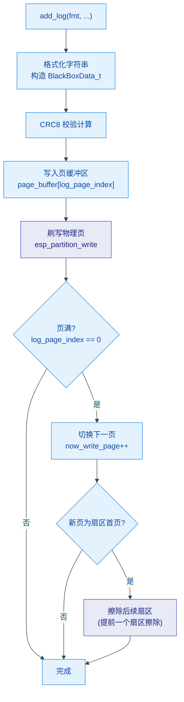
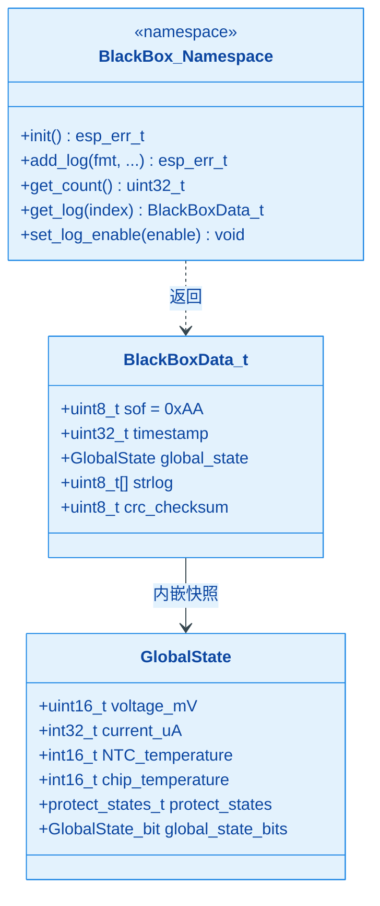

# BlackBox — 嵌入式环形 Flash 日志模块

基于 ESP32-C6 Flash 分区的循环写入黑匣子日志系统，掉电不丢失，自动管理扇区擦除，适用于异常回溯与运行状态追溯。

## 模块特点

- **环形写入**：日志写满 Flash 分区后自动回绕，无需手动清理
- **掉电安全**：逐页写入 + CRC8 校验 + 帧头验证，异常掉电后数据可恢复
- **分区级隔离**：独立 `blackbox` 分区，不占用应用 Flash 空间
- **全局状态快照**：每条日志自动附带当时的电压、电流、温度及保护状态
- **互斥保护**：FreeRTOS 二值信号量保证并发写入/读取安全
- **可暂停记录**：`set_log_enable(false)` 可在读取期间冻结写入，防止数据竞争

## 环境与依赖

| 类别 | 依赖 | 说明 |
|------|------|------|
| 硬件 | ESP32-C6 | Flash 页 256B / 扇区 4096B，硬编码不可改 |
| 分区表 | `blackbox` 数据分区 | 需在分区表中声明 `ESP_PARTITION_TYPE_DATA` + name "`blackbox`" |
| RTOS | FreeRTOS | 二值信号量 (`xSemaphoreCreateBinary`) |
| IDF | ESP-IDF v5.x | `esp_partition`、`esp_timer`、`spi_flash` |
| 内部模块 | `global_state` | 提供 `GlobalState` 结构体及全局引用 |
| C++ | C++11 及以上 | `constexpr`、`static_assert`、`__attribute__((packed))` |

## 架构与原理





**写入策略**：采用页缓冲 + 延迟扇区擦除。写满一页后切换至下一页；当下一页恰好是某个扇区的起始页时，提前擦除**再下一个扇区**（该扇区数据已是最旧的），确保新页写入时空间已就绪。

**启动恢复**：`init()` 遍历全部分区找到首个空页，结合前后页状态推断上次写入位置，计算已记录日志数量，实现断电重启后无缝续写。

## 集成与使用

### 1. 分区表配置

在分区表中添加 `blackbox` 数据分区（大小按需选取，须为 4096 的整数倍）：

```
# Name,     Type, SubType, Offset,  Size
blackbox,   data, spiffs,  ,        0x10000
```

### 2. 初始化

```cpp
#include "blackbox.h"

esp_err_t ret = BlackBox::init();
if (ret != ESP_OK) {
    // 处理初始化失败（分区未找到 / Flash 寿命耗尽）
}
```

### 3. 记录日志

```cpp
BlackBox::add_log("Output enabled, V=%d mV", voltage);
BlackBox::add_log("OVP triggered!");
```

### 4. 读取日志

```cpp
BlackBox::set_log_enable(false);                  // 冻结写入
uint32_t count = BlackBox::get_count();
for (uint32_t i = 0; i < count; i++) {
    BlackBoxData_t entry = BlackBox::get_log(i);  // 0 = 最新日志
    if (entry.sof != 0xAA) continue;              // 跳过无效条目
    printf("[%u ms] %s\n", entry.timestamp, entry.strlog);
}
BlackBox::set_log_enable(true);                   // 恢复写入
```

## API 参考

| API | 说明 |
|-----|------|
| `esp_err_t init()` | 初始化分区、定位写入位置、创建互斥锁。返回 `ESP_OK` / `ESP_ERR_INVALID_STATE` / `ESP_ERR_NO_MEM` |
| `esp_err_t add_log(const char *fmt, ...)` | printf 风格写入一条日志，自动附加时间戳、全局状态和 CRC8 |
| `uint32_t get_count()` | 返回已记录日志总数 |
| `BlackBoxData_t get_log(uint32_t index)` | 按索引倒序读取日志（`0` = 最新），含 SOF + CRC8 完整性校验 |
| `void set_log_enable(bool enable)` | 启用/禁用日志写入，读取前应设为 `false` |

### 关键常量

| 常量 | 值 | 说明 |
|------|----|------|
| `BLACKBOX_DATA_SIZE` | 64 | 单条日志字节长度 |
| `DATA_SOF` | `0xAA` | 帧头标识 |
| `PAGE_SIZE` | 256 | Flash 页大小（ESP32-C6） |
| `SECTOR_SIZE` | 4096 | Flash 扇区大小 |
| `LOG_PER_PAGE` | 4 | 每页存储日志条数 |
