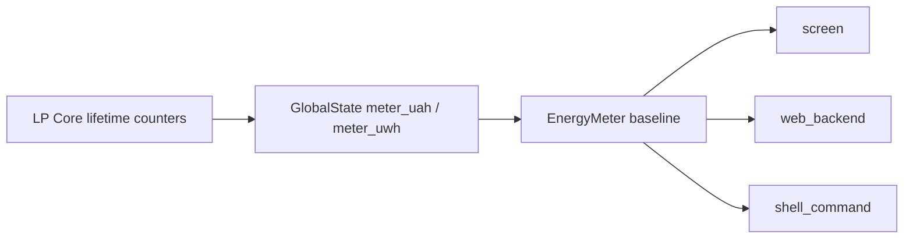

# energy_meter

共享电量计量会话中间件。基于 LP Core 自启动以来持续累加的 `meter_uah` 和
`meter_uwh`，为屏幕、Web 和 Shell 提供可重置的相对计量值。

## 行为

- `snapshot()` 返回相对当前基线的 `μAh`、`μWh` 和计量时间。
- `reset()` 将当前 LP Core 累计值记录为新基线，不修改底层累计值。
- 屏幕、Web 和 Shell 共用同一基线，因此任一入口重置后其他入口同步生效。
- 内部使用 FreeRTOS 临界区保护基线和计量起始时间。

## API

| API | 说明 |
|-----|------|
| `EnergyMeter::snapshot()` | 获取共享计量会话快照 |
| `EnergyMeter::reset()` | 重置共享计量基线和计量时间 |

## 数据来源

## 依赖

- `global_state`
- `esp_timer`
- `freertos`
