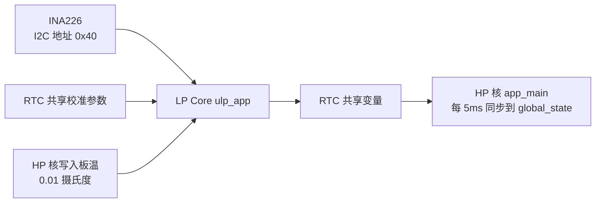
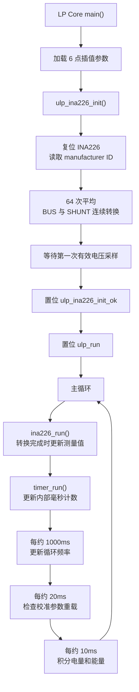
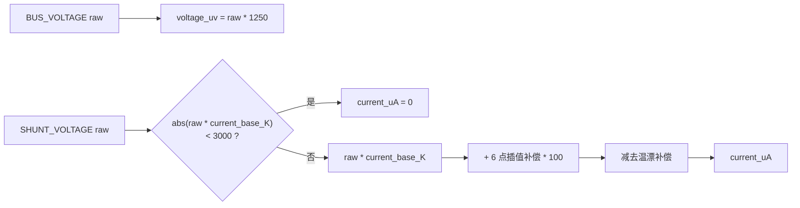
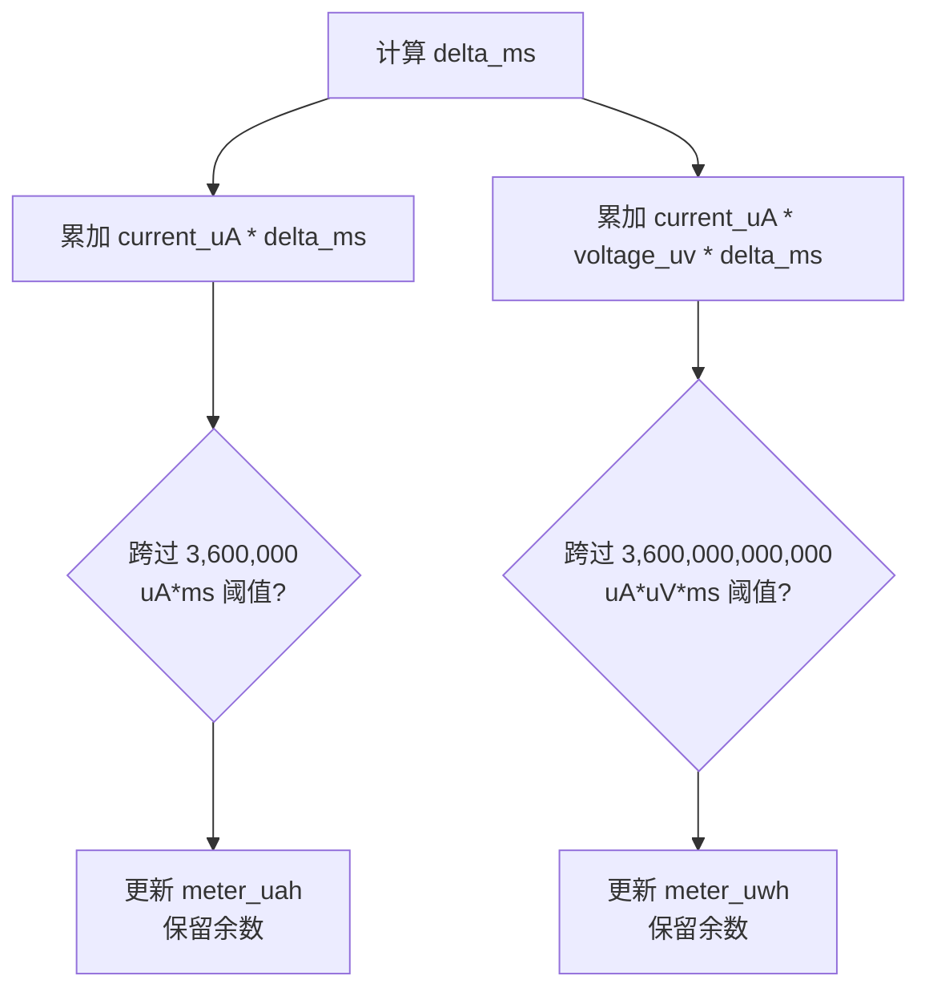

# ulp_app

`ulp_app` 运行在 ESP32-C6 的 LP Core 上。LP Core 可以理解为一个较轻量的辅助处理器：HP 核运行主业务、屏幕和网络，LP 核持续采样 INA226 并累计电量。

本目录只包含 LP 核程序。HP 核侧的加载、启动和校准参数搬运见 [`../ulp_loader/README.md`](../ulp_loader/README.md)。

## 设计目标

- 使用 LP I2C 持续读取 INA226，不占用 HP 核主任务。
- 在 LP 核上完成电流校准、温漂补偿、电量积分和能量积分。
- 通过 RTC 共享内存向 HP 核暴露测量值和状态。
- 使用整数运算，适应 LP 核环境。

## 整体架构

## 启动与主循环

初始化失败时 LP 核会停留在 3 秒延时循环中，`ulp_run` 不会置位。HP 核侧 `LP_Core_Load()` 会检测启动失败。

## INA226 采样

INA226 配置为：

| 项目 | 配置 |
|------|------|
| I2C 地址 | `0x40` |
| 平均次数 | `64 samples` |
| 分流电压转换时间 | `1100 us` |
| 总线电压转换时间 | `1100 us` |
| 模式 | 分流电压与总线电压连续转换 |

主循环读取 MASK/ENABLE 寄存器的转换完成标志。只有转换完成时才更新电压和电流。

## 电流校准

校准参数类型来自 `current_calibration` 组件：

| 字段 | 作用 |
|------|------|
| `current_base_K` | 分流寄存器原始值到电流的基础比例 |
| `points[6]` | 6 个非等间距插值点，修正不同电流区间误差 |
| `temperature_K` | 温漂补偿系数 |

HP 核修改参数后，会置位 `ulp_reload_calib_params`。LP 核每约 20ms 检查一次该标志，重新加载插值表后清除标志。

`Board_temperature` 由 HP 核写入，单位是 `0.01 摄氏度`。LP 核先换算成整摄氏度温差，再进行补偿。

## 电量与能量积分

LP 核每约 10ms 调用 `update_meter()`：

积分保留电流正负号，因此充电和放电方向会影响累计值。

## RTC 共享变量

带 `LP_VAR` 的变量位于 `.rtc.bss` 段，HP 核可直接访问。

| 变量 | 类型 | 单位 | 方向 | 说明 |
|------|------|------|------|------|
| `ulp_state` | `uint32_t` | - | LP -> HP，HP 可清零/置重载位 | 状态位集合 |
| `log_data` | `uint32_t` | - | LP -> HP | 预留 LP 日志数据 |
| `core_run_freq_hz` | `uint32_t` | Hz | LP -> HP | LP 主循环频率统计 |
| `voltage_uv` | `uint32_t` | uV | LP -> HP | 总线电压 |
| `voltage_register_raw` | `uint16_t` | raw | LP -> HP | INA226 总线电压原始值 |
| `current_uA` | `int32_t` | uA | LP -> HP | 补偿后的电流 |
| `shunt_register_raw` | `int16_t` | raw | LP -> HP | INA226 分流电压原始值 |
| `ina226_manufacturer_id` | `uint16_t` | raw | LP -> HP | INA226 厂商 ID |
| `Board_temperature` | `int32_t` | 0.01 摄氏度 | HP -> LP | 板温，用于温漂补偿 |
| `meter_uah` | `int32_t` | uAh | LP -> HP | 累计电量 |
| `meter_uwh` | `int32_t` | uWh | LP -> HP | 累计能量 |
| `current_calib_params` | `CurrentCalib::params_t` | - | HP -> LP | 校准参数 |

## 状态位

| 位域 | 当前行为 |
|------|----------|
| `ulp_have_log` | `lp_log()` 写入日志时置位；当前主循环没有启用日志调用 |
| `ulp_i2c_init_err` | INA226 初始化中的 I2C 操作失败时置位 |
| `ulp_ina226_init_ok` | INA226 初始化和首个电压样本成功后置位 |
| `ulp_ina226_read_timeout` | 已预留，当前代码没有置位 |
| `ulp_run` | INA226 初始化成功后、进入主循环前置位 |
| `ulp_reload_calib_params` | HP 核请求重新加载校准参数时置位，LP 核处理后清除 |

## 文件说明

| 文件 | 作用 |
|------|------|
| `ulp_main.cpp` | LP 核入口、采样、补偿、积分和 RTC 共享变量 |
| `ina226.hpp` | LP I2C 版 INA226 寄存器访问和配置 |
| `ulp_Interp.hpp` | 固定容量非等间距插值器 |
| `ulp_state.h` | HP/LP 共用的状态位定义 |

## 注意事项

- LP 核侧尽量使用整数运算，新增逻辑前要评估代码体积和执行开销。
- `voltage_uv` 是 uV，HP 核写入 `global_state` 时除以 `1000` 转换为 mV。
- `current_uA` 已包含死区、插值和温漂补偿，不是 INA226 原始寄存器值。
- 当前普通采样读取失败不会设置 `ulp_ina226_read_timeout`；该状态位只是预留接口。
- `app_loop_every_ms()` 使用 `>` 判断间隔，因此文档使用“约 10ms / 20ms / 1000ms”描述。
