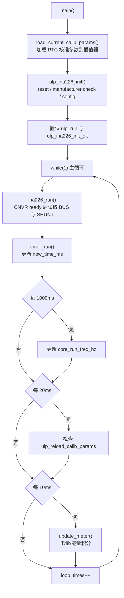
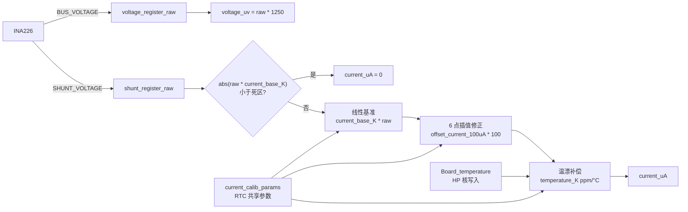
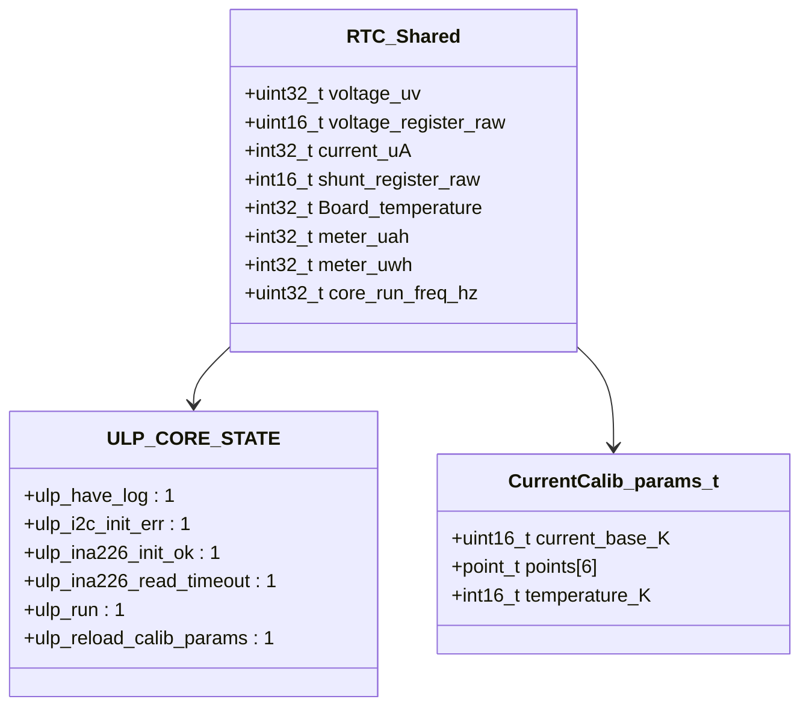
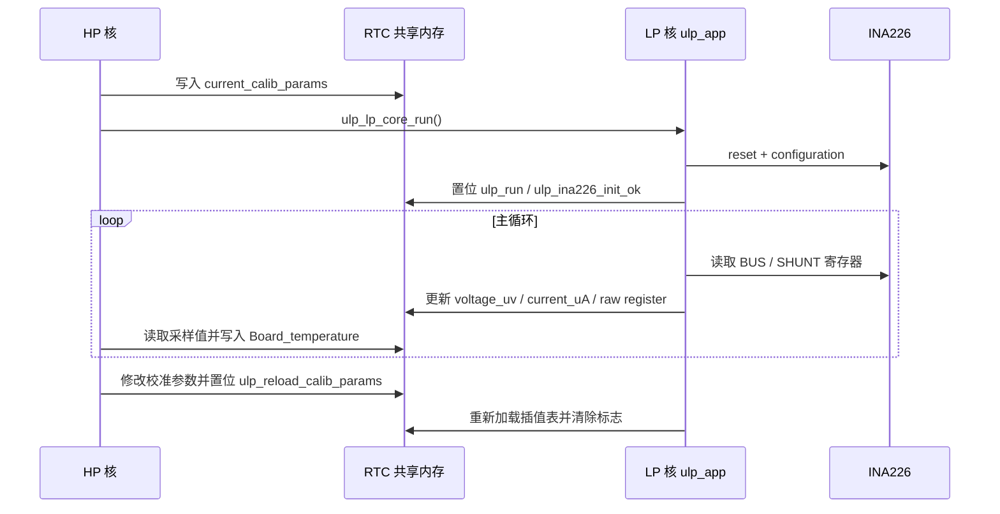

# ulp_app

LP 核应用程序，运行在 ESP32-C6 的 LP Core 上，负责 INA226 采样、电流校准补偿、电量/能量积分以及向 HP 核暴露 RTC 共享变量。主程序入口在 `ulp_main.cpp`，INA226 低功耗 I2C 驱动在 `ina226.hpp`，LP/HP 共享状态位定义在 `ulp_state.h`。

## 模块特点

- **LP 核独立采样**：INA226 连续转换，LP 核轮询 `CNVR` 转换完成位后读取电压与分流器寄存器
- **RTC 共享变量**：采样值、原始寄存器、积分值、状态位和校准参数放在 `.rtc.bss` 段，供 HP 核直接访问
- **整数电流校准**：使用 `current_base_K`、6 点非等间距插值和 `temperature_K` 完成无浮点温漂补偿
- **电量/能量积分**：以 `uA·ms` 和 `uA·uV·ms` 累加，跨阈值后更新 `meter_uah` 和 `meter_uwh`
- **溢出安全计时**：基于 20MHz CPU cycle 维护 `now_time_ms`，处理底层计数回绕

## 运行流程

## 采样与校准数据流

## HP/LP 共享变量

## 与 HP 核交互

## 文件说明

| 文件 | 作用 |
|------|------|
| `ulp_main.cpp` | LP 核主循环、INA226 调度、电流补偿、电量/能量积分 |
| `ina226.hpp` | LP Core I2C 版 INA226 寄存器读写与配置 |
| `ulp_Interp.hpp` | LP 核可用的固定容量非等间距插值器 |
| `ulp_state.h` | HP/LP 共享状态位定义 |

## 注意事项

- `voltage_uv` 实际由 INA226 bus voltage raw 乘以 `voltage_scale = 1250` 得到，HP 核在 `app_main.cpp` 中转换为 mV。
- `current_uA` 是已完成死区、插值和温漂补偿后的最终电流值，符号保留电流方向。
- `Board_temperature` 由 HP 核写入，单位为 0.01°C，LP 核用它做温漂补偿。
