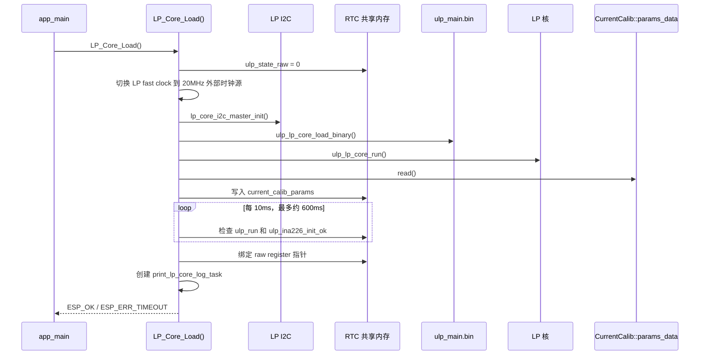
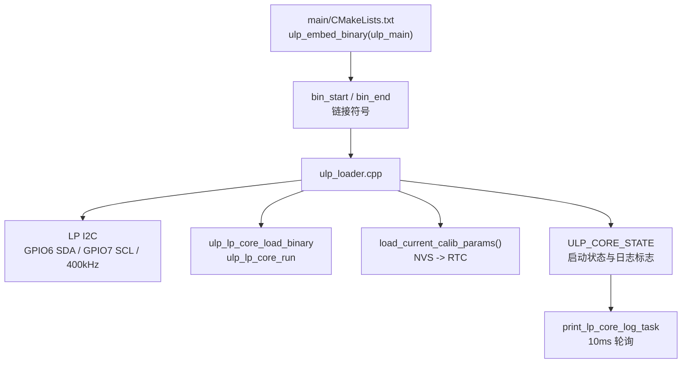
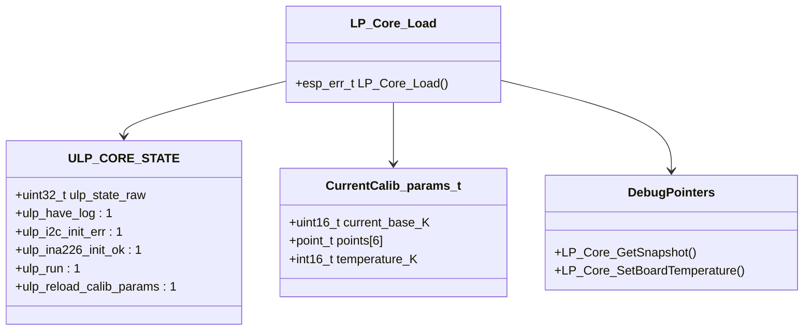

# ulp_loader

HP 核侧 LP Core 加载模块，负责初始化 LP I2C、加载 `ulp_app` 编译出的二进制、启动 LP 核、搬运电流校准参数，并把 LP 核的原始寄存器共享变量指针暴露给调试命令。

## 模块特点

- **LP Core 启动封装**：`LP_Core_Load()` 完成 LP I2C 初始化、二进制加载、运行和启动状态检查
- **校准参数桥接**：从 `CurrentCalib::params_data` 读取 NVS 参数，写入 LP 核 RTC 共享变量
- **启动握手**：等待 `ulp_run` 与 `ulp_ina226_init_ok` 置位，最长约 600ms
- **LP 日志桥接**：后台任务轮询 `ulp_have_log`，将 LP 核日志值转为 HP 核 `ESP_LOGI`
- **共享快照**：通过 LP/HP 跨核锁一次性读取状态、采样值、原始寄存器和累计值

## 启动流程

## 模块结构

## 关键数据关系

## API 参考

| API | 说明 |
|-----|------|
| `LP_Core_Load()` | 初始化并启动 LP 核，成功后返回 `ESP_OK`，启动握手超时返回 `ESP_ERR_TIMEOUT` |

## 文件说明

| 文件 | 作用 |
|------|------|
| `ulp_loader.cpp` | LP 核加载、启动握手、校准参数搬运、LP 日志轮询 |
| `ulp_loader.h` | 对外声明 `LP_Core_Load()` |

## 注意事项

- 当前 `i2c_cfg` 固定使用 GPIO6/GPIO7，与 `hardware_config` 中 INA226 引脚保持一致；若未来硬件版本切换 INA226 引脚，需要同步调整这里。
- `LP_Core_Load()` 内部使用 `ESP_ERROR_CHECK` 处理 I2C、二进制加载和运行错误，相关错误会直接触发 ESP-IDF 错误检查行为。
- `LP_Core_GetSnapshot()` 使用 RTC 共享自旋锁，调用方不会读取到撕裂的 `int64_t` 累计值或不一致的采样字段。
