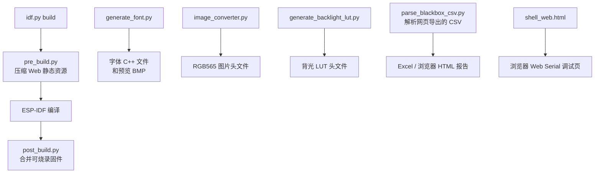

# scripts

`scripts/` 保存构建辅助工具和资源生成工具。部分脚本由 CMake 自动调用，部分脚本只在开发者更新资源时手工运行。

## 总览



## 自动构建脚本

### `pre_build.py`

将 `components/assets/web_file/` 下的 HTML 和 CSS 源文件压缩为 `.gz` 文件。

```bash
python3 scripts/pre_build.py
```

特点：

- 使用 gzip level 9。
- 使用固定 `mtime=0`，保证相同源文件生成相同字节。
- 只在内容变化时重写 `.gz` 文件。
- `.gz` 文件是构建产物，已被 `.gitignore` 忽略。
- CMake 配置 `web_file` 时会先执行一次，`idf.py build` 也会通过 `run_pre_build` 目标执行。

详细资源流程见 [`../components/assets/web_file/README.md`](../components/assets/web_file/README.md)。

### `post_build.py`

构建完成后，将 bootloader、分区表和已有分区镜像合并为一个固件文件：

```text
Wireless_power_meter_lite_merged.bin
```

CMake 的 `run_post_build` 目标会自动执行它。脚本内部调用：

```bash
python -m esptool --chip esp32c6 merge-bin ...
```

合并时跳过 `blackbox` 和 `coredump` 分区，避免全新烧录覆盖日志类数据。脚本还会打印各分区占用情况。

## 手工资源工具

### `generate_font.py`

把 TTF/OTF 字体转换为项目 `Font_t` 可用的 C++ 文件，并生成 BMP 预览图。

```bash
python3 scripts/generate_font.py <字体文件> <字体大小> <字体名称>
```

输出目录以字体名称命名，包含 `.h`、`.cpp` 和 `_preview.bmp`。依赖 Pillow。

### `image_converter.py`

把 PNG、JPG、BMP 等图片转换为 ST7735 可用的 RGB565 小端序数组头文件。

```bash
python3 scripts/image_converter.py <输入图片> <输出头文件> [-n 自定义数组名]
```

图片超过 `160x80` 时脚本会警告，但不会阻止生成。依赖 Pillow。

### `generate_backlight_lut.py`

根据 gamma 曲线生成 `backlight_lut.h`。当前参数直接写在脚本末尾，如需修改点数、gamma 或最小占空比，请先调整脚本常量。

```bash
python3 scripts/generate_backlight_lut.py
```

该脚本依赖 NumPy。`scripts/requirements.txt` 当前只包含 Pillow，因此需要单独安装 NumPy：

```bash
pip install numpy
```

### `parse_blackbox_csv.py`

将历史日志页面导出的黑匣子 CSV 转换为浏览器和 Excel 均可打开的单文件 HTML 报告：

```bash
python scripts/parse_blackbox_csv.py wireless-power-meter-history.csv
```

默认生成同名 `.html` 文件。脚本按启动后毫秒时间减少的位置划分每次运行，并结合
`TimeService sync raw` 日志为该次运行估算网络时间。报告会将 `ERROR` 标红、
`WARN` 标黄，提供运行摘要、浏览器筛选控件和可拖拽调整宽度的日志表格列。结构化
快照中的全局标志位默认显示紧凑摘要，可以单条展开或使用按钮批量展开、收起。
运行摘要会显示每段日志推算出的网络时间段；没有 `TimeService sync raw` 锚点时
显示“无时间锚点”。网络时间使用 `YYYY-MM-DD HH:MM:SS.mmm` 格式，报告顶部统一
注明时区。标题下方还会显示各次运行日志覆盖时长之和，并根据最早一条日志是否为
`[Blackbox]: reset` 显示黑匣子是否执行过重置。

脚本默认从工程源码读取 `GlobalStateFlags` 和 `protect_states_t` 位域定义，以解析
结构化快照中的 `flags` 和 `protect`。全局标志位按行显示全部已定义字段，包括值为
`0` 的字段和多 bit 字段。源码目录不在默认位置时可指定：

```bash
python scripts/parse_blackbox_csv.py history.csv --project-root <工程根目录>
```

脚本仅使用 Python 标准库，不需要安装额外 pip 包。使用 `--no-source-flags` 可以在
没有工程源码时跳过标志位解析，仍然生成包含原始数值的报告。

## 调试页面

### `shell_web.html`

独立的 Web Serial 串口终端页面，可在支持 Web Serial API 的浏览器中打开。它通过浏览器选择串口设备，以 `115200` 波特率连接，并提供基础终端交互。

页面通过 CDN 加载 xterm.js，使用时需要网络访问。

## Python 依赖

字体和图片转换工具的基础依赖：

```bash
pip install -r scripts/requirements.txt
```

当前 `requirements.txt` 包含：

```text
Pillow
```

背光 LUT 工具还需要额外安装 `numpy`。

## 注意事项

- 自动构建脚本从项目根目录和固定目录结构推导路径，移动文件后要同步修改 CMake 和脚本。
- 当前 CMake 自动目标调用命令名 `python`。ESP-IDF 构建环境需要提供该命令；手工运行脚本时可直接使用 `python3`。
- 资源生成工具会写入输出文件，运行前确认目标路径。
- `post_build.py` 按 ESP32-C6 和当前分区表设计；修改芯片或分区布局后要同步检查脚本。
